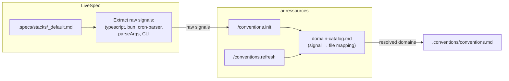

# Domain Catalog — Centralized Signal-to-Convention Mapping

> **Date:** 2026-03-30
> **Status:** Approved
> **Scope:** ai-ressources (domain-catalog.md, conventions.init, conventions.refresh) + livespec (conventions-sync.md simplification)

---

## Problem

The signal-to-domain mapping currently lives in `~/.claude/livespec/references/conventions-sync.md`. This is wrong because:

1. **Maintenance burden** — every new file in ai-ressources requires updating a file in LiveSpec
2. **Wrong ownership** — ai-ressources owns the domains, it should own the mapping
3. **Incomplete detection** — `/conventions.init` only maps stack entries to languages/frameworks, missing architecture, stack-ref, design, copywriting, legal, pricing, SEO
4. **Duplication risk** — each consumer (LiveSpec, audit, future tools) would need its own copy of the mapping

## Solution

Create a **domain-catalog.md** in ai-ressources that serves as the single source of truth for "given a signal, which convention files are relevant?" Both `/conventions.init` and `/conventions.refresh` read this catalog at runtime. LiveSpec passes raw signals only — no pre-mapping.



---

## Part 1 — domain-catalog.md

**Location:** `~/projects/ai-ressources/domain-catalog.md` (project root)

**Purpose:** Exhaustive mapping of keyword signals to convention files. Read by `/conventions.init` and `/conventions.refresh` at runtime for domain detection.

### Structure

The catalog is organized by **detection category**. Each category contains a table mapping signals (keywords, package names, file patterns) to convention file paths relative to the ai-ressources root.

Categories:
1. **Code** — language deltas (always includes general + architecture + logging + testing)
2. **Frameworks** — framework-specific convention deltas
3. **Architecture** — SaaS architectural patterns
4. **Stack-Ref** — external services, platforms, vendors (12 subcategories)
5. **Design** — design systems, components, quality, references
6. **Copywriting** — messaging, email, taglines
7. **Conventions** — transversal rules (diagrams, naming, authority)
8. **Legal** — CGU, RGPD, privacy, cookies
9. **Pricing** — pricing model patterns
10. **SEO** — technical SEO, Core Web Vitals

### Signal format

Each signal is a **case-insensitive keyword**. The consumer passes a flat list of keywords extracted from whatever source (stack file, package.json, file extensions, project description). The catalog resolves each keyword to zero or more convention files.

### Matching rules

- A signal can match multiple categories (e.g., `redis` matches both `databases/redis-self-hosted` in stack-ref AND `caching-strategies` in architecture)
- All matches are cumulative (union)
- The consumer does NOT need to know which category a signal belongs to — just pass all signals, the catalog resolves everything
- Unknown signals are silently ignored

---

## Part 2 — Update /conventions.init

**File:** `~/projects/ai-ressources/claude/skills/conventions.init/SKILL.md`

### Changes

1. **Phase 2 (Domain Detection):** Add a new step at the beginning:
   > "Read `~/projects/ai-ressources/domain-catalog.md` to load the signal-to-domain mapping."

2. **Spec-Aware Detection:** When receiving signals from LiveSpec (or any caller), resolve them through the catalog instead of the hardcoded mapping tables

3. **Existing detection channels remain** — file extension scanning, dependency scanning, and code grepping still work for non-LiveSpec contexts. The catalog is an additional (and primary when signals are provided) detection source.

4. **Reference files update:** The existing `package-mapping.md`, `architecture-signals.md`, and `project-type-signals.md` in `conventions.init/references/` become secondary — the catalog is authoritative. These files can be kept for backward compatibility but the catalog takes precedence.

---

## Part 3 — Update /conventions.refresh

**File:** `~/projects/ai-ressources/claude/skills/conventions.init/SKILL.md` (refresh is part of the same skill)

Same change: read `domain-catalog.md` for domain resolution when `--full` mode re-detects domains.

---

## Part 4 — Simplify conventions-sync.md (LiveSpec)

**File:** `~/.claude/livespec/references/conventions-sync.md`

### Changes

1. **Remove** the entire "Exhaustive Domain Mapping Table" section (all 6 sub-tables)
2. **Replace** with a "Signal Extraction" section that:
   - Reads `.specs/stacks/_default.md`
   - Reads `.specs/project.md` (if exists)
   - Extracts a flat list of raw signal keywords
   - Passes them to `/conventions.init` or `/conventions.refresh` with the instruction: "Use domain-catalog.md to resolve these signals into convention domains"

### Signal extraction format

```
Signals from .specs/stacks/_default.md:
typescript, bun, cron-parser, parseArgs, cli, flat-file-storage

Project type from .specs/project.md:
CLI tool, background scheduler
```

The consumer (`/conventions.init`) reads the catalog and resolves.

---

## Part 5 — Auto-sync rule for ai-ressources

**File:** `~/projects/ai-ressources/CLAUDE.md` (create if not exists) or a `.claude/rules/` file

### Rule

When any `.md` file is created, renamed, or deleted in the following directories:
- `architecture/`
- `code-conventions/`
- `copywriting/`
- `conventions/`
- `design/`
- `stack-ref/`
- `legal/`
- `pricing-models/`
- `seo/`
- `models/`

Then verify that `domain-catalog.md` reflects the change:
- New file → add signal entries
- Deleted file → remove signal entries
- Renamed file → update paths

This is a documentation rule (not a git hook) — the agent checks coherence when it touches these directories.

---

## Files Summary

| Action | File | Project |
|--------|------|---------|
| **Create** | `domain-catalog.md` | ai-ressources |
| **Create/Update** | `CLAUDE.md` or `.claude/rules/domain-catalog-sync.md` | ai-ressources |
| **Modify** | `claude/skills/conventions.init/SKILL.md` | ai-ressources |
| **Simplify** | `~/.claude/livespec/references/conventions-sync.md` | livespec (global) |
| **Update** | `commands/refresh-conventions.md` | livespec |

---

## Definition of Done

- [ ] `domain-catalog.md` exists at ai-ressources root with all 10 categories
- [ ] All existing convention files are represented in the catalog
- [ ] `/conventions.init` reads the catalog for domain detection
- [ ] `conventions-sync.md` has no hardcoded mapping table — only signal extraction
- [ ] Auto-sync rule exists in ai-ressources
- [ ] Running `/spec.refresh-conventions` on cronshed (Bun+cron+CLI) correctly detects: TypeScript, background-jobs, frontend/cli, cli-patterns

---

*Design Spec v1.0*
