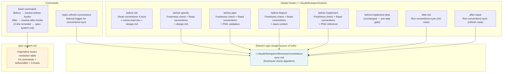
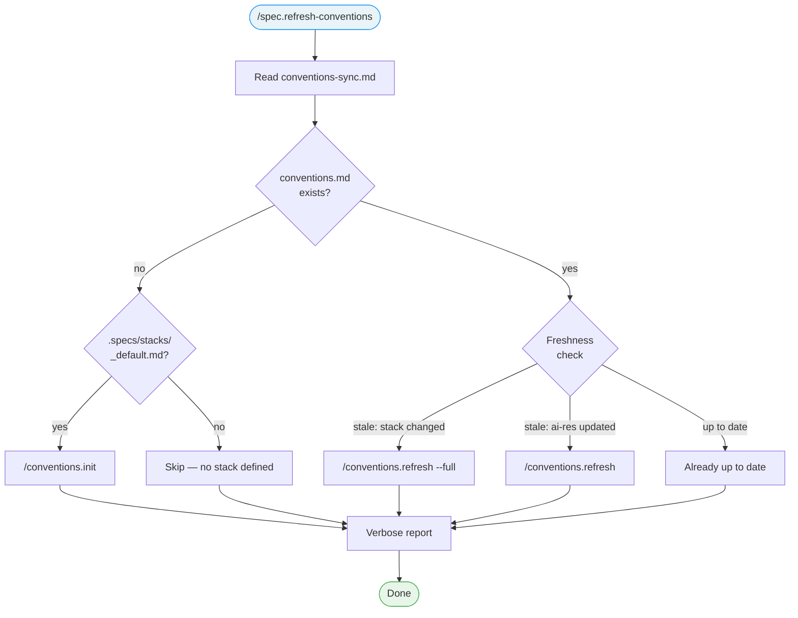
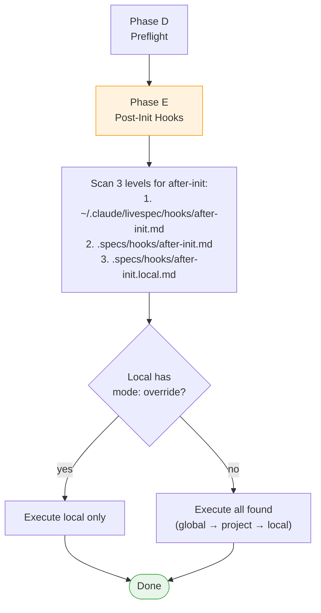

# Hooks & Conventions Integration — Design Spec

> **Date:** 2026-03-30
> **Status:** Draft
> **Scope:** Global hooks migration, conventions-sync reference, spec-system.md hooks resolution, /spec.refresh-conventions command

---

## Problem Statement

LiveSpec's hooks system has 3 interconnected problems:

1. **Global hooks call `/ai-res`** — The 5 `before-*` hooks in `~/.claude/livespec/hooks/` load conventions via the `/ai-res` skill, which is now obsolete. The conventions system (`.conventions/conventions.md`) replaces `/ai-res` for all materialized domains.

2. **Orphan hooks in wrong location** — 4 hooks (`after-init`, `after-stack`, `before-plan`, `before-implement`) were created in `projects/livespec/hooks/` instead of the global directory `~/.claude/livespec/hooks/`. These contain the correct conventions-based approach but are never discovered.

3. **No command resolves hooks** — `spec-system.md` declares that "all commands resolve hooks automatically" but no command actually implements hook resolution. The protocol exists in `system/hooks.md` but is never executed.

4. **No manual conventions refresh** — After `/spec.init` creates the stack, there's no way to manually trigger conventions generation. The `after-init` hook (which does this) is never executed.

---

## Solution

### Architecture



---

## Part 1 — Conventions-Sync Reference (shared logic)

**File:** `~/.claude/livespec/references/conventions-sync.md`

Single source of truth for the conventions freshness check algorithm. Referenced by all hooks and the manual command — zero duplication.

### Algorithm

```
1. Read 3 dates:
   - `generated` from `.conventions/conventions.md` YAML frontmatter
   - `updated` from `.specs/stacks/_default.md` YAML frontmatter
   - content of `~/projects/ai-ressources/.last-updated`

2. Decision matrix:
   a. .conventions/conventions.md does NOT exist + .specs/stacks/_default.md exists
      → Run /conventions.init
      → Report: "Conventions initialized from stack."

   b. .conventions exists + generated < updated (stack changed)
      → Run /conventions.refresh --full
      → Report: "Conventions refreshed (stack changed)."

   c. .conventions exists + generated < .last-updated (ai-ressources updated)
      → Run /conventions.refresh
      → Report: "Conventions refreshed (ai-ressources updated)."

   d. .conventions exists + generated >= both dates
      → Skip silently.

   e. .specs/stacks/_default.md does NOT exist
      → Skip silently (not a LiveSpec project or stack not yet defined).

3. Edge cases:
   - `updated` missing from _default.md frontmatter → treat as always stale
   - ~/projects/ai-ressources/.last-updated missing → skip that comparison
```

---

## Part 2 — Rewrite Global Hooks

All 5 `before-*` hooks in `~/.claude/livespec/hooks/` are rewritten to remove `/ai-res` calls and use the conventions system instead.

### Common pattern

```
1. Freshness check: Read conventions-sync.md → follow instructions
2. Load conventions: Read .conventions/conventions.md (full file, into context)
3. Hook-specific logic (PNG checks, design.md, memo, etc.)
```

### Hook details

| Hook | Freshness check | Read conventions | Specific logic |
|------|----------------|-----------------|----------------|
| `before-init` | No (conventions may not exist yet) | Yes, if file exists | `/memo.read dev` + Read `~/.claude/livespec/design.md` |
| `before-specify` | Yes (via conventions-sync.md) | Yes | Read `~/.claude/livespec/design.md` |
| `before-plan` | Yes (via conventions-sync.md) | Yes | PNG mockup validation: verify referenced PNGs in `.specs/design/screens/` |
| `before-feature` | Yes (via conventions-sync.md) | Yes | Stack context: `{{stack}}` from `_default.md` |
| `before-implement` | Yes (via conventions-sync.md) | Yes | PNG design reference: Read mockup PNGs as visual targets |
| `before-implement-step` | **Unchanged** | No (already loaded by before-implement) | Pre-step gate: tests, typecheck, lint, scope guard |

---

## Part 3 — Move Orphan Hooks

### Moved to `~/.claude/livespec/hooks/`

| Source (projects/livespec/hooks/) | Destination (~/.claude/livespec/hooks/) |
|---|---|
| `after-init.md` | `after-init.md` — runs conventions-sync.md (init case guaranteed) |
| `after-stack.md` | `after-stack.md` — runs conventions-sync.md (refresh --full case) |

### Absorbed into rewritten hooks (Part 2)

| Orphan file | Absorbed into |
|---|---|
| `before-plan.md` (freshness check) | Rewritten `before-plan.md` |
| `before-implement.md` (freshness check) | Rewritten `before-implement.md` |

### Deleted

`projects/livespec/hooks/` directory — removed entirely (4 files moved or absorbed).

---

## Part 4 — spec-system.md: Imperative Hooks Resolution

Add a new subsection in "Rules for AI Tools" with an **imperative** hooks resolution table.

### Content to add

**MANDATORY — Hooks Resolution Protocol**

Before executing ANY `/spec.*` command, resolve before-hooks. After completing, resolve after-hooks. This is NOT optional.

For each hook event, Read files at 3 levels in order:

| Level | Path pattern | Scope |
|-------|-------------|-------|
| Global | `~/.claude/livespec/hooks/{before\|after}-{command}.md` | All projects |
| Project | `.specs/hooks/{before\|after}-{command}.md` | This project (committed) |
| Local | `.specs/hooks/{before\|after}-{command}.local.md` | Personal (gitignored) |

Resolution: if local hook has `mode: override` → use only local. Otherwise → load all existing in order (extend).

**Exhaustive hook table — all 14 commands:**

| Command | Before hooks | After hooks |
|---------|-------------|-------------|
| init | `before-init` (global, project, local) | `after-init` (global, project, local) |
| propose | `before-propose` (global, project, local) | `after-propose` (global, project, local) |
| specify | `before-specify` (global, project, local) | `after-specify` (global, project, local) |
| plan | `before-plan` (global, project, local) | `after-plan` (global, project, local) |
| implement | `before-implement` (global, project, local) | `after-implement` (global, project, local) |
| implement (step) | `before-implement-step` (global, project, local) | `after-implement-step` (global, project, local) |
| check | `before-check` (global, project, local) | `after-check` (global, project, local) |
| explain | `before-explain` (global, project, local) | `after-explain` (global, project, local) |
| stack | `before-stack` (global, project, local) | `after-stack` (global, project, local) |
| feature | `before-feature` (global, project, local) | `after-feature` (global, project, local) |
| refine | `before-refine` (global, project, local) | `after-refine` (global, project, local) |
| preflight | `before-preflight` (global, project, local) | `after-preflight` (global, project, local) |
| hooks | (none) | (none) |
| play-coverage | (none) | (none) |
| status | (none) | (none) |
| refresh-conventions | (none) | (none) |

`hooks`, `play-coverage`, `status`, and `refresh-conventions` are diagnostic/utility commands — no hooks.

---

## Part 5 — Command Hooks Reminder

Add 2 lines to each of the 14 hookable commands (init, propose, specify, plan, implement, check, explain, stack, feature, refine, preflight):

```markdown
> **Before starting:** Resolve `before-{command}` hooks — see `spec-system.md` § Hooks Resolution.
> **After completing:** Resolve `after-{command}` hooks — see `spec-system.md` § Hooks Resolution.
```

For `implement`, add additionally:

```markdown
> **Before each step:** Resolve `before-implement-step` hooks.
> **After each step:** Resolve `after-implement-step` hooks.
```

For `feature`, add additionally:

```markdown
> **Sub-commands:** Each phase (specify, plan, implement) resolves its own hooks in addition to `before-feature`/`after-feature`.
```

Diagnostic commands (`hooks`, `play-coverage`, `status`, `refresh-conventions`) get no reminder.

---

## Part 6 — /spec.refresh-conventions Command

**File:** `commands/refresh-conventions.md` in the livespec project.

### Behavior

1. Read `~/.claude/livespec/references/conventions-sync.md` — follow the algorithm
2. Display verbose output regardless of outcome:
   - Dates compared (generated, updated, .last-updated)
   - Action taken (init / refresh --full / refresh / skip)
   - Result confirmation
3. If conventions were created or refreshed, display the domains included

### Mermaid flow



### Linked globally

After creation, linked via `/link` as `/spec.refresh-conventions`.

---

## Part 7 — spec.init Phase E (Post-Init Hooks)

### Update to commands/init.md

Add Phase E after Phase D, before the "Done" message.

### Phase E flow



### Updated Mermaid in init.md

The main flowchart changes from `D → DONE` to `D → E → DONE`.

### Updated exit criteria

Add:
- [ ] After-init hooks resolved and executed (or none found)
- [ ] `.conventions/conventions.md` exists (if `.specs/stacks/_default.md` was created)

---

## Files Summary

| Action | File | Location |
|--------|------|----------|
| Create | `conventions-sync.md` | `~/.claude/livespec/references/` |
| Create | `after-init.md` | `~/.claude/livespec/hooks/` |
| Create | `after-stack.md` | `~/.claude/livespec/hooks/` |
| Create | `refresh-conventions.md` | `projects/livespec/commands/` |
| Rewrite | `before-init.md` | `~/.claude/livespec/hooks/` |
| Rewrite | `before-specify.md` | `~/.claude/livespec/hooks/` |
| Rewrite | `before-plan.md` | `~/.claude/livespec/hooks/` |
| Rewrite | `before-feature.md` | `~/.claude/livespec/hooks/` |
| Rewrite | `before-implement.md` | `~/.claude/livespec/hooks/` |
| Modify | `spec-system.md` | `projects/livespec/system/` |
| Modify | 11 × `commands/*.md` | `projects/livespec/commands/` |
| Delete | `hooks/` directory (4 files) | `projects/livespec/` |
| Link | `spec.refresh-conventions` | Global via `/link` |

---

## Definition of Done

- [ ] `conventions-sync.md` exists with complete freshness algorithm
- [ ] All 5 global before-hooks rewritten (no `/ai-res` calls)
- [ ] `after-init.md` and `after-stack.md` in global hooks directory
- [ ] `projects/livespec/hooks/` deleted
- [ ] `spec-system.md` has imperative hooks resolution table
- [ ] All 11 hookable commands have before/after reminder lines
- [ ] `/spec.refresh-conventions` command created and linked
- [ ] `spec.init` includes Phase E (post-init hooks)
- [ ] Running `/spec.hooks` shows the correct global hooks

---

*Design Spec v1.0*
