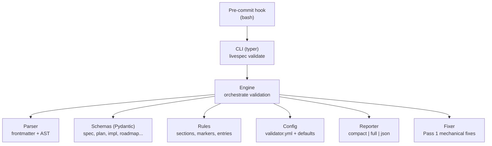

# Design: Layer 1 — Structural Validation

> Standalone Python validator for LiveSpec `.specs/` files.
> Date: 2026-04-02

---

## Overview

A Python package (`validator/`) that validates `.specs/` Markdown files structurally: frontmatter schemas (Pydantic), required sections (Markdown AST), and type-specific rules (roadmap markers, changelog entries). Exposes a `livespec validate` CLI and a pre-commit hook.

## Architecture



### File Type Detection

```python
resolve_file_type(path, specs_root) -> str
```

Maps file path to type: `spec`, `plan`, `implementation`, `roadmap`, `changelog`, `stack`, `preflight`, `progress`, `constitution`, `project`, `unknown`.

### Validation Pipeline

Per file:
1. Parse frontmatter + body (python-frontmatter)
2. Validate frontmatter via Pydantic schema (per type)
3. Extract headings via mistune AST, check required sections
4. Run type-specific rules (roadmap markers, changelog regex, progress table, @spec anchors, mermaid blocks)
5. Compute display score: `max(0, 100 - errors*20 - warnings*5)` (informational only)

### Blocking

Binary: any error = exit 1 (unless `--warn-only`). Score is display-only, never used for blocking.

## Schemas

| Type | Frontmatter | Required Sections | Special Rules |
|---|---|---|---|
| spec | title, status, priority, created, updated | Stories, AC, FR, Edge Cases | — |
| plan | title, spec_ref, created | Summary, Implementation, Testing, Risks | >=1 mermaid block |
| implementation | title, feature | Requirement Mapping, AC | >=1 @spec anchor |
| roadmap | (none) | — | 4 HTML marker pairs |
| changelog | (none) | — | >=1 entry `## YYYY-MM-DD — [Type]: Desc` |
| stack | title, updated | Stack, Rationale | — |
| preflight | (none) | Tooling, Auth, Tokens | — |
| progress | (none) | — | table with "Step" column |
| constitution/project | (none) | — | >100 chars, no [TBD]/[PLACEHOLDER]/[TODO] |

## Auto-fix Pass 1

Deterministic, zero-token corrections:

| Error | Fix |
|---|---|
| Invalid status | → `Draft` |
| updated < created | → today |
| Missing created/updated | → mtime / today |
| Empty title | → from folder name |
| Missing priority | → `P2` |
| Missing required section | → skeleton `## Section\n\n*A compléter.*` |
| Missing roadmap markers | → empty marker pairs |
| [TBD]/[PLACEHOLDER]/[TODO] in constitution/project | NOT fixed (WARNING only, human correction required) |

Re-validates after fixes. Rollback if fix introduces new errors. `.bak` backup before modification.

## Auto-fix Pass 2 (deferred)

Pass 2 is fully specified in `docs/future/layer1-structural-validation.md` (Section 9) but deliberately deferred from this implementation. It requires Claude SDK (`anthropic` package) and API key management.

`--smart` flag is defined in the CLI but raises `NotImplementedError` with message: "Pass 2 (Claude SDK) not implemented in this release. Remove --smart flag."

## CLI

```
livespec validate [PATH]           # all .specs/ or specific path
livespec validate --staged         # git staged files only
livespec validate --format compact|full|json
livespec validate --warn-only      # don't block
livespec validate --score-only     # scores only
livespec validate --fix            # Pass 1 mechanical
livespec validate --fix --smart    # raises NotImplementedError (deferred)
livespec validate --fix --auto     # skip confirmation (for pipelines)
livespec validate --fix --dry-run  # preview fixes
livespec validate --list-excluded  # show excluded files
livespec install-hook [--target-dir PATH]  # install pre-commit hook
```

`--staged` and positional PATH are mutually exclusive.

## Config

`validator.yml` (optional):

```yaml
version: 1
block_on: error           # or "warning" — blocks on warnings too
validate: [spec, plan, implementation, roadmap, changelog, stack, preflight, progress]
exclude: [".specs/README.md", ...]
```

Without config: hardcoded exclusions (README, preflight-report, ADRs, logs, checks, baselines, archive, design, testing, hooks).

JSON output includes `excluded` array for CI debugging.

## Reporter

- **compact**: one-line per file + error count (hook default)
- **full**: grouped errors/warnings per file with categories `[frontmatter]`, `[section]`, `[rule]`
- **json**: machine-readable with `errors`, `warnings`, `score`, `excluded` arrays

## Pre-commit Hook

Bash script. Only runs if `.specs/` exists and `livespec` is in PATH. Validates staged `.specs/*.md` files. Graceful exit 0 if tool not installed.

## File Structure

```
validator/
├── __init__.py
├── cli.py              # typer app
├── engine.py           # orchestrator
├── parser.py           # frontmatter + AST extraction
├── config.py           # validator.yml loading + defaults
├── reporter.py         # compact/full/json output
├── fixer.py            # Pass 1 mechanical fixes
├── schemas/
│   ├── __init__.py
│   ├── base.py         # BaseFrontmatter
│   ├── spec.py
│   ├── plan.py
│   ├── implementation.py
│   ├── roadmap.py
│   ├── changelog.py
│   ├── stack.py
│   ├── progress.py
│   ├── preflight.py
│   └── generic.py      # constitution, project
├── rules/
│   ├── __init__.py
│   ├── sections.py     # required section validation
│   ├── roadmap_markers.py
│   └── changelog_entries.py
└── hooks/
    └── pre-commit-hook
tests/
├── conftest.py
├── fixtures/           # valid + invalid .md files per type
├── test_parser.py
├── test_schemas.py
├── test_rules.py
├── test_engine.py
├── test_cli.py
├── test_fixer.py
└── test_config.py
pyproject.toml
```

## Dependencies

```toml
[project]
name = "livespec-validator"
version = "0.1.0"
requires-python = ">=3.11"
dependencies = [
    "pydantic>=2.7",
    "python-frontmatter>=1.1",
    "mistune>=3.0",
    "rich>=13.0",
    "typer>=0.12",
    "pyyaml>=6.0",       # direct use for validator.yml parsing
]

[project.scripts]
livespec = "validator.cli:app"
```

---

*Generated by auto-brainstorm — LiveSpec Layer 1*
