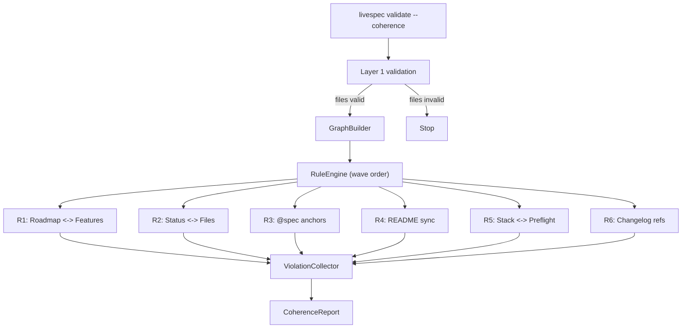

# Design: Layer 2 — Coherence Validation

> Inter-file coherence validation for LiveSpec .specs/ files.
> Date: 2026-04-02

---

## Overview

Extends the validator package with `validator/coherence/` — builds an in-memory SpecGraph from .specs/ and runs 14 coherence rules (R1-R6) organized in 3 waves.

## Architecture



## Data Model — SpecGraph

```python
@dataclass
class RoadmapItem:
    name: str
    slug: str
    checked: bool
    link: str | None
    line_number: int

@dataclass
class FeatureInfo:
    dir_name: str
    num: int
    slug: str
    files: dict[str, bool]  # spec, plan, implementation, progress, changelog
    status: str | None
    spec_anchors: list[str]  # FR-xxx, AC-xxx from implementation.md
    spec_mtime: float | None  # for suppress_if_creating

@dataclass
class SpecGraph:
    roadmap: list[RoadmapItem]
    features: list[FeatureInfo]
    readme_entries: list[str]  # feature dir names referenced in README
    readme_statuses: dict[str, str]  # dir_name -> status text
    stack_technologies: list[str]
    preflight_checks: list[str]
    changelog_refs: list[str]  # feature dir names referenced in changelog
```

GraphBuilder reads .specs/ lazily: metadata pass first (frontmatter only), full content only for rules that need it (R3, R6).

## Rule Interface

```python
class CoherenceRule(Protocol):
    rule_id: str
    description: str
    wave: int

    def check(self, graph: SpecGraph) -> list[Violation]:
        ...

@dataclass
class Violation:
    rule_id: str
    severity: Severity  # ERROR | WARNING | INFO
    message: str
    context: dict
    fix_hint: str | None
    suppress_if_creating: bool
```

## Rules (14 sub-rules across 6 groups)

| Rule | ID | Severity | Wave | suppress_if_creating |
|---|---|---|---|---|
| Feature roadmap sans dossier | R1.1 | ERROR | 1 | no |
| Dossier orphelin | R1.2 | WARNING | 1 | yes |
| Status <-> marqueur roadmap | R1.3 | ERROR | 1 | yes |
| Item checke sans lien | R1.4 | WARNING | 1 | no |
| Fichier requis absent | R2.1 | ERROR | 1 | yes |
| Fichier avance pour status bas | R2.2 | WARNING | 1 | no |
| Status invalide | R2.3 | ERROR | 1 | no |
| Chemin source introuvable | R3.1 | WARNING | 2 | no |
| Ancre @spec absente | R3.2 | INFO | 3 | no |
| Feature README absente | R4.1 | ERROR | 1 | no |
| Feature disque absente README | R4.2 | WARNING | 1 | yes |
| Status README desynchronise | R4.3 | WARNING | 1 | yes |
| Stack sans check preflight | R5.1 | INFO | 3 | no |
| Feature changelog inexistante | R6.1 | WARNING | 2 | no |

## suppress_if_creating

`mtime(spec.md) < 30min` → violations with `suppress_if_creating=True` are promoted to INFO with tag `[in-progress, Nmin]`. Disabled with `--no-suppress`. CI should use `--no-suppress` or `--strict`.

## Wave Execution Order

RuleEngine runs waves sequentially (1→2→3). ViolationCollector is shared — later rules can check if a feature was already flagged by earlier waves. R3 skips features flagged by R2 (missing files).

## CLI Extensions

```
livespec validate --coherence          # Layer 1 + Layer 2
livespec validate --coherence-only     # Layer 2 only
livespec validate --rules R1,R2        # Specific rules
livespec validate --ignore R3.2,R5.1   # Ignore rules
livespec validate --wave 1             # Wave 1 only
livespec validate --strict             # Block on ERROR
livespec validate --no-suppress        # Disable suppress_if_creating
```

## Reporting

Console output grouped by rule group (R1, R2, etc.) with severity colors. JSON output includes violations array, suppressed count, graph summary.

## File Structure

```
validator/coherence/
├── __init__.py
├── graph_builder.py      # Builds SpecGraph from disk
├── rule_engine.py        # Orchestrates rules by wave
├── violation.py          # Violation, Severity, CoherenceRule Protocol
├── report.py             # Console + JSON formatting
└── rules/
    ├── __init__.py       # ALL_RULES registry
    ├── r1_roadmap_features.py
    ├── r2_status_files.py
    ├── r3_spec_anchors.py
    ├── r4_readme_sync.py
    ├── r5_stack_preflight.py
    └── r6_changelog_refs.py
tests/
├── test_graph_builder.py
├── test_coherence_rules.py
├── test_rule_engine.py
└── test_coherence_cli.py
```

---

*Generated by auto-brainstorm — LiveSpec Layer 2*
