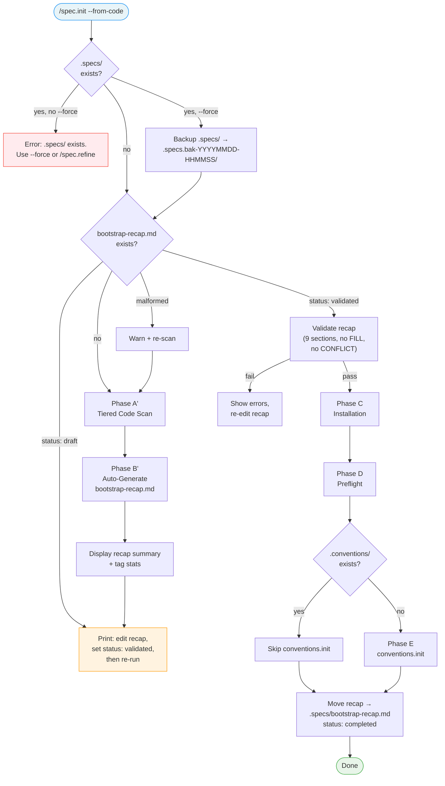
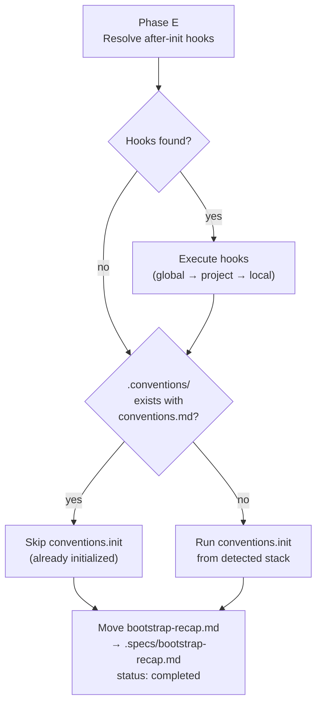

# Design: spec.init --from-code

> Reverse engineering an existing codebase into a full LiveSpec `.specs/` structure.
> Generated: 2026-04-02

---

## Problem

`spec.init` creates `.specs/` for **new** projects via a 3-phase conversational brainstorm. Existing projects with established codebases cannot use it — they need to go from **code to specs**, not from questions to specs.

## Solution

A `--from-code` flag on `spec.init` that:
1. Scans the repository to understand the project
2. Auto-generates answers to the same 6 brainstorm questions
3. Auto-detects the stack (skipping the decision tree)
4. Produces a `bootstrap-recap.md` draft the human reviews in one pass
5. Feeds the validated recap into the standard Phase C/D/E pipeline



---

## Phase A' — Tiered Code Scan

Replaces the conversational brainstorm (6 questions). The LLM scans the repo and auto-generates answers.

### Tier System

| Tier | What | How | Budget cap |
|---|---|---|---|
| **1 — Manifests** | `package.json`, `go.mod`, `pyproject.toml`, `Cargo.toml`, `composer.json`, `Gemfile`, `pom.xml`, `build.gradle` | Read in full | 12K tokens max |
| **2 — Structure** | README (first 100 lines), main entrypoints, directory tree (`ls -R` depth 3, ignoring node_modules/dist/.git) | Read with caps | 12K tokens max |
| **3 — Deep** | Route definitions, DB schemas/migrations, test describe blocks, component directories | Targeted grep only | Remaining budget |
| **4 — History** _(only with `--deep`)_ | `git log --oneline -50`, CI configs (`.github/workflows/`, `.gitlab-ci.yml`), `.env.example` | Read with caps | +30K extra budget |

**Token budget:** 30K default, 60K with `--deep`. Waterfall model — Tier 1 reads what it needs, remaining flows to Tier 2, then Tier 3.

**Overflow handling:** If any tier exceeds its cap, truncate by file modification date (most recent first). Log skipped files in the recap under `## Analysis Coverage`.

### Manifest Detection Patterns

```
package.json       → Node.js / JavaScript / TypeScript ecosystem
go.mod             → Go ecosystem
pyproject.toml     → Python ecosystem
Cargo.toml         → Rust ecosystem
composer.json      → PHP ecosystem
Gemfile            → Ruby ecosystem
pom.xml            → Java / Maven ecosystem
build.gradle       → Java / Kotlin / Gradle ecosystem
pubspec.yaml       → Dart / Flutter ecosystem
*.csproj           → .NET ecosystem
```

### Entrypoint Detection

Scan in order, stop at first match per category:

| Category | Patterns |
|---|---|
| Server | `src/index.ts`, `src/main.ts`, `src/server.ts`, `src/app.ts`, `main.go`, `cmd/*/main.go`, `app.py`, `main.py` |
| Frontend | `src/App.tsx`, `src/App.vue`, `src/App.svelte`, `app/layout.tsx`, `pages/_app.tsx` |
| CLI | `bin/*`, files with `#!/usr/bin/env` shebang |
| Config | `next.config.*`, `vite.config.*`, `astro.config.*`, `wrangler.toml`, `vercel.json`, `Dockerfile` |

### Deep Scan Grep Patterns

| Signal | Grep pattern | Confidence |
|---|---|---|
| API routes | `router\.(get\|post\|put\|delete)`, `app\.(get\|post)`, `@Get\|@Post`, `func.*Handler` | OBSERVED |
| DB schemas | `CREATE TABLE`, `model.*{`, `schema\.`, `@Entity`, `type.*struct.*gorm` | OBSERVED |
| Auth | `auth`, `login`, `session`, `jwt`, `passport`, `supabase.auth`, `clerk` | INFERRED |
| Payments | `stripe`, `payment`, `billing`, `invoice`, `subscription` | INFERRED |
| Real-time | `websocket`, `socket.io`, `realtime`, `sse`, `EventSource`, `useChannel` | OBSERVED |
| Testing | `describe\(`, `test\(`, `it\(`, `func Test`, `@Test`, `pytest` | OBSERVED |

### Auto-Answering the 6 Questions

The LLM uses scan results to answer each question. Format depends on confidence:

| Question | Primary signal source | Typical confidence |
|---|---|---|
| **Q1: What are you building?** | README + entrypoints + package description | INFERRED |
| **Q2: Who uses it?** | Auth patterns, role references, admin routes | INFERRED/SPECULATIVE |
| **Q3: Where do they use it?** | Frontend framework detection, mobile config | OBSERVED/INFERRED |
| **Q4: What needs to be real-time?** | WebSocket/SSE grep results | OBSERVED |
| **Q5: Where are users geographically?** | Deploy config, CDN setup, i18n files | INFERRED/SPECULATIVE |
| **Q6: Scale and budget?** | CI config, infra files, .env patterns | SPECULATIVE |

**Format rule:**
- `[OBSERVED]` / `[INFERRED]` → affirmation: "Your project is a task management API built with Express and PostgreSQL."
- `[SPECULATIVE]` → question: "Is this project primarily targeting individual developers or teams?"

---

## Phase B' — Auto Stack Detection

Replaces the interactive decision tree. The stack is extracted directly from the code.

### Detection Logic

1. Read all Tier 1 manifests
2. Extract dependencies with versions
3. Map to stack layers:

| Layer | Detection source |
|---|---|
| Language | Manifest type + file extensions |
| Framework | Dependencies (express, next, django, gin, etc.) |
| Database | Dependencies (pg, mysql2, prisma, drizzle, mongoose) + schema files |
| Auth | Dependencies (passport, clerk, supabase, auth0) + auth file patterns |
| Deploy | Config files (vercel.json, wrangler.toml, Dockerfile, fly.toml) |
| Testing | Dependencies (vitest, jest, pytest, go test) + test file patterns |
| Package Manager | Lock file (bun.lockb, pnpm-lock.yaml, package-lock.json, yarn.lock) |
| Linter/Formatter | Config files (.eslintrc, biome.json, .prettierrc) + dependencies |

### Conflict Handling

When conflicting signals are detected (e.g., both Jest and Vitest in dependencies):

```markdown
## Detected Stack

| Layer | Choice | Evidence | Tag |
|---|---|---|---|
| Testing | Jest + Vitest | [OBSERVED-CONFLICT] | Both in devDependencies. Jest: 45 test files. Vitest: 12 test files. |
```

The `[OBSERVED-CONFLICT]` tag flags it for human resolution in the recap.

### ADR Generation

Generate one ADR per major stack choice as "observed":

```markdown
# ADR-001: Express as HTTP framework

- **Date:** 2026-04-02
- **Status:** Observed (from existing codebase)
- **Context:** Project uses Express 4.18 as HTTP server framework.
- **Evidence:** package.json dependency, 23 route files in src/routes/
- **Alternatives in ecosystem:** Fastify, Hono, Koa
- **Note:** This ADR documents an observed choice, not a deliberate decision.
  Rationale was not available from the codebase.
```

### Polyglot Projects

When multiple manifest types are detected:

```markdown
## Detected Stack

### Stack 1: Node.js 20 (package.json)
[OBSERVED] Express 4.18, Prisma 5.x, React 18, TypeScript 5.4

### Stack 2: Go 1.22 (go.mod)
[OBSERVED] Chi router, sqlc, PostgreSQL driver

### Domain roles
[INFERRED] Stack 1 appears to be the web frontend + API layer.
[INFERRED] Stack 2 appears to be a background worker/CLI tool.

> Review and correct the domain role assignments above.
```

---

## bootstrap-recap.md — Format Specification

### Location

Project root during editing phase. Moved to `.specs/bootstrap-recap.md` after Phase C completion.

### Structure

```yaml
---
generated: 2026-04-02
status: draft  # draft → validated (by human) → completed (after Phase C)
project_name: "detected-project-name"
from_code: true
deep: false  # true if --deep was used
analysis_tokens: 24500  # actual tokens consumed by scan
---
```

```markdown
# Bootstrap Recap: [Project Name]

> Auto-generated by `spec.init --from-code` on 2026-04-02.
> Review each section. Edit what's wrong. Set `status: validated` when done.
>
> Tag legend:
> - `[OBSERVED]` — direct evidence in code (high confidence)
> - `[INFERRED]` — deduced from patterns (medium confidence, review recommended)
> - `[SPECULATIVE]` — hypothesis without strong signal (review required)
> - `[OBSERVED-CONFLICT]` — conflicting evidence found (resolution required)

---

## Project Vision

[INFERRED] Your project is a task management API...

**The core problem it solves:**
[INFERRED] ...

**Success in 2 years looks like:**
[SPECULATIVE] Is this project aiming for...?

---

## Users & Roles

| Role | Description | Access Level | Key Needs | Tag |
|---|---|---|---|---|
| User | Standard user | Full (own data) | ... | [INFERRED] |
| Admin | System administrator | Full admin | ... | [INFERRED] |

> [SPECULATIVE] Are there other roles not reflected in the codebase?

---

## Platforms

[OBSERVED] Web application (React frontend detected).
[INFERRED] No mobile-specific configuration found — desktop-primary assumed.

---

## Real-Time Needs

| Feature | Real-Time? | Evidence | Tag |
|---|---|---|---|
| Notifications | Yes | socket.io in dependencies, /ws route | [OBSERVED] |

> [SPECULATIVE] Are there other features that need real-time updates?

---

## Geography

[SPECULATIVE] No deploy configuration or i18n files detected. Where are your users?
- **User locations:** [FILL]
- **Data residency:** [FILL]

---

## Scale & Budget

[SPECULATIVE] No scale indicators found in configuration.
- **Expected users (year 1):** [FILL]
- **Expected users (year 3):** [FILL]
- **Infra budget:** [FILL]

---

## Detected Stack

| Layer | Choice | Version | Evidence | Tag |
|---|---|---|---|---|
| Language | TypeScript | 5.4 | tsconfig.json, .ts files | [OBSERVED] |
| Framework | Express | 4.18 | package.json | [OBSERVED] |
| Database | PostgreSQL | — | prisma/schema.prisma | [OBSERVED] |
| ORM | Prisma | 5.x | package.json + schema | [OBSERVED] |
| Auth | — | — | No auth library detected | [SPECULATIVE] |
| Testing | Vitest | 1.x | package.json + 34 test files | [OBSERVED] |
| Deploy | — | — | No deploy config found | [SPECULATIVE] |
| Package Manager | bun | 1.x | bun.lockb present | [OBSERVED] |
| Linter | Biome | 1.x | biome.json | [OBSERVED] |

---

## Inferred Features

Features detected from code patterns:

- [x] **User Authentication** — [INFERRED] login/register routes + session middleware · Scope: M
- [x] **Task CRUD** — [OBSERVED] full REST routes in src/routes/tasks.ts · Scope: M
- [x] **Real-time Notifications** — [OBSERVED] socket.io setup · Scope: S
- [ ] **Admin Dashboard** — [SPECULATIVE] admin role exists but no admin routes found · Scope: M
- [ ] **Search** — [SPECULATIVE] no search implementation detected · Scope: S

> Checked items = detected in code. Unchecked = gaps/enhancements.
> Edit this list: remove false positives, add missing features, adjust scope.

---

## Proposed Roadmap

### Implemented (detected in code)
- [x] **User Authentication** — login, register, session · Scope: M
- [x] **Task CRUD** — full REST API · Scope: M
- [x] **Real-time Notifications** — WebSocket push · Scope: S

### MVP (gaps to fill)
- [ ] **Admin Dashboard** — admin routes + moderation UI · Scope: M · Deps: auth

### Post-MVP
- [ ] **Search & Filtering** — task search with filters · Scope: S

### Future
> No items inferred. Add future plans here.

---

## Analysis Coverage

| Tier | Files scanned | Files skipped | Tokens used |
|---|---|---|---|
| 1 — Manifests | 1 (package.json) | 0 | 850 |
| 2 — Structure | 4 (README, src/index.ts, dir tree, tsconfig) | 0 | 3,200 |
| 3 — Deep | 12 grep patterns | 0 | 8,400 |
| **Total** | | | **12,450 / 30,000** |
```

### Parsing Anchors

The following H2 headings are **required** and used as parsing anchors by Phase C:

1. `## Project Vision` → feeds `project.md` Vision section
2. `## Users & Roles` → feeds `project.md` Users table
3. `## Platforms` → feeds `project.md` Constraints (target platforms)
4. `## Real-Time Needs` → feeds `project.md` Real-Time Requirements table
5. `## Geography` → feeds `project.md` Geographic Requirements
6. `## Scale & Budget` → feeds `project.md` Constraints (scale, budget)
7. `## Detected Stack` → feeds `stacks/_default.md`
8. `## Inferred Features` → feeds `roadmap.md`
9. `## Proposed Roadmap` → feeds `roadmap.md` tier sections

### Validation Rules

Before proceeding to Phase C, verify:
- [ ] YAML frontmatter parseable with `status: validated`
- [ ] All 9 H2 sections present
- [ ] `## Project Vision` is not empty
- [ ] `## Users & Roles` has at least 1 role row
- [ ] `## Detected Stack` has at least 1 row
- [ ] No `[FILL]` markers remain (human must have addressed them)
- [ ] No `[OBSERVED-CONFLICT]` tags remain (human must have resolved them)

If validation fails: show specific error and re-prompt.

---

## Continuation Mechanism

`spec.init --from-code` is **idempotent**:

| State | Behavior |
|---|---|
| No `bootstrap-recap.md`, no `.specs/` | Generate recap from code scan |
| `bootstrap-recap.md` exists, `status: draft` | Print: "Edit the recap and set status to validated, then re-run." |
| `bootstrap-recap.md` exists, `status: validated` | Proceed to Phase C |
| `.specs/` exists, no `--force` | Error: ".specs/ already exists" |
| `.specs/` exists, `--force` | Backup to `.specs.bak-YYYYMMDD-HHMMSS/`, then proceed |

---

## Scan Quality Gate

After Phase A' completes and before generating the recap, evaluate scan quality:

| Populated sections (OBSERVED or INFERRED) | Action |
|---|---|
| < 3, OR missing both "Project Vision" and "Detected Stack" | **Abort**: "Insufficient signal. Use `spec.init` without --from-code, or add a README to improve detection." |
| 3-5 sections | **Warn**: "Low coverage — N sections need manual input." Proceed, mark gaps as `[FILL]`. |
| 6+ sections | **Proceed** normally |

**Hard requirement:** `## Project Vision` and `## Detected Stack` must both have at least INFERRED content. If either is empty, abort regardless of total count.

---

## Phase C/D/E Pipeline

After the recap is validated, the standard init pipeline runs with minor adaptations.

### Phase C — Installation

Creates `.specs/` directory structure. Reads the validated recap to populate:

| Recap section | Target file |
|---|---|
| Project Vision + Users + Platforms + Real-Time + Geography + Scale | `.specs/project.md` (project-template.md) |
| Detected Stack | `.specs/stacks/_default.md` (with `updated` frontmatter) |
| Stack ADRs | `.specs/stacks/decisions/ADR-NNN-*.md` |
| Proposed Roadmap | `.specs/roadmap.md` (roadmap-template.md) |

Also creates: `spec-system.md` (verbatim copy), `testing/strategy.md`, `README.md`, `hooks/`, `design/`, `changelog.md`.

**Constitution generation:** `.specs/constitution.md` is generated from the recap's Project Vision (architecture style) + Detected Stack (technology constraints) + any architecture patterns inferred from the codebase structure (monolith vs microservices, API-first, event-driven, etc.). The LLM synthesizes these into architecture principles using `system/constitution-template.md`.

**Design tool check (Step 3.5):** Runs identically to standard init. If `~/.claude/livespec/design.md` exists, use it. If not, prompt the design gate. The `--from-code` flag does not skip this step — the user needs a design tool decision regardless of how specs were generated.

Touches existing project files **only**:
- `CLAUDE.md` — idempotent LiveSpec section between markers
- `.gitignore` — append `.specs/hooks/*.local.md` if not present

**Never modifies:** package.json, tsconfig, eslint, CI, or any project config.

### Phase D — Preflight

Generates preflight manifest from detected stack. **Validates** existing tools — does not install or configure. If a tool is already installed, the check passes.

### Phase E — Post-Init Hooks (with convention guard)

Phase E runs the standard hook resolution mechanism from init.md (scan 3 levels for `after-init` hooks). The only modification: the convention guard.



The convention guard prevents double-initialization when `--from-code` is used on a project that already has `.conventions/` set up.

---

## Flags

| Flag | Short | Behavior |
|---|---|---|
| `--from-code` | `-f` | Enable reverse engineering mode (scan code instead of brainstorm) |
| `--deep` | | Include Tier 4 scan (git log, CI, env). Budget: 60K tokens |
| `--force` | `-F` | Backup existing `.specs/` and proceed. Also overwrites existing `bootstrap-recap.md`. |
| `--auto` | `-a` | Combined with `--from-code`: skip human validation, proceed directly to Phase C. Tags remain in generated files as documentation. |
| `--dir [path]` | `-D` | Existing flag — install in specified directory |
| `--dry-run` | `-d` | Existing flag — show what would be created (short alias preserved) |

### Flag Interactions

| Combination | Behavior |
|---|---|
| `--from-code` alone | Scan → generate recap → wait for human → Phase C/D/E |
| `--from-code --auto` | Scan → generate recap → skip validation → Phase C/D/E immediately |
| `--from-code --deep` | Extended scan (Tier 4 included, 60K budget) |
| `--from-code --force` | Backup existing .specs/, then proceed |
| `--from-code --stack` | Warning: "--stack ignored in --from-code mode (stack detected from code)". Proceed without preset. |
| `--from-code --force` + recap exists | Re-scan codebase, overwrite existing `bootstrap-recap.md` |

---

## Edge Cases

| Case | Handling |
|---|---|
| Empty repo (no code files) | Error: "No source code detected. Use `spec.init` without --from-code." |
| Monorepo (15+ manifests) | Scan root + 5 most recent. Warn in `## Analysis Coverage`. |
| No README | Q1 (vision) tagged `[SPECULATIVE]` with generic answer |
| No tests found | Testing strategy generated with recommendations based on stack |
| Binary-only project | Error: "No parseable source code found." |
| `.brainstorm/` exists | `--from-code` ignores brainstorm data. Use regular `spec.init` for that path. |
| `bootstrap-recap.md` + `--force` | Re-scan the codebase, overwrite existing recap |
| All Q5/Q6 answers are SPECULATIVE | Valid — the recap just has more `[FILL]` markers for human |
| Corrupted/partial `bootstrap-recap.md` | If YAML frontmatter is unparseable or required H2 sections are missing: treat as "no recap", re-scan. Warn: "Existing recap is malformed — regenerating." |
| `.specs/` exists + `bootstrap-recap.md` at root | `--force` required to proceed. Backs up `.specs/`, then checks recap status normally. |
| User typos in YAML status field | If `status` is not exactly `draft` or `validated`: error with "Invalid status '[value]'. Set status to 'validated' to proceed." |
| `## Analysis Coverage` section | Informational only — not parsed by Phase C, not required for validation |

---

## Output Example

```
Scanning repository...
  Tier 1: 1 manifest (package.json) ................... 850 tokens
  Tier 2: 4 structure files ........................... 3,200 tokens
  Tier 3: 12 deep grep patterns ....................... 8,400 tokens
  Total: 12,450 / 30,000 tokens

Auto-generating project profile...
  Q1 Vision ........... [INFERRED]
  Q2 Users ............ [INFERRED] 2 roles detected
  Q3 Platforms ........ [OBSERVED] Web (React)
  Q4 Real-time ........ [OBSERVED] 1 feature (WebSocket)
  Q5 Geography ........ [SPECULATIVE]
  Q6 Scale ............ [SPECULATIVE]

Detecting stack...
  7 layers detected, 0 conflicts

Inferring features...
  3 implemented, 2 gaps detected

bootstrap-recap.md generated.

  Tags: 8 OBSERVED · 6 INFERRED · 4 SPECULATIVE · 0 CONFLICT
  Action required: 2 sections need manual input (Geography, Scale)

→ Edit bootstrap-recap.md, set status to "validated", then re-run:
  /spec.init --from-code
```

---

*Design spec for spec.init --from-code — LiveSpec v1.1*
