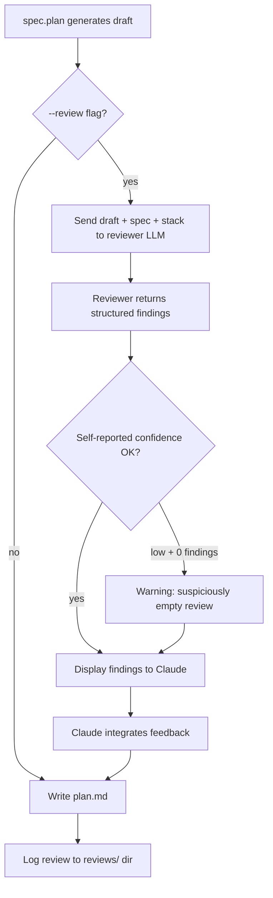

# LLM Plan Review — Design Spec

## Purpose

Add LLM-based technical review of plan substance before finalization. A second LLM (different from the generator) reviews the draft plan against the spec, stack, and constitution to catch coverage gaps, tech inconsistencies, ordering issues, and missing steps.

## Architecture



## Components

### 1. `validator/semantic/plan_review.py`

Core module. Functions:

- `review_plan(spec, plan, stack, constitution, model) -> PlanReviewResult` — sends adversarial prompt to LLM, returns structured findings
- `compute_plan_complexity(plan) -> PlanComplexity` — extracts FR count, file count, AC count, diagram count
- `log_review(result, plan_dir)` — saves review JSON to `{plan_dir}/reviews/`

Data structures:

- `ReviewFinding(category, severity, description, suggestion)` — single finding with free-form category
- `PlanReviewResult(findings, reviewer_model, confidence, complexity)` — full review result
- `PlanComplexity(fr_count, file_count, ac_count, diagram_count)` — plan metrics

### 2. `validator/semantic/config.py` extension

New fields on `SemanticConfig`:
- `review_reviewers: list[str]` — ordered list of reviewer model IDs (default: empty)
- `review_confidence_threshold: float` — below this with 0 findings = warning (default: 3)

### 3. CLI integration (`validator/cli.py`)

New flag `--plan-review` on `livespec validate`:
- Requires LLM provider
- Finds all features with plan.md + spec.md
- Runs review, displays findings
- Exit 1 if any blocking findings

### 4. Command integration (`commands/plan.md`)

New flag `--review` on `/spec.plan`:
- Advisory only (never blocks plan generation)
- Runs review after draft generation
- Claude reads findings and self-corrects before writing final plan.md

## Review Prompt Strategy

Adversarial prompt asking "where does this plan break?" not "is this plan good?":
- Coverage: which AC/FR from spec have no corresponding plan step?
- Stack: which tech choices contradict the configured stack?
- Ordering: which steps depend on outputs of later steps?
- Missing: what's obviously needed but not planned?
- Over-engineering: what's planned but not required by any FR?

## Config Example

```yaml
# .specs/semantic/config.yaml
review_reviewers:
  - google/gemini-3.1-pro
  - openai/gpt-5.4
review_confidence_threshold: 3
```

## Decisions

- Findings schema is flat (`findings[]` with `category: str`), not bucketed into fixed categories
- `--review` on spec.plan is advisory (exit 0), `--plan-review` on CLI is gate (exit 1)
- Multi-reviewer is explicit via `--all-reviewers`, default uses first configured reviewer
- No auto-correction — Claude reads findings and decides what to fix
- Reviews logged to `{feature_dir}/reviews/` for value tracking
