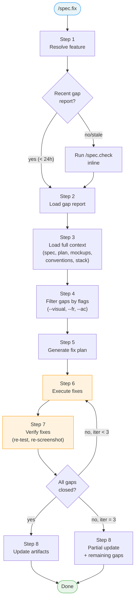

# Design: spec.fix + Brainstorm Design Import

**Date:** 2026-04-06
**Status:** Draft
**Scope:** New command (`spec.fix`) + brainstorm design import in `spec.init` + screen index template

---

## 1. Problem Statement

### 1.1 — No correction command

LiveSpec has a full pipeline: specify → plan → implement → test → check. But when `spec.check` reveals gaps (missing FR, visual drift, design divergence), the only options are:

- `spec.check --fix` — suggests fixes but doesn't execute them
- `spec.implement --resume` — resumes from progress.md, not from gap reports
- Manual correction — developer reads the gap report and fixes by hand

There's no command that says: "here's what's wrong, here's the reference (mockup, spec, plan), fix it and verify."

### 1.2 — Brainstorm design artifacts are orphaned

When a project uses `/auto-brainstorm` or `project-brainstorm` with a design tool (Pencil), the brainstorm produces:

```
.brainstorm/
├── mockups/
│   ├── ui.pen              <- design source file
│   ├── 01-screen-a.png     <- exported screens
│   ├── 02-screen-b.png
│   └── index.md            <- screen inventory
├── project-profile.md      <- IMPORTED by spec.init Phase A
└── 01-exploration.md ...   <- listed but not imported
```

Today `spec.init` imports `project-profile.md` into `.specs/project.md` but **ignores all design artifacts**. The `.pen` file and PNGs stay in `.brainstorm/` with no link to the spec pipeline.

### 1.3 — No screen index

`.specs/design/changelog.md` tracks history (who changed what screen, when). But there's no quick-reference index of **what screens currently exist** with their latest path. Commands like `spec.fix` and `spec.implement` need this to load visual context efficiently.

---

## 2. Non-Goals

| What | Why |
|------|-----|
| Modify specs (spec.md, plan.md) | spec.fix corrects **code** to match **specs**, not the reverse. Use `/spec.refine` to update specs |
| Modify mockups | Code adapts to design. If the mockup is wrong, update it manually or via `/spec.specify` |
| Create new FRs or ACs | spec.fix closes existing gaps, it does not expand scope. Use `/spec.specify` for new requirements |
| Replace `spec.implement` | spec.fix handles targeted gap closure, not full feature implementation from scratch |
| Replace `spec.check` | spec.fix is the execution complement, not a replacement. It needs a gap report to operate |

### Scope Boundaries

| Responsibility | spec.check | spec.fix | spec.implement | spec.test |
|----------------|-----------|----------|----------------|-----------|
| Detect gaps | **Primary** | Reuses check output | — | Detects test gaps |
| Suggest fixes | **Yes** (text) | — | — | — |
| Execute fixes | — | **Primary** | Full feature | Test generation |
| Visual comparison | Detect drift | **Fix drift** | Match mockup during build | Capture baselines |
| Update implementation.md | Optional | **Always** | Always | — |

---

## 3. Design Decisions

| Decision | Choice | Rationale |
|----------|--------|-----------|
| spec.fix: standalone vs mode of spec.check | **Standalone command** | Different posture (corrector vs auditor), different entry point (gap report vs full audit) |
| Gap report source | **Reuse latest `checks/YYYY-MM-DD.md`, fallback to inline spec.check** | Avoids redundant audit if recent report exists |
| Visual fix capability | **Yes — loads mockup PNGs, corrects code to match** | Core differentiator, fills the main pipeline gap |
| Fix loop | **Fix → re-test → re-screenshot → re-compare, max 3 iterations** | Visual fixes may need multiple passes to converge |
| Screen index | **`screens/index.md` separate from changelog** | Index = current state, changelog = history |
| Brainstorm import location | **spec.init Phase C, Step 3.6** | Phase A = text, Phase C = design, clean separation |
| .pen file handling | **Copy to `.specs/design/ui.<ext>`** | .brainstorm/ is archive, .specs/ must be self-contained |
| spec.specify fallback | **Detect unimported brainstorm assets before generating new mockups** | Handles cases where init was run before brainstorm had design |

---

## 3. Screen Index — `screens/index.md`

### 3.1 — Format

```markdown
# Screen Index

> Current state of all design screens. Auto-maintained by LiveSpec commands.
> For history, see [changelog.md](../changelog.md).

| Screen | Latest | Source | First Added | Last Modified |
|--------|--------|--------|-------------|---------------|
| dashboard | [dashboard.png](dashboard.png) | spec.specify (001-auth) | 2026-03-15 | 2026-04-01 |
| login | [login.png](login.png) | Brainstorm import | 2026-03-10 | 2026-03-10 |
| settings | [settings.png](settings.png) | spec.specify (003-settings) | 2026-04-01 | 2026-04-01 |
```

### 3.2 — Fields

| Field | Description |
|-------|-------------|
| Screen | Screen name (kebab-case, matches filename without extension) |
| Latest | Link to the latest PNG in `screens/` |
| Source | How the screen entered the system: `Brainstorm import`, `spec.specify (NNN-name)`, `Manual` |
| First Added | Date when the screen first appeared |
| Last Modified | Date of the most recent update |

### 3.3 — Maintenance rules

| Command | Action on index |
|---------|----------------|
| `spec.init` (brainstorm import) | Create index with imported screens, Source = `Brainstorm import` |
| `spec.specify` | Add new screens / update Last Modified for modified screens, Source = `spec.specify (NNN-name)` |
| `spec.fix --visual` | Update Last Modified if mockup was regenerated |
| Manual addition | User adds row manually, Source = `Manual` |

### 3.4 — Template location

`system/templates/screen-index-template.md`

---

## 4. Brainstorm Design Import — spec.init Phase C

### 4.1 — Detection (new Step 3.6)

After Step 3.5 (Design Tool Check), add Step 3.6. This step has two parts:
- **Detection + confirmation** happens in Phase B context (Step 3.6 is after Step 3.5, still in the decision phase)
- **File copy** happens automatically during Phase C (Installation) alongside other file creation

This respects Phase C's "automatic" contract — all user decisions are made before Phase C starts.

```
Step 3.6 — Brainstorm Design Import
```

**Detection logic:**

1. Check if `.brainstorm/mockups/` directory exists
2. If not, check if `.brainstorm/ui.pen` (or `ui.fig`, `ui.excalidraw`, `ui.html`) exists at root
3. If neither → skip silently
4. If found:
   a. Glob `.brainstorm/mockups/*.png` (or `.brainstorm/*.png` if no `mockups/` dir)
   b. Check for `.brainstorm/mockups/index.md` (or `.brainstorm/index.md`)
   c. Check for `.brainstorm/mockups/ui.<ext>` (or `.brainstorm/ui.<ext>`)
   d. Display import summary and proceed

**Design file detection order** (check each, take first match):

```
.brainstorm/mockups/ui.pen
.brainstorm/mockups/ui.fig
.brainstorm/mockups/ui.excalidraw
.brainstorm/mockups/ui.html
.brainstorm/ui.pen
.brainstorm/ui.fig
.brainstorm/ui.excalidraw
.brainstorm/ui.html
```

**PNG detection order:**

```
.brainstorm/mockups/*.png    (preferred — dedicated mockups dir)
.brainstorm/*.png            (fallback — PNGs at brainstorm root)
```

### 4.2 — Import summary format

```
🎨 Brainstorm design artifacts detected:

  📄 Source file: .brainstorm/mockups/ui.pen
  🖼️  Screens: 5 PNGs found
     • 01-dashboard.png
     • 02-login.png
     • 03-settings.png
     • 04-profile.png
     • 05-onboarding.png
  📋 Index: .brainstorm/mockups/index.md

  → Import into .specs/design/? (recommended — design assets become part of the spec pipeline)
  → Skip? (you can import later with /spec.specify)
```

### 4.3 — Import procedure (on confirmation)

1. **Copy design source file:**
   - Copy `.brainstorm/mockups/ui.<ext>` → `.specs/design/ui.<ext>`
   - If `~/.claude/livespec/design.md` exists, verify extension matches configured tool
   - If extension mismatch → warn but still copy

2. **Export screens via MCP** (preferred) or copy PNGs (fallback):
   - If MCP available for the design tool → open `.specs/design/ui.<ext>`, export each screen as PNG to `.specs/design/screens/<screen-name>.png`
   - If MCP not available → copy `.brainstorm/mockups/*.png` directly to `.specs/design/screens/`
   - Strip numeric prefix from filenames: `01-dashboard.png` → `dashboard.png`

3. **Generate screen index:**
   - Create `.specs/design/screens/index.md` from template
   - Populate with all imported screens, Source = `Brainstorm import`, dates = today

4. **Initialize design changelog:**
   - For each imported screen, add a section to `.specs/design/changelog.md`:
     ```markdown
     ## dashboard

     | Spec | Date | Mockup | Notes |
     |------|------|--------|-------|
     | — | YYYY-MM-DD | [📸](screens/dashboard.png) | Imported from brainstorm |

     **Latest:** [dashboard.png](screens/dashboard.png)
     ```
   - Spec column = `—` (no feature spec yet, imported from brainstorm)

5. **Export PDF** (if MCP available):
   - Export full PDF to `.specs/design/ui.pdf`

### 4.4 — Flag interaction

| Flag | Behavior |
|------|----------|
| `--auto` | Auto-import without asking (brainstorm data is validated) |
| `--force` | Overwrite existing `.specs/design/ui.<ext>` if present |

### 4.5 — Artifact hierarchy

**PNG exports are the canonical design artifacts.** All downstream commands (`spec.fix`, `spec.check`, `spec.implement`, `spec.plan`) reference PNGs from `.specs/design/screens/`, never `.pen` files directly.

The `.pen` (or `.fig`, `.excalidraw`, `.html`) source file is an **optional editable source** stored alongside PNGs for re-editing via design tools. It is not required for the spec pipeline to function.

| Artifact | Role | Required? | Referenced by |
|----------|------|-----------|---------------|
| `screens/*.png` | Canonical design reference | **Yes** | spec.fix, spec.check, spec.implement, spec.plan |
| `ui.<ext>` | Editable source file | No | spec.specify (for regeneration via MCP) |
| `ui.pdf` | Full export for humans | No | — |

### 4.6 — Post-import rule

After import, `.brainstorm/` is **never referenced again** by any LiveSpec command. All downstream commands read exclusively from `.specs/design/`.

---

## 5. Brainstorm Fallback in spec.specify

### 5.1 — When it triggers

In `spec.specify` Step 5.5 (Generate Mockups), before generating new mockups:

1. Check if `.specs/design/screens/` is empty or has no PNGs
2. If empty AND `.brainstorm/mockups/` (or `.brainstorm/*.png`) exists:
   - Display: "Design screens are empty but brainstorm mockups exist. Import first?"
   - On yes → run the same import procedure as spec.init Step 3.6
   - On no → proceed with new mockup generation

### 5.2 — Why this fallback exists

- User may have run `spec.init` before the brainstorm had design artifacts
- User may have skipped the import during init
- Brainstorm design may have been added after init

### 5.3 — Flag interaction

| Flag | Behavior |
|------|----------|
| `--auto` | Auto-import if brainstorm exists and screens/ is empty |

---

## 6. spec.fix Command

### 6.1 — Purpose

Targeted correction of implementation gaps identified by `spec.check`. Unlike `spec.check --fix` which suggests fixes, `spec.fix` **executes** them with full project context.

### 6.2 — Frontmatter

```yaml
---
description: "Fix implementation gaps from spec.check — functional and visual corrections"
argument-hint: "<feature-name>"
---
```

### 6.3 — Usage

```
/spec.fix                            → auto-detect feature, fix all gaps
/spec.fix feature-name               → fix all gaps for specific feature
/spec.fix feature-name --visual      → fix only visual/design divergence
/spec.fix feature-name --fr FR-003   → fix specific FR
/spec.fix feature-name --ac AC-002   → fix specific AC
/spec.fix feature-name --dry-run     → show what would be fixed without changing code
/spec.fix feature-name --resume      → resume interrupted fix session
/spec.fix --all                      → fix all features with gaps
```

### 6.4 — Overview flowchart



### 6.5 — Hooks

> **Before starting:** **Read** `before-fix` hooks from all 3 levels (skip missing files):
> 1. `~/.claude/livespec/hooks/before-fix.md`
> 2. `.specs/hooks/before-fix.md`
> 3. `.specs/hooks/before-fix.local.md` (if `mode: override` → use only this one)
>
> **After completing:** Same resolution with `after-fix` at all 3 levels.

### 6.6 — Preflight

Before Step 1, verify:

- [ ] `.specs/` directory exists
- [ ] At least one feature directory exists in `.specs/features/`
- [ ] If feature name provided: feature directory exists

If `.specs/` does not exist → error: "No spec system found. Run `/spec.init` first."
If no features → error: "No features found. Run `/spec.specify` first."

### 6.7 — Steps

#### Step 1 — Resolve Feature

Same logic as `spec.check` Step 3:
1. If feature name provided → find `.specs/features/NNN-feature-name/`
2. If no feature name → detect from current git branch (`feature/NNN-feature-name`)
3. If still ambiguous → list all features with status `Implemented` or `In Progress` and ask user to choose

#### Step 2 — Load or Generate Gap Report

1. Look for the most recent file in `.specs/features/NNN-feature-name/checks/`
2. **Staleness check** — report is fresh if ALL of these are true:
   - Report date is within the same calendar day (not 24h rolling — avoids confusion)
   - No commits touch files listed in `implementation.md` since the report date (`git log --since=<date> -- <files>`)
   - No commits touch `.specs/features/NNN/` since the report date (spec changes invalidate too)
   - If fresh → use existing gap report, display: `📋 Using gap report from YYYY-MM-DD (N gaps found)`
3. If not found or stale (report missing, from a previous day, or code/spec changed since):
   - Run `spec.check` inline (same logic as Steps 3-9 of check.md)
   - Save the gap report to `checks/YYYY-MM-DD.md`
   - Display: `📋 Fresh gap report generated (N gaps found)`
4. If gap report shows 0 gaps:
   - Display: `✅ No gaps found — nothing to fix`
   - Exit

#### Step 3 — Load Full Context

Read **all** of these before any fix attempt:

| File | Purpose |
|------|---------|
| `.specs/spec-system.md` | Universal rules |
| `.specs/project.md` | Project vision and constraints |
| `.specs/constitution.md` | Architecture principles |
| `.specs/stacks/_default.md` | Stack, patterns, conventions |
| `.specs/testing/strategy.md` | Testing approach |
| `.specs/features/NNN/spec.md` | What to build (FR, AC, user stories) |
| `.specs/features/NNN/plan.md` | How to build it (architecture, diagrams) |
| `.specs/features/NNN/implementation.md` | Where code is (FR→file mappings) |
| `.specs/features/NNN/progress.md` | Previous implementation state |
| `.specs/design/screens/index.md` | Current screen inventory |
| `.specs/design/screens/*.png` | Mockup PNGs (visual reference) |
| `.specs/features/NNN/baselines/*.png` | Current Playwright screenshots |
| `.conventions/conventions.md` | Code conventions (if exists) |

**Context loading is what differentiates spec.fix from manual correction.** The command has complete knowledge of what the code should do (spec), how it should be structured (plan, constitution), what it should look like (mockups), and what it currently looks like (baselines, implementation.md).

#### Step 4 — Filter Gaps

Parse the gap report and filter based on flags:

| Flag | Filter |
|------|--------|
| (none) | All gaps: ❌ Missing + ⚠️ Partial + 🖼️ Drift + 🎨 Diverged |
| `--visual` | Only: 🖼️ Drift + 🎨 Diverged (visual/design gaps) |
| `--fr FR-NNN` | Only the specified FR (and its dependent ACs) |
| `--ac AC-NNN` | Only the specified AC |
| `--functional` | Only: ❌ Missing FR/AC + ⚠️ Partial FR/AC (no visual) |

**Conflict detection (spec drift guard):**

Before fixing, check if the gap might be an intentional divergence:
- If code for a gap **passes all existing tests** but diverges from spec → flag as potential spec drift
- Display: `⚠️ FR-004 diverges from spec but tests pass. Fix code to match spec, or update spec via /spec.refine? [fix/refine/skip]`
- On "fix" → proceed with code fix
- On "refine" → skip this gap, suggest `/spec.refine` for the FR
- On "skip" → skip this gap
- With `--auto` → default to "fix" (spec is source of truth)

This prevents spec.fix from reverting intentional changes that were made without updating the spec.

Display filtered gap summary:

```
🔧 Fix plan for 004-notifications:

  Functional:
    ❌ FR-006: Mark all notifications as read
    ❌ AC-005: Mark all as read in single action
    ⚠️ FR-004: Navigate to notification target (no fallback for missing target_url)

  Visual:
    🎨 dashboard: 8.4% diverged from mockup
    🖼️ panel-unread: 4.2% drift from baseline

  Scope: 3 functional + 2 visual gaps → 5 total
```

#### Step 5 — Generate Fix Plan

For each gap, generate a targeted fix plan:

**Functional gaps (❌ Missing, ⚠️ Partial):**
1. Read the FR/AC definition from spec.md
2. Read the plan.md section covering this FR/AC
3. Read implementation.md to find related code locations
4. Identify specific files to create or modify
5. Generate implementation steps (same granularity as spec.implement)

**Visual gaps (🖼️ Drift, 🎨 Diverged) — analysis pipeline:**
1. Read the mockup PNG from `.specs/design/screens/` (design intent)
2. Read the current baseline PNG from `baselines/` (actual state)
3. Run pixel diff to identify regions of divergence and diff percentage
4. Feed both images + diff regions + component source code to LLM for visual reasoning:
   - What is different? (layout shift, color mismatch, missing element, spacing error)
   - Which component is responsible? (map to implementation.md)
   - What CSS/layout/props change would fix it?
5. Generate targeted correction steps (CSS property changes, component restructuring, prop adjustments)

Pixel diff alone identifies *that* something differs. LLM visual reasoning identifies *what* and *how to fix*. Both are required.

The fix plan is displayed but NOT saved to disk (it's ephemeral — the gap report is the persistent record).

#### Step 6 — Execute Fixes

Execute the fix plan. For each gap:

**Functional fixes:**
- Follow the same implementation rules as `spec.implement`:
  - Add `@spec` anchors for new code
  - Follow patterns from `stacks/_default.md`
  - Follow conventions from `.conventions/conventions.md`
  - Generate tests for new AC implementations
- Update `progress.md` with fix checkpoint

**Visual fixes:**
- Read the mockup PNG as visual target
- Read the component source code
- Modify CSS/layout/styling to match the mockup
- Reference the mockup explicitly: "Aligning `NotificationPanel.tsx` with mockup `panel-unread.png`"
- Match: layout structure, spacing, colors, typography, component hierarchy
- Do NOT modify the mockup — code adapts to design, not the other way

**Execution order:**
1. Functional fixes first (code changes may affect visual output)
2. Visual fixes second (after functional code is stable)

#### Step 7 — Verify Fixes

After all fixes are applied:

1. **Run tests:** Execute the resolved test commands from `plan.md` or `testing/strategy.md`
2. **Re-capture baselines:** For visual fixes, run Playwright to capture new screenshots
3. **Re-compare:**
   - Functional: verify `@spec` anchors exist, code compiles, tests pass
   - Visual regression: compare new baseline vs previous baseline (2% threshold)
   - Design fidelity: compare new baseline vs mockup PNG (5% threshold)
4. **Score results:**
   - ✅ Fixed — gap is closed
   - ⚠️ Improved — gap is smaller but not closed (e.g., diff dropped from 8% to 3%)
   - ❌ Still failing — gap persists

**Iteration logic (with early-exit):**
- If all gaps are ✅ Fixed → **exit loop**, proceed to Step 8
- If any visual diff **increased** between iterations (regression) → **exit loop**, revert that fix, proceed to Step 8 with partial results
- If any gap is ⚠️ Improved or ❌ Still failing AND iteration < max → retry Step 6 for remaining gaps only
- If iteration = max → proceed to Step 8 with partial results

#### Step 8 — Update Artifacts

1. **Update `implementation.md`:**
   - Add/update FR→code mappings for fixed FRs
   - Add/update AC→test mappings for fixed ACs
   - Update status column (✅ Implemented for fixed, ⚠️ Partial for improved)

2. **Update baselines:**
   - For visual fixes: copy new Playwright screenshots to `baselines/`
   - Update Visual Baselines table in `implementation.md`

3. **Update screen index:**
   - If mockups were regenerated, update Last Modified in `screens/index.md`

4. **Update changelogs:**
   - Feature changelog entry:
     ```markdown
     ### YYYY-MM-DD — Fix: [N] gaps closed ([M] functional, [K] visual)

     - **Type:** Bug Fix
     - **Spec modified:** No
     - **Code modified:** [list of modified files]
     - **Gaps closed:** [list of FR/AC IDs]
     - **Remaining:** [list of still-open gaps, or "None"]
     - **Author:** spec.fix
     ```
   - Global changelog entry:
     `[Feature NNN] Fix: N/M gaps closed (X% → Y% alignment)`

5. **Update gap report:**
   - Save updated gap report to `checks/YYYY-MM-DD.md` (overwrite today's if exists)
   - Mark fixed items as ✅ with fix date

6. **Update README.md:**
   - If all gaps closed and status was `In Progress` → update to `Implemented`

### 6.8 — Flags

| Flag | Short | Behavior |
|------|-------|----------|
| `--visual` | `-v` | Fix only visual/design gaps (🖼️ Drift + 🎨 Diverged) |
| `--functional` | `-f` | Fix only functional gaps (❌ Missing + ⚠️ Partial FR/AC) |
| `--fr FR-NNN` | | Fix specific FR and its dependent ACs |
| `--ac AC-NNN` | | Fix specific AC |
| `--dry-run` | `-d` | Show fix plan without executing |
| `--resume` | `-r` | Resume interrupted fix (reads progress.md) |
| `--no-loop` | `-1` | Single iteration, no retry loop |
| `--update` | `-u` | Auto-update implementation.md without asking |
| `--auto` | `-a` | Skip all confirmations |
| `--max-iter N` | | Override max iterations (default: 3) |
| `--all` | `-A` | Fix all features with gaps (multi-feature mode) |
| `--no-visual` | `-V` | Fix everything except visual gaps |

### 6.9 — Multi-Feature Mode (`--all`)

When `--all` is set:

1. Run `spec.check --all` to generate gap reports for all features
2. Filter features that have at least one gap
3. Execute Steps 3-8 for each feature sequentially
4. Produce a consolidated report at the end (same pattern as `spec.check` Step 11):

```markdown
## Consolidated Fix Report

| Feature | Gaps Before | Gaps After | Fixed | Remaining |
|---------|-------------|------------|-------|-----------|
| 001-auth | 3 | 0 | 3 | 0 |
| 004-notifications | 5 | 2 | 3 | 2 |

Total: 6/8 gaps closed (75%)
```

### 6.10 — Edge Cases

| Case | Behavior |
|------|----------|
| `--visual` but no mockups exist for feature | Warn: "No mockups found for NNN. Run `/spec.specify` to generate." Exit |
| `--visual` but no baselines exist | Warn: "No baselines found. Run `/spec.test` to capture." Exit |
| `--functional` but only visual gaps in report | Display: "No functional gaps found — N visual gaps exist. Use `--visual` to fix." Exit |
| `--visual` but only functional gaps in report | Display: "No visual gaps found — N functional gaps exist. Use `--functional` to fix." Exit |
| Filter yields 0 gaps | Display: "No matching gaps found." Exit |
| Feature has no implementation.md | Warn: "No implementation map found. Run `/spec.implement` first, or use `--force` to fix from spec+plan only." |
| Feature status is Draft or Planned | Warn: "Feature not yet implemented. Use `/spec.implement` instead." Exit |

### 6.11 — Definition of Done

`/spec.fix` is complete only if all are true:

- [ ] Gap report loaded or generated
- [ ] Full context loaded (spec, plan, mockups, conventions, stack)
- [ ] Fix plan generated and displayed
- [ ] Fixes executed (or dry-run displayed)
- [ ] Verification run (tests + visual comparison)
- [ ] `implementation.md` updated with new mappings
- [ ] Baselines updated (if visual fixes)
- [ ] Feature `changelog.md` has fix entry
- [ ] Global `.specs/changelog.md` has summary entry
- [ ] Gap report updated with fix results
- [ ] If all gaps closed: README status updated
- [ ] Remaining gaps (if any) clearly listed

### 6.12 — Error Reporting

```markdown
## spec.fix — Error Report

**Feature:** NNN-feature-name
**Date:** YYYY-MM-DD
**Iteration:** N/3

### Fixes Attempted

| Gap | Type | Status | Details |
|-----|------|--------|---------|
| FR-006 | ❌ Missing | ✅ Fixed | Implemented markAllRead endpoint + UI button |
| AC-005 | ❌ Missing | ✅ Fixed | E2E test added and passing |
| FR-004 | ⚠️ Partial | ⚠️ Improved | Fallback added, but edge case remains for null URLs |
| dashboard | 🎨 Diverged | ✅ Fixed | Layout aligned with mockup (diff: 8.4% → 1.2%) |
| panel-unread | 🖼️ Drift | ❌ Failed | Badge color still doesn't match (diff: 4.2% → 3.8%) |

### Remaining Gaps

- FR-004: null URL edge case — need spec clarification
- panel-unread: badge color — check if design system override is intentional

### Recovery

→ Fix specific gap: `/spec.fix notifications --fr FR-004`
→ Re-run visual: `/spec.fix notifications --visual`
→ Full re-check: `/spec.check notifications`
```

---

## 7. Impact on Existing Commands

### 7.1 — spec.check

No changes to spec.check itself. The `--fix` flag remains as-is (suggestion mode). `spec.fix` is the execution complement.

Add to Step 10 (Suggest Fixes) output:

```
→ To auto-fix these gaps: /spec.fix [feature-name]
→ To fix visual only: /spec.fix [feature-name] --visual
```

### 7.2 — spec.init

Add Step 3.6 after Step 3.5. No changes to other steps.

Update Phase C directory tree to include `screens/index.md`:

```
├── design/
│   ├── screens/
│   │   └── index.md        ← screen inventory (empty or from brainstorm import)
│   └── changelog.md
```

### 7.3 — spec.specify

Add brainstorm fallback detection before Step 5.5 sub-step 3 (Identify screens).

Add index maintenance: after exporting screens, update `screens/index.md`.

### 7.4 — spec-system.md

Add `spec.fix` to the command registry table.

Add `screens/index.md` to the design directory documentation.

---

## 8. Files to Create/Modify

| File | Action | Description |
|------|--------|-------------|
| `commands/fix.md` | **Create** | New spec.fix command (main deliverable) |
| `system/templates/screen-index-template.md` | **Create** | Screen index template |
| `commands/init.md` | **Modify** | Add Step 3.6 (brainstorm design import) |
| `commands/specify.md` | **Modify** | Add brainstorm fallback + index maintenance |
| `commands/check.md` | **Modify** | Add spec.fix suggestion in Step 10 |
| `system/spec-system.md` | **Modify** | Add spec.fix to registry + screens/index.md to design dir |
| `README.md` | **Modify** | Add spec.fix to command list |

---

*LiveSpec Design Spec v1.0*
