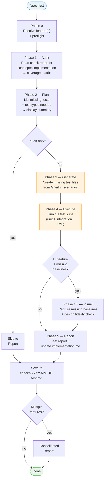

# Design: `/spec.test` — Test validation command

## Context

After `/spec.implement` or `/spec.ship`, there is no standalone command to:
1. Audit test completeness against specs (AC/FR coverage)
2. Generate missing tests from Gherkin scenarios
3. Execute the full test suite (unit, integration, E2E)
4. Capture missing visual baselines and verify design fidelity against mockups

Tests are currently embedded in `/spec.implement` phases 2/5/6, but there's no way to re-validate tests independently. `/spec.check` verifies spec↔code alignment statically but doesn't generate or execute tests.

**Lifecycle placement (flexible):**

```
specify → plan → implement → [TEST] → [check] → ship
```

`/spec.test` is typically run after `/spec.implement` (in `/spec.feature` Phase 3.5 or `/spec.ship` Step 3.5):
- **Before `/spec.check`** (typical): no check report exists — Phase 1 builds the coverage matrix from `spec.md` + `implementation.md` directly
- **After `/spec.check`** (optional): Phase 1 consumes the existing check report for faster audit

Both orders are valid. Choose based on whether you want to audit tests before or after verifying spec↔code alignment.

## Scope boundaries

| Responsibility | /spec.test | /spec.check | /spec.implement |
|---|---|---|---|
| Audit test coverage per AC | ✅ (consumes check report) | ✅ (produces gap report) | — |
| Generate missing test files | ✅ | — | ✅ (during TDD) |
| Execute test suite | ✅ | — | ✅ (per step) |
| Verify @spec anchors | — | ✅ | — |
| Verify code implements FR | — | ✅ | — |
| Run visual regression (existing baselines) | — | ✅ (Step 8, 2% threshold) | ✅ (Phase 5) |
| Execute visual tests (capture + fidelity) | ✅ (Phase 4.5, 5% threshold) | — | — |
| Capture missing baselines | ✅ | — | ✅ (Phase 5) |
| Generate visual test code | ✅ | — | — |
| Design fidelity (new baselines vs mockup) | ✅ (Phase 4.5, 5%) | — | — |
| Fix implementation code | — | — | ✅ |

## Design

### Command signature

```
/spec.test [feature-name] [flags]
```

### Pipeline



### Phase 0 — Resolve & Preflight

1. **Feature resolution** — same pattern as `/spec.check`:
   - If feature name provided → find `.specs/features/NNN-feature-name/`
   - If no name → detect from git branch, or interactive selection (multi-spec)
   - If `--all` → all features with status `Implemented` or `In Progress`

2. **Preflight checks** (blocking):
   - [ ] `.specs/` directory exists
   - [ ] Feature directory exists with `spec.md`
   - [ ] Resolved Test Commands available (in `plan.md` or `testing/strategy.md`)
   - [ ] Test framework binary available (verify with `--version`)

3. **If no Resolved Test Commands:**
   - Attempt discovery via `system/testing/discovery.md`
   - If still nothing → report "No test framework — cannot generate or execute tests. Run `/spec.plan` to resolve test commands." and exit with audit-only report.

4. **Non-testable features:**
   - If all FR are infrastructure-only (no executable code) → report "Infrastructure feature — no executable tests" and skip.
   - If 0 AC map to testable behavior → report "0 testable AC" and skip to visual phase (if UI) or exit.

### Phase 1 — Audit

**Goal:** Build a coverage matrix of what SHOULD be tested vs what IS tested.

**Data sources (in priority order):**

1. **Latest check report** — `checks/YYYY-MM-DD.md` (most recent). If available, extract AC status (✅/⚠️/❌) and test file references directly. This avoids re-scanning.
2. **If no check report exists**, build the matrix from:
   - `spec.md` → extract all AC (with Gherkin scenarios) and FR
   - `implementation.md` → extract AC→test file mappings
   - Source files → grep `@spec FR-NNN` anchors for FR→file mappings
3. **If inside /spec.ship agent** (lean mode) → read `progress.md` from just-completed implementation instead.

**Coverage matrix output:**

```markdown
## Test Coverage Audit: NNN-feature-name

| AC | Description | Test file | Test exists? | Gherkin source? |
|---|---|---|---|---|
| AC-001 | Unread count badge | tests/api/notifications.test.ts | ✅ Yes | ✅ Yes |
| AC-002 | Click marks read | tests/e2e/notifications.spec.ts | ✅ Yes | ✅ Yes |
| AC-003 | Disable email notifs | tests/api/notifications.test.ts | ⚠️ Partial | ✅ Yes |
| AC-004 | Immediate effect | — | ❌ Missing | ✅ Yes |
| AC-005 | Mark all as read | — | ❌ Missing | ✅ Yes |

**Coverage:** 2/5 fully covered (40%), 1 partial, 2 missing
```

**Visual audit** (UI features):

| Screen (from spec.md) | Baseline exists? | Visual test file exists? |
|---|---|---|
| login | ✅ baselines/login.png | ✅ tests/e2e/login.spec.ts |
| dashboard | ❌ Missing | ❌ Missing |

### Phase 2 — Plan

Display what will be generated before writing any code:

```markdown
## Test Generation Plan

### Tests to generate:

| # | AC | Type | Target file | From Gherkin |
|---|---|---|---|---|
| 1 | AC-004 | E2E | tests/e2e/notifications.spec.ts (append) | Scenario: "Preference change takes effect" |
| 2 | AC-005 | E2E | tests/e2e/notifications.spec.ts (append) | Scenario: "Mark all as read" |
| 3 | AC-003 | Unit | tests/api/notifications.test.ts (append) | Scenario: "Disable all email notifications" |

### Visual tests to generate:

| # | Screen | Target file | Action |
|---|---|---|---|
| 1 | dashboard | tests/e2e/dashboard.spec.ts (create) | New Playwright visual test |

### Tests to execute:
- Unit: `npx vitest run`
- E2E: `npx playwright test`
- Visual: `npx playwright test --grep visual`
- Lint: `npx eslint src/`
- Types: `npx tsc --noEmit`

→ Proceed? (yes / no / audit-only)
```

In `--auto` mode (from `/spec.feature` Phase 3.5 or `/spec.ship`), skip the confirmation prompt.

### Phase 3 — Generate

**Deduplication (TDD awareness):** When running after `/spec.implement` (typical in `/spec.feature` and `/spec.ship` pipelines), implementation may have already created tests via TDD. Phase 1 detects these as ✅ Covered or ⚠️ Partial. Phase 3 only generates tests for AC classified as ❌ Missing — it never overwrites or duplicates tests created during implementation.

**For each missing test identified in Phase 2:**

1. **Detect framework** from Resolved Test Commands:
   - `npx vitest` → Vitest
   - `npx playwright test` → Playwright
   - `pytest` → pytest
   - etc.

2. **Read existing test patterns** — find 1-2 test files from the same feature (or nearest feature) and extract:
   - Import style (`import { describe, it, expect } from 'vitest'`)
   - Helper/fixture patterns (`beforeEach`, `afterEach`, seed functions)
   - Assertion library (`expect`, `assert`)
   - File naming convention (`*.test.ts`, `*.spec.ts`)

3. **Translate Gherkin to test:**
   - `Given` → setup/arrange (beforeEach, seed data, navigate)
   - `When` → action/act (API call, click, form submit)
   - `Then` → assertion/assert (expect, toEqual, toHaveText)
   - Test name references AC: `"AC-004: preference change takes effect immediately"`

4. **Overwrite protection:**
   - Never overwrite existing test files
   - If target file exists → append new `it()` / `test()` blocks inside existing `describe()` blocks
   - If structure is unclear → create new file with `_generated` suffix (e.g., `notifications_generated.spec.ts`)

5. **Compilation gate (per generated file):**
   - Run the test file in isolation (e.g., `npx vitest run tests/api/notifications.test.ts`)
   - If compilation/import error → fix and retry (max 3 iterations)
   - If still broken after 3 iterations → delete generated code, mark as "Generation Failed" in report

### Phase 4 — Execute

Run the full resolved test suite in order:

1. **Type checker** (if resolved) — e.g., `npx tsc --noEmit`
2. **Linter** (if resolved) — e.g., `npx eslint src/`
3. **Unit tests** — e.g., `npx vitest run`
4. **Integration tests** (if resolved) — e.g., `npx vitest run tests/integration/`
5. **E2E tests** (if resolved) — e.g., `npx playwright test`

All commands come from `plan.md` or `testing/strategy.md` **Resolved Test Commands**. No hardcoded commands.

**Result tracking per test:**

| Test | AC | Result | Notes |
|---|---|---|---|
| `"AC-001: returns unread count"` | AC-001 | ✅ Pass | |
| `"AC-002: marks as read on click"` | AC-002 | ✅ Pass | |
| `"AC-004: preference change immediate"` | AC-004 | ❌ Fail | Generated — assertion error: expected 0, got 3 |
| `"AC-005: mark all as read"` | AC-005 | ✅ Pass | Generated |

**Failure handling:**
- **Generated test fails (assertion):** Report as "Generated — Fail". Do NOT attempt to fix implementation code. This likely means the implementation is incomplete or buggy.
- **Existing test fails:** Report as "Regression". Not /spec.test's responsibility to fix.
- **Test runner crashes:** Report as "Blocked — [error]" with recovery suggestion.

### Phase 4.5 — Visual (UI features only)

**Only runs when:**
- Feature's `spec.md` has a `## Screens` section
- Missing baselines detected in Phase 1 audit
- Playwright is resolved and available
- `--no-visual` is NOT set

**Steps:**

1. **Generate missing visual test files** — for each screen in spec.md that has no corresponding Playwright test:
   - Read mockup PNG from `.specs/design/screens/`
   - Generate a Playwright test that navigates to the screen, waits for idle, captures screenshot
   - Follow existing visual test patterns (same as Phase 3 pattern matching)

2. **Capture missing baselines:**
   - Run the visual tests (new + existing) via resolved visual test command
   - New screenshots saved to `.specs/features/NNN/baselines/`

3. **Design fidelity check (new baselines only):**
   - For each freshly captured baseline, compare against mockup PNG from `.specs/design/screens/`
   - Threshold: 5% (allows minor implementation differences)
   - Report: ✅ Faithful (< 5%) or 🎨 Diverged (> 5%) with diff percentage

4. **If Playwright not installed:** Skip entire phase, report "Visual tests skipped — Playwright not installed. Run `npm install -D @playwright/test && npx playwright install --with-deps`"

### Phase 5 — Report

**Test report structure:**

```markdown
## Test Report: NNN-feature-name

**Date:** YYYY-MM-DD
**Feature:** `.specs/features/NNN-feature-name/`

### Coverage

| AC | Description | Test | Result | Notes |
|---|---|---|---|---|
| AC-001 | Unread count badge | `tests/api/notifications.test.ts` | ✅ Pass | Existing |
| AC-002 | Click marks read | `tests/e2e/notifications.spec.ts` | ✅ Pass | Existing |
| AC-003 | Disable email notifs | `tests/api/notifications.test.ts` | ⚠️ Partial | Missing edge cases |
| AC-004 | Immediate effect | `tests/e2e/notifications.spec.ts` | ❌ Fail | Generated — impl bug |
| AC-005 | Mark all as read | `tests/e2e/notifications.spec.ts` | ✅ Pass | Generated |

### Suite Results

| Suite | Command | Result | Duration |
|---|---|---|---|
| Types | `npx tsc --noEmit` | ✅ Pass | 2.1s |
| Lint | `npx eslint src/` | ✅ Pass | 1.4s |
| Unit | `npx vitest run` | ✅ Pass (12/12) | 3.2s |
| E2E | `npx playwright test` | ⚠️ 1 fail (7/8) | 18.4s |

### Visual Baselines (if applicable)

| Screen | Baseline | Mockup | Diff | Status |
|---|---|---|---|---|
| login | baselines/login.png | ✅ Existing | — | — |
| dashboard | baselines/dashboard.png | ✅ Captured | 3.2% | ✅ Faithful |

### Summary

- **AC coverage:** 4/5 (80%) — 1 fail (AC-004: implementation bug)
- **Test suite:** 19/20 passing
- **Visual:** 2/2 baselines present, 1 new captured
- **Generated:** 3 tests (2 pass, 1 fail)
- **Overall:** ⚠️ Needs attention — AC-004 implementation incomplete
```

**Persist:**
- Save report to `.specs/features/NNN-feature-name/checks/YYYY-MM-DD-test.md`
- Update `implementation.md` AC Mapping section with current test status
- Add entry to feature `changelog.md`
- Add summary to global `.specs/changelog.md`

### Consolidated report (multi-feature)

Same pattern as `/spec.check` Step 11:

```markdown
## Consolidated Test Report

| Feature | AC Coverage | Suite | Visual | Generated | Overall |
|---|---|---|---|---|---|
| 004-notifications | ⚠️ 80% | ⚠️ 19/20 | ✅ 2/2 | 3 (2✅ 1❌) | ⚠️ |
| 001-user-auth | ✅ 100% | ✅ 8/8 | N/A | 0 | ✅ |

### Priorities
1. ❌ 004-notifications AC-004: implementation incomplete (generated test reveals bug)
2. ⚠️ 004-notifications AC-003: partial test coverage
```

## Flags

| Flag | Short | Behavior |
|---|---|---|
| `--audit-only` | `-a` | Only audit coverage, don't generate or execute |
| `--no-generate` | `-G` | Execute existing tests but don't generate missing ones. Skips Phase 3 and Phase 4.5.1 (visual test file generation) |
| `--no-visual` | `-V` | Skip visual baseline capture and design fidelity check |
| `--all` | `-A` | Test all implemented features without selection prompt |
| `--auto` | | No confirmation prompts (for /spec.feature Phase 3.5 and /spec.ship integration) |
| `--update` | `-u` | Auto-update implementation.md without asking |
| `--no-update` | `-U` | Skip implementation.md update |

## Iteration limits

| Action | Max iterations | On limit reached |
|---|---|---|
| Generated test compilation fix | 3 per file | Delete generated code, mark "Generation Failed" |
| Visual capture retry | 2 | Skip, mark "Blocked" |

## Integration points

### /spec.feature pipeline
Added as Phase 3.5 (after implement, before completion):
```
Phase 1: specify → Phase 1.5: spec review → Phase 2: plan → Phase 2.5: plan review → Phase 2.7: preflight → Phase 3: implement → Phase 3.5: TEST → Done
```

### /spec.ship
After each feature's implementation phase, the spawned agent runs `/spec.test <feature> --auto` before merge. If test report shows ❌ failures → SHIP_RESULT: BLOCKED.

### /spec.check
`/spec.check` can reference the latest test report from `checks/YYYY-MM-DD-test.md` to include dynamic test results in its gap report.

## Definition of Done (Command-Level)

`/spec.test` is complete only if all are true:

- [ ] Coverage matrix produced for all AC
- [ ] Missing tests generated (or `--audit-only` / `--no-generate`)
- [ ] Full test suite executed (or `--audit-only`)
- [ ] Visual baselines captured for missing screens (or `--no-visual` / non-UI)
- [ ] Test report saved to `checks/YYYY-MM-DD-test.md`
- [ ] `implementation.md` AC status updated (or `--no-update`)
- [ ] Feature `changelog.md` has test entry
- [ ] Global `.specs/changelog.md` has summary entry
- [ ] If multi-feature: consolidated report produced

## Non-goals

- /spec.test does NOT fix implementation code (it reveals bugs, doesn't fix them)
- /spec.test does NOT evaluate visual drift on existing baselines (pixel-diff comparison against previous baselines is /spec.check's responsibility). It executes visual tests but only performs design fidelity checks on newly captured baselines
- /spec.test does NOT verify @spec anchors or FR→code alignment (that's /spec.check)
- /spec.test does NOT run during implementation steps (that's /spec.implement TDD protocol)

---

*LiveSpec Design v1.0 — 2026-04-06*
