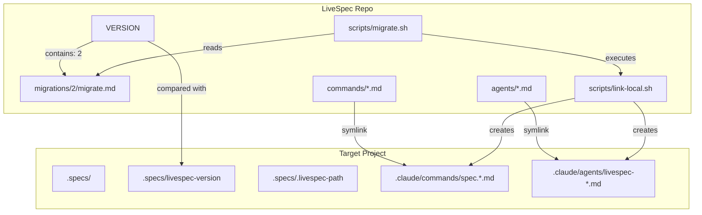
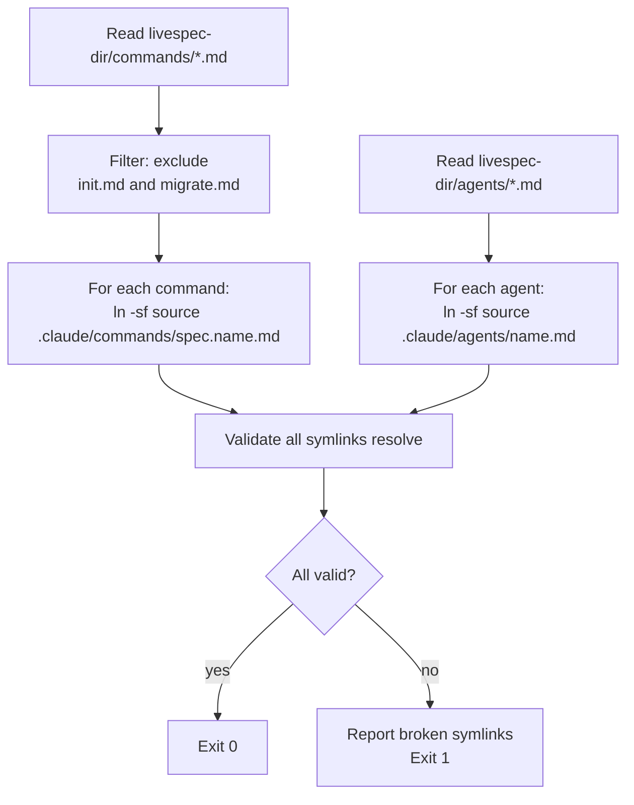
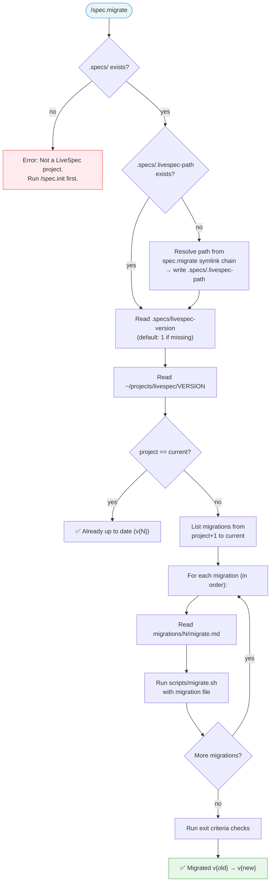

# Design: LiveSpec Migration System — Local Distribution & Versioning

> **Date:** 2026-04-08
> **Scope:** Versioning framework, migration DSL, `spec.migrate` command, local symlink distribution, `spec.init` changes, cleanup of global symlinks
> **Status:** Draft

---

## Problem

LiveSpec's 18 commands and 4 agents are currently symlinked to `~/.claude/` globally, making them available in ALL projects. This pollutes the command namespace of projects that don't use LiveSpec. Commands should only be discoverable in projects where LiveSpec is initialized (`.specs/` exists).

Additionally, there is no versioning mechanism — when LiveSpec adds new commands, changes templates, or restructures `.specs/`, existing projects have no way to upgrade incrementally.

---

## Solution Overview



### Two entry points

| Command | Scope | Purpose |
|---------|-------|---------|
| `spec.init` | New projects | Full init pipeline + create local symlinks + write version |
| `spec.migrate` | Existing projects | Read version gap → apply migrations sequentially |

Both commands stay **global** (`~/.claude/commands/`). All other spec.* commands become **local** (`.claude/commands/` in target project).

---

## 1. Versioning

### 1.1 Version file (LiveSpec repo)

**File:** `~/projects/livespec/VERSION`

```
2
```

- Single integer, no prefix, no newline issues (trimmed on read)
- Incremented manually when a new migration is created
- Current version: **2** (first migration = global→local transition)
- Version starts at 2 because v1 is the implicit pre-migration state (no VERSION file existed before this system)

### 1.2 Project version file

**File:** `.specs/livespec-version`

```
2
```

- Written by `spec.init` at the end of Phase C
- Updated by `spec.migrate` after each successful migration
- **Committed to git** — meaningful project metadata (which LiveSpec version generated the spec structure)
- Projects without this file are implicitly **v1**

### 1.3 Path discovery file

**File:** `.specs/.livespec-path`

```
/Users/julienm/projects/livespec
```

- Written by `spec.init` (absolute path of the LiveSpec repo at init time)
- **Gitignored** — machine-specific
- Read by `link-local.sh` to resolve symlink targets
- If missing or stale, `spec.migrate` and `link-local.sh` prompt for the path

---

## 2. Migration Framework

### 2.1 Directory structure

```
livespec/
├── VERSION                    ← current version (integer)
├── migrations/
│   └── 2/
│       └── migrate.md         ← first migration (v1 → v2)
├── scripts/
│   ├── link-local.sh          ← symlink creator (NEW)
│   └── migrate.sh             ← DSL interpreter (NEW)
```

### 2.2 Migration DSL

Each migration file (`migrations/N/migrate.md`) uses a rigid format:

```markdown
---
version: 2
description: "Transition from global to local command distribution"
---

# Migration v2: Local Command Distribution

## Actions

MKDIR .claude/commands
MKDIR .claude/agents
RUN scripts/link-local.sh
GITIGNORE .claude/commands/spec.*.md
GITIGNORE .claude/agents/livespec-*.md
GITIGNORE .specs/.livespec-path
SET_VERSION 2
```

### 2.3 DSL Verbs

| Verb | Syntax | Behavior | Idempotency |
|------|--------|----------|-------------|
| `MKDIR` | `MKDIR <relative-path>` | Create directory (from project root) | No-op if exists |
| `SYMLINK` | `SYMLINK <src> <dest>` | Create symlink. `src` relative to LiveSpec repo, `dest` relative to project | Replaces existing symlink |
| `COPY` | `COPY <src> <dest>` | Copy file. Same path semantics as SYMLINK | Overwrites existing |
| `DELETE` | `DELETE <relative-path>` | Delete file or directory | No-op if missing |
| `RUN` | `RUN <script> [args...]` | Execute script from LiveSpec repo's `scripts/` | Script must be idempotent |
| `GITIGNORE` | `GITIGNORE <pattern>` | Add pattern to `.gitignore` if not already present | No-op if present |
| `SET_VERSION` | `SET_VERSION <N>` | Write N to `.specs/livespec-version` | Overwrites |

**Rules:**
- Lines starting with `#` are comments (ignored)
- Empty lines are ignored
- Frontmatter (`---` block) is metadata, not executed
- All paths are relative (to project root for `dest`, to LiveSpec repo for `src`)
- All verbs are idempotent — re-running a migration is always safe

### 2.4 Shell interpreter: `scripts/migrate.sh`

**Purpose:** Parse and execute the DSL. Called by `spec.migrate` command.

**Interface:**
```bash
./scripts/migrate.sh <migration-file> <project-dir> <livespec-dir>
```

**Behavior:**
1. Read migration file line by line
2. Skip comments, empty lines, frontmatter
3. For each verb line: execute the corresponding shell operation
4. Exit 0 on success, non-zero on failure (with the failing line reported)

**No rollback mechanism.** Migrations are idempotent — if a migration fails mid-execution, re-running `spec.migrate` safely completes it. `SET_VERSION` is always the last action to ensure the version is only bumped on full success. For content writes beyond `SET_VERSION`, use `RUN` with a dedicated script (escape hatch for arbitrary file operations).

**Verb implementations:**

| Verb | Shell equivalent |
|------|-----------------|
| `MKDIR path` | `mkdir -p "$PROJECT_DIR/path"` |
| `SYMLINK src dest` | `ln -sf "$LIVESPEC_DIR/src" "$PROJECT_DIR/dest"` |
| `COPY src dest` | `cp -f "$LIVESPEC_DIR/src" "$PROJECT_DIR/dest"` |
| `DELETE path` | `rm -rf "$PROJECT_DIR/path"` |
| `RUN script args` | `"$LIVESPEC_DIR/scripts/script" "$PROJECT_DIR" "$LIVESPEC_DIR" args` |
| `GITIGNORE pattern` | Append `pattern` to `$PROJECT_DIR/.gitignore` if not already present |
| `SET_VERSION N` | `echo "N" > "$PROJECT_DIR/.specs/livespec-version"` |

---

## 3. Scripts

### 3.1 `scripts/link-local.sh`

**Purpose:** Create all command and agent symlinks in a target project's `.claude/` directory.

**Interface:**
```bash
./scripts/link-local.sh <project-dir> <livespec-dir>
```

**Behavior:**



**Naming convention:**
- Commands: `commands/spec-check.md` → `.claude/commands/spec.check.md`
- Agents: `agents/livespec-supervisor.md` → `.claude/agents/livespec-supervisor.md`

**Exclusions:** The script does NOT symlink `init.md` and `migrate.md` locally — they stay global only.

**Idempotency:** Uses `ln -sf` (force) — existing symlinks are replaced.

### 3.2 `scripts/migrate.sh`

See section 2.4 above.

---

## 4. New Command: `spec.migrate`

### 4.1 Overview



### 4.2 Flags

| Flag | Behavior |
|------|----------|
| `--dry-run` | Show what migrations would run without executing |
| `--force` | Re-run all migrations even if version matches |

### 4.3 Output format

```
🔄 LiveSpec migration: v1 → v2

Applying migration v2: Local Command Distribution
  ✓ MKDIR .claude/commands
  ✓ MKDIR .claude/agents
  ✓ RUN link-local.sh (17 commands, 4 agents)
  ✓ GITIGNORE .claude/commands/spec.*.md
  ✓ GITIGNORE .claude/agents/livespec-*.md
  ✓ GITIGNORE .specs/.livespec-path
  ✓ SET_VERSION 2

Validation:
  ✓ 17 command symlinks valid
  ✓ 4 agent symlinks valid
  ✓ .specs/livespec-version = 2

✅ Migration complete: v1 → v2
```

### 4.4 Exit criteria

- [ ] All migration DSL lines executed successfully
- [ ] All command symlinks exist and resolve to real files
- [ ] All agent symlinks exist and resolve to real files
- [ ] `.specs/livespec-version` matches target version
- [ ] No orphaned symlinks (commands removed in newer versions get cleaned up)

---

## 5. Changes to `spec.init`

### 5.1 New step in Phase C: Local symlink installation

After creating the `.specs/` directory structure (existing Phase C), add:

**Step 3.12 — Install Local Commands and Agents**

1. Determine the LiveSpec repo path (the repo containing this command — resolve via symlink chain of the running command)
2. Write the path to `.specs/.livespec-path`
3. Create `.claude/commands/` and `.claude/agents/` directories
4. Run `scripts/link-local.sh <project-dir> <livespec-dir>`
5. Read `VERSION` from LiveSpec repo, write to `.specs/livespec-version`
6. Add gitignore patterns: `.claude/commands/spec.*.md`, `.claude/agents/livespec-*.md`, `.specs/.livespec-path`

### 5.2 Updated exit criteria

Add to the existing exit criteria list:

- [ ] `.claude/commands/` exists with symlinks for all spec.* commands (except init/migrate)
- [ ] `.claude/agents/` exists with symlinks for all livespec-* agents
- [ ] All symlinks resolve to existing files (no broken links)
- [ ] `.specs/livespec-version` exists and matches `VERSION` from LiveSpec repo
- [ ] `.specs/.livespec-path` exists and points to a valid LiveSpec repo
- [ ] `.gitignore` contains patterns for `.claude/commands/spec.*.md`, `.claude/agents/livespec-*.md`, `.specs/.livespec-path`

### 5.3 Updated installation output

Add to the success message:

```
> - `.claude/commands/` — 17 spec commands (local symlinks)
> - `.claude/agents/` — 4 LiveSpec agents (local symlinks)
> - `.specs/livespec-version` — version tracking (v2)
```

---

## 6. Changes to `spec-system.md`

### 6.1 Update command roster and distribution description

Update the "Command discovery" paragraph in `spec-system.md` to:
- Add `spec.migrate` as the 19th command
- Replace the global distribution description ("installed globally via `bash scripts/install.sh`") with the new local distribution model: "Commands are symlinked into `.claude/commands/` of each project via `scripts/link-local.sh`. Only `spec.init` and `spec.migrate` remain global (`~/.claude/commands/`)."

### 6.2 Update CLAUDE.md command list template

In `commands/spec-init.md` Step 3.11, add `/spec.migrate` to the command list written between `<!-- livespec:start -->` and `<!-- livespec:end -->` markers.

### 6.3 Version check preamble

Add to the "Rules for AI Tools" section, before the hook resolution protocol:

```markdown
### Version Check (ADVISORY)

Before executing any `/spec.*` command (except `/spec.init` and `/spec.migrate`):

1. Read `.specs/livespec-version` — if missing, assume v1
2. Resolve the LiveSpec repo path from `.specs/.livespec-path` (if missing, resolve from command symlink chain)
3. Read `VERSION` from the LiveSpec repo
4. If project version < repo version, display:

> ⚠️ This project uses LiveSpec v{project}. Current version is v{repo}.
> Run `/spec.migrate` to update.

This check is **non-blocking** — the command continues normally after the warning.
```

---

## 7. Cleanup

### 7.1 Global symlinks to remove

```bash
# Commands (17 — all except init which stays global; migrate is new, never was global)
rm ~/.claude/commands/spec.check.md
rm ~/.claude/commands/spec.explain.md
rm ~/.claude/commands/spec.feature.md
rm ~/.claude/commands/spec.fix.md
rm ~/.claude/commands/spec.hooks.md
rm ~/.claude/commands/spec.implement.md
rm ~/.claude/commands/spec.plan.md
rm ~/.claude/commands/spec.play-coverage.md
rm ~/.claude/commands/spec.preflight.md
rm ~/.claude/commands/spec.propose.md
rm ~/.claude/commands/spec.refine.md
rm ~/.claude/commands/spec.refresh-conventions.md
rm ~/.claude/commands/spec.ship.md
rm ~/.claude/commands/spec.specify.md
rm ~/.claude/commands/spec.stack.md
rm ~/.claude/commands/spec.status.md
rm ~/.claude/commands/spec.test.md

# Agents (4)
rm ~/.claude/agents/livespec-documenter.md
rm ~/.claude/agents/livespec-implementer.md
rm ~/.claude/agents/livespec-supervisor.md
rm ~/.claude/agents/livespec-verifier.md
```

### 7.2 Global symlinks to CREATE (new)

```bash
# spec.migrate — new global command
ln -sf ~/projects/livespec/commands/spec-migrate.md ~/.claude/commands/spec.migrate.md
```

`spec.init` is already globally symlinked — no change needed.

### 7.3 Files to delete from LiveSpec repo

| File | Reason |
|------|--------|
| `.claude/skills/link/SKILL.md` | Replaced by `scripts/link-local.sh` |
| `.claude/rules/commands-agents-must-be-linked.md` | No longer applicable |

### 7.4 Files to deprecate

| File | Action |
|------|--------|
| `scripts/install.sh` | Keep for reference but mark as deprecated in header comment. Replaced by `link-local.sh` for local installs. |

---

## 8. First Migration: v2

**File:** `migrations/2/migrate.md`

```markdown
---
version: 2
description: "Transition from global to local command distribution"
date: 2026-04-08
---

# Migration v2: Local Command Distribution

Moves all spec.* commands and livespec-* agents from global ~/.claude/
to project-local .claude/ directories via symlinks.

## Actions

MKDIR .claude/commands
MKDIR .claude/agents
RUN link-local.sh
GITIGNORE .claude/commands/spec.*.md
GITIGNORE .claude/agents/livespec-*.md
GITIGNORE .specs/.livespec-path
SET_VERSION 2
```

---

## 9. Git Tracking Policy

| Artifact | Tracked | Reason |
|----------|---------|--------|
| `.specs/livespec-version` | ✅ Committed | Project metadata — which LiveSpec version generated the spec structure |
| `.specs/.livespec-path` | ❌ Gitignored | Machine-specific absolute path |
| `.claude/commands/spec.*.md` | ❌ Gitignored | Machine-specific symlinks (absolute paths) |
| `.claude/agents/livespec-*.md` | ❌ Gitignored | Machine-specific symlinks (absolute paths) |
| `migrations/*/migrate.md` | ✅ Committed | Part of LiveSpec source |
| `VERSION` | ✅ Committed | Part of LiveSpec source |

---

## 10. Edge Cases

### 10.1 LiveSpec repo moved

If the LiveSpec repo is moved to a different path:
- Local symlinks break (point to old path)
- `spec.migrate --force` recreates all symlinks from the new path
- `.specs/.livespec-path` is updated

### 10.2 New command added to LiveSpec

When a new command is added (e.g., `spec.dashboard`):
1. Increment `VERSION` to N+1
2. Create `migrations/N+1/migrate.md` with `RUN link-local.sh` (which auto-discovers all commands)
3. Existing projects run `spec.migrate` to pick up the new command

### 10.3 Command removed from LiveSpec

1. Create a migration with `DELETE .claude/commands/spec.removed.md`
2. `link-local.sh` won't create it (file doesn't exist in repo anymore)

### 10.4 Project without `.specs/.livespec-path`

**This is the expected state for all v1 projects** (the file didn't exist before v2).

`spec.migrate` handles this **before executing any migration**:
1. Check if `.specs/.livespec-path` exists
2. If missing → resolve the LiveSpec repo path from `spec.migrate`'s own symlink chain (`readlink ~/.claude/commands/spec.migrate.md` → `~/projects/livespec/commands/spec-migrate.md` → strip `commands/spec-migrate.md`)
3. Write the resolved path to `.specs/.livespec-path`
4. Then proceed with migrations (which call `link-local.sh`, which reads `.livespec-path`)

### 10.5 Multiple developers

Each developer runs `spec.init` or `spec.migrate` on their machine. The symlinks are machine-specific (gitignored), but `.specs/livespec-version` is shared (committed) so everyone knows the expected version.

---

## Implementation Summary

| # | Artifact | Type | Description |
|---|----------|------|-------------|
| 1 | `VERSION` | New file | Integer version at repo root |
| 2 | `migrations/2/migrate.md` | New file | First migration (global → local) |
| 3 | `scripts/link-local.sh` | New file | Symlink creator for local distribution |
| 4 | `scripts/migrate.sh` | New file | DSL interpreter for migrations |
| 5 | `commands/spec-migrate.md` | New file | `spec.migrate` command spec |
| 6 | `commands/spec-init.md` | Modify | Add Step 3.12 (local symlinks) + exit criteria |
| 7 | `system/spec-system.md` | Modify | Add version check preamble + update command roster + distribution description |
| 8 | `commands/spec-init.md` (Step 3.11) | Modify | Add `/spec.migrate` to CLAUDE.md command list template |
| 9 | `.claude/skills/link/SKILL.md` | Delete | Replaced by link-local.sh |
| 10 | `.claude/rules/commands-agents-must-be-linked.md` | Delete | No longer applicable |
| 11 | `~/.claude/commands/spec.*.md` (17) | Delete | Global symlinks removed |
| 12 | `~/.claude/agents/livespec-*.md` (4) | Delete | Global symlinks removed |
| 13 | `~/.claude/commands/spec.migrate.md` | New symlink | Global symlink for new command |
| 14 | `README.md` | Modify | Reflect new distribution model |

---

*LiveSpec Design v1.0*
