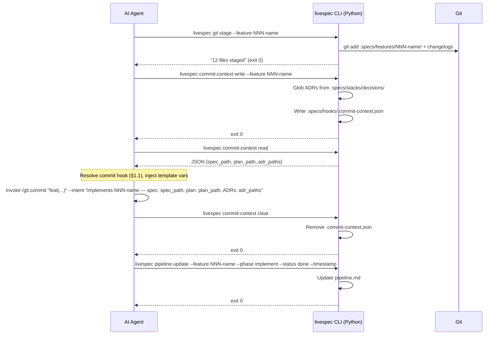

# Design: LiveSpec Commit Hook + Python Validation & Orchestration

## Problem Statement

The current LiveSpec pipeline has three structural weaknesses:

1. **Commit tooling is hardcoded** — auto-commit uses `/git.commit` without context, bypassing the enriched invocation (Codex audit with spec/plan context). No way to configure commit behavior per environment without modifying core commands.

2. **Structural validation is post-hoc** — semantic review (verifier agent) runs before structural validation (required sections, frontmatter fields). A malformed spec can spend 3 minutes going through plan review before failing on structure.

3. **Pipeline state is AI-owned** — `pipeline.md` is written by the same AI that might skip steps or mistrack state. Git operations (branch creation, merge, staging) are raw bash interpreted by AI — silent failures don't stop the pipeline.

## Branch Relationship

Branches are **sequential** and each produces a stable, shippable state:

```
main
  └─ Branch 1: feature/python-commit-hook
       → Ships: commit hook + structural validation
       → feature.md auto-commit: AI-driven (hook resolution)
       └─ Branch 2: feature/python-pipeline-orchestration
            → Ships: Python CLI for pipeline state + git ops
            → feature.md auto-commit: Python-driven (replaces Branch 1 AI flow)
```

**Target state per branch:**

| Concern | Branch 1 | Branch 2 |
|---|---|---|
| Commit hook | AI resolves + invokes | Python writes context.json, AI reads + invokes |
| Pipeline state | AI writes pipeline.md | Python CLI writes pipeline.md |
| Git branch/stage/merge | AI-issued bash | Python CLI (livespec git) |
| Structural validation | Python subprocess | Python subprocess (unchanged) |

Branch 2 supersedes Branch 1's auto-commit flow for pipeline.md writes and git ops. The commit hook mechanism (hook resolution, `/git.commit --context`) from Branch 1 is **preserved** in Branch 2 — Python adds the context resolution step before AI invokes the hook.

---

## Branch 1: Commit Hook + Structural Validation

### 1.1 New Hook Type: `commit`

**Naming:** `commit.md` (no before/after prefix — it IS the action)

**Resolution (3 levels) — same algorithm as `system/hooks.md`:**
```
Level 1 (Global):  ~/.claude/livespec/hooks/commit.md
Level 2 (Project): .specs/hooks/commit.md              (committed)
Level 3 (Local):   .specs/hooks/commit.local.md        (gitignored — personal prefs)
```

"Local" = `.specs/hooks/commit.local.md` with a `mode: override` or `mode: extend` frontmatter field, exactly like all other LiveSpec local hooks (see `system/hooks.md` §3).

**Inheritance:** `mode: extend` (default) — all levels accumulate. `mode: override` on local — only local is used.

**Template variables resolved BEFORE hook injection:**

| Variable | Resolved value | Source |
|---|---|---|
| `{{spec_path}}` | Absolute path to `spec.md` | Feature directory |
| `{{plan_path}}` | Absolute path to `plan.md` | Feature directory |
| `{{adr_paths}}` | Comma-separated absolute paths matching `.specs/stacks/decisions/ADR-*.md` | Glob from project root (not feature dir). Empty string if no ADRs. |
| `{{feature_name}}` | Full kebab directory name (e.g., `003-notifications`) | Feature directory name |
| `{{feature_number}}` | Numeric prefix only (e.g., `003`) | Parsed from feature directory name |

**`{{adr_paths}}` resolution:** Glob is `{project_root}/.specs/stacks/decisions/ADR-*.md` where `{project_root}` is the parent of `.specs/`. Result is absolute paths joined with `,`. If glob matches zero files → `{{adr_paths}}` = empty string.

**Example global hook (`~/.claude/livespec/hooks/commit.md`):**
```markdown
---
mode: override
---

Use `/git.commit "feat({{feature_name}}): <message>" --intent "implements {{feature_name}} — spec: {{spec_path}}, plan: {{plan_path}}, ADRs: {{adr_paths}}"` to commit.
This enriched invocation passes spec, plan, and ADRs as intent so Codex understands
WHY the code was written and which acceptance criteria to validate against.

If {{adr_paths}} is empty, use: `/git.commit "feat({{feature_name}}): <message>" --intent "implements {{feature_name}} — spec: {{spec_path}}, plan: {{plan_path}}"`
```

**Fallback (no commit hook at any level):** invoke `/git.commit` without `--intent`. Never use bare `git commit` — blocked by `commit-via-skill.md`.

### 1.2 Auto-Commit Phase (Branch 1 — AI-driven)

```
Auto-Commit (--auto only, after Phase 3.5 Test passes):

1. Run /audit → fail → fix (max 3 retries) → abort if still failing
2. Verify all tests pass
3. git add: spec.md, plan.md, implementation.md, progress.md, changelogs, roadmap

4. RESOLVE COMMIT HOOK:
   a. Read each level in order (global → project → local), apply mode rules
   b. If no hook files exist at any level → skip to step 5b
   c. Resolve template variables using the table in §1.1
   d. Inject resolved hook content into AI context

5a. IF hook found → follow hook instructions (e.g., invoke /git.commit "feat(...)" --intent "implements ...")
5b. IF no hook → invoke /git.commit (no --intent)

6. Update pipeline.md: all phases → Done  [Note: replaced by Python CLI in Branch 2]
```

### 1.3 Structural Validation Gate (specify.md)

**Location:** After the AI generates spec.md, before the spec gate (Phase 1 → Phase 1.5).

**Exact flow:**
```
After generating spec.md:

  Run: livespec validate .specs/features/NNN-feature-name/spec.md --format compact
  
  Exit 0:
    → Proceed to spec gate as normal
  
  Exit non-zero (validation failed):
    → Capture stdout from livespec validate (list of errors in compact format)
    → Inject into AI context as ADDITIONAL constraint:
      
      "The spec.md you just generated failed structural validation.
       Fix these issues exactly as listed and regenerate spec.md:
       <livespec validate output verbatim>"
      
    → Regenerate spec.md (restart generation step with this constraint)
    → Retry counter += 1
    
    If retry > 2:
      ABORT: "spec.md failed structural validation after 2 retries.
              Last errors: <livespec validate output>
              Fix manually, then re-run /spec.specify."
```

**What the AI receives for regeneration:** the original feature description + constitution + stack context + the verbatim `livespec validate --format compact` output. The AI does NOT receive a diff — it regenerates the full spec with the error list as a hard constraint.

### 1.4 Structural Validation Gate (plan.md)

Same flow as §1.3 but applied to plan.md after generation, before the plan gate (Phase 2 → Phase 2.5). Error injection message:

```
"The plan.md you just generated failed structural validation.
 Fix these issues exactly as listed and regenerate plan.md:
 <livespec validate output verbatim>"
```

### 1.5 Files Modified (Branch 1)

| File | Change |
|---|---|
| `system/hooks.md` | Add `commit` hook type section: naming, resolution, template vars table, `{{adr_paths}}` glob root, example hook content |
| `commands/feature.md` | Replace auto-commit `git commit -m` with hook-resolution flow (§1.2) |
| `commands/specify.md` | Add structural validation step after spec.md generation (§1.3) |
| `commands/plan.md` | Add structural validation step after plan.md generation (§1.4) |

### 1.6 Acceptance Criteria (Branch 1)

```gherkin
Scenario: Commit hook resolved and used
  Given ~/.claude/livespec/hooks/commit.md exists with /git.commit --context instruction
  When /spec.feature "test feature" --auto completes in test-audit-fix
  Then /git.commit --context <spec_path>,<plan_path> is invoked (not bare git commit)
  And {{spec_path}} resolves to the actual absolute path of spec.md

Scenario: No commit hook — fallback
  Given no commit.md exists at any level
  When /spec.feature "test feature" --auto completes
  Then /git.commit (no --context) is invoked

Scenario: Structural validation catches malformed spec
  Given the AI would generate a spec.md missing ## Acceptance Criteria section
  When /spec.specify runs
  Then livespec validate exits non-zero
  And the AI receives the validation errors as context
  And spec.md is regenerated with the missing section

Scenario: Structural validation retry limit
  Given validation keeps failing for 2 retries
  When /spec.specify runs
  Then pipeline aborts with a clear error message listing the validation errors

Scenario: ADR paths resolved correctly
  Given .specs/stacks/decisions/ADR-001-auth.md and ADR-002-db.md exist
  When commit hook is resolved
  Then {{adr_paths}} = "/abs/path/ADR-001-auth.md,/abs/path/ADR-002-db.md"

Scenario: No ADRs — empty adr_paths
  Given .specs/stacks/decisions/ contains no ADR-*.md files
  When commit hook is resolved
  Then {{adr_paths}} = "" and the hook instruction handles the empty case
```

---

## Branch 2: Python Pipeline Orchestration + Git Ops

### 2.1 Architecture

Extend `validator/` with 3 new focused modules registered as Typer command groups on the existing `livespec` CLI. `validator/orchestrator.py` (LLM semantic validation) is untouched.

```
validator/
├── cli.py                  (existing — add app.add_typer() calls)
├── orchestrator.py         (existing — UNTOUCHED)
├── pipeline.py             (NEW)
├── git_ops.py              (NEW)
└── commit_context.py       (NEW)
```

**Registration in cli.py:**
```python
from .pipeline import pipeline_app
from .git_ops import git_app
from .commit_context import commit_context_app

app.add_typer(pipeline_app, name="pipeline")
app.add_typer(git_app, name="git")
app.add_typer(commit_context_app, name="commit-context")
```

### 2.2 `livespec pipeline` Commands

**Purpose:** Python owns pipeline.md writes. AI reads state (livespec pipeline read); Python transitions it.

**Phase names (canonical enum):** `specify`, `spec-review`, `plan`, `plan-review`, `preflight`, `implement`, `test`

**Status values (canonical enum):** `pending`, `in_progress`, `done`, `skipped`, `blocked`

**Commands:**

```
livespec pipeline init --feature <dir_name>
  Behavior: Creates .specs/features/<dir_name>/pipeline.md from system/templates/pipeline-template.md
            All phases set to Pending
  Exit: 0 on success, 1 if .specs/ not found, 2 if feature dir not found

livespec pipeline update --feature <dir_name> --phase <phase> --status <status> [--timestamp]
  Behavior: Parses pipeline.md, finds the row matching <phase>, updates status cell
            --timestamp adds ISO 8601 datetime to Completed At cell
  Exit: 0 on success, 1 if file not found, 2 if phase name invalid

livespec pipeline read --feature <dir_name>
  Behavior: Reads pipeline.md, outputs JSON on stdout:
            {"specify": "done", "spec-review": "done", "plan": "in_progress", ...}
  Exit: 0 on success, 1 if file not found

livespec pipeline next --feature <dir_name>
  Behavior: Reads pipeline.md, finds FIRST phase with status != done and != skipped
            Outputs phase name on stdout (e.g., "plan-review")
  Exit: 0 if a next phase found, 1 if all phases are done/skipped (pipeline complete)
```

### 2.3 `livespec git` Commands

**Purpose:** Python handles git with proper, structured exit codes. AI no longer issues raw bash git commands.

**Commands:**

```
livespec git branch <name>
  Behavior: git checkout -b <name>
  Stdout: "Created and checked out branch: <name>"
  Exit: 0 on success, 1 on failure (branch already exists, dirty worktree, etc.)

livespec git stage --feature <dir_name>
  Behavior: git add .specs/features/<dir_name>/ (all files)
            git add .specs/roadmap.md (if modified)
            git add .specs/changelog.md (if modified)
  Stdout: "<N> files staged"
  Exit: 0 on success, 1 if git not initialized or feature dir not found

livespec git merge <branch> [--no-ff]
  Behavior: git merge <branch> [--no-ff]
            On merge conflict: git merge --abort
  Stdout: "Merged <branch>" OR "Conflict: <conflicting files>"
  Exit: 0 on clean merge, 1 on generic failure, 2 on merge conflict (distinct code)

livespec git delete <branch> [--force]
  Behavior: git branch -d <branch> (--force → git branch -D)
  Exit: 0 on success, 1 if branch not found, 2 if unmerged (without --force)

livespec git status
  Behavior: Reads git state
  Stdout (JSON): {"branch": "current-branch", "staged": ["file1", ...], "ahead": N, "behind": N}
  Exit: 0 on success, 1 if not a git repo
```

**Merge conflict handling (exit 2):**
When `livespec git merge` exits 2, the AI (or pipeline) reads the conflict list from stdout and reports:
```
Merge conflict on feature/<name>. Conflicting files: <list>.
Merge aborted. Resolve manually on feature/<name>, then /spec.ship --resume.
```
Pipeline state: feature → `Blocked (merge conflict)` in ship.md.

### 2.4 `livespec commit-context` Commands

**Purpose:** Python resolves paths and writes a structured file. AI reads it to know what context to pass to `/git.commit`.

**`.commit-context.json` schema (v1):**
```json
{
  "version": 1,
  "feature_name": "NNN-feature-name",
  "spec_path": "/absolute/path/to/spec.md",
  "plan_path": "/absolute/path/to/plan.md",
  "adr_paths": "/absolute/path/ADR-001.md,/absolute/path/ADR-002.md"
}
```

`adr_paths` is empty string `""` if no ADRs found (not null, not omitted).

**File location:** `.specs/hooks/.commit-context.json` (gitignored — add to `.specs/.gitignore` or project `.gitignore`)

**Commands:**

```
livespec commit-context write --feature <dir_name>
  Behavior: Resolves spec_path, plan_path, adr_paths (glob from project root)
            Writes .specs/hooks/.commit-context.json with schema above
  Exit: 0 on success, 1 if .specs/ or feature dir not found

livespec commit-context read
  Behavior: Reads .specs/hooks/.commit-context.json, outputs JSON on stdout
  Exit: 0 on success, 1 if file not found

livespec commit-context clear
  Behavior: Removes .specs/hooks/.commit-context.json if it exists
            If file not found → exit 0 (idempotent)
            If removal fails for other reason (permissions) → exit 1, write error to stderr
  Exit: 0 on success or file already absent, 1 on removal failure
```

**Stale context detection:** Before `livespec commit-context write`, if `.commit-context.json` already exists, it is overwritten (not an error). This handles re-runs without manual cleanup.

### 2.5 Updated Auto-Commit Flow (Branch 2)

Branch 2 replaces the AI-owned steps in §1.2 for git ops and pipeline state:



### 2.6 Updated Pipeline State Transitions (Branch 2)

Each AI-issued `pipeline.md` write in `feature.md` is replaced:

| Old (AI writes markdown) | New (Python CLI) |
|---|---|
| `Update pipeline.md: Specify → In Progress` | `livespec pipeline update --feature {{feature_name}} --phase specify --status in_progress` |
| `Update pipeline.md: Specify → Done` | `livespec pipeline update --feature {{feature_name}} --phase specify --status done --timestamp` |
| `Create pipeline.md` | `livespec pipeline init --feature {{feature_name}}` |

**Failure handling:** If any `livespec pipeline update` exits non-zero, the AI reports the error and halts the pipeline. It does NOT continue with stale state.

### 2.7 Ship.md Git Operation Updates (Branch 2)

In `commands/ship.md`, replace:

| Old | New |
|---|---|
| `git checkout -b feature/NNN-name` | `livespec git branch feature/NNN-name` |
| `git checkout <target>` + `git merge feature/NNN-name --no-ff` | `livespec git merge feature/NNN-name --no-ff` (exit 2 → conflict handling) |
| `git branch -d feature/NNN-name` | `livespec git delete feature/NNN-name` |

### 2.8 Files Modified (Branch 2)

| File | Change |
|---|---|
| `validator/pipeline.py` | NEW — Typer app with `init`, `update`, `read`, `next` |
| `validator/git_ops.py` | NEW — Typer app with `branch`, `stage`, `merge`, `delete`, `status` |
| `validator/commit_context.py` | NEW — Typer app with `write`, `read`, `clear` |
| `validator/cli.py` | Add `app.add_typer()` for 3 new command groups |
| `commands/feature.md` | Replace AI pipeline.md writes with `livespec pipeline` calls; replace git staging with `livespec git stage`; update auto-commit flow with commit-context steps |
| `commands/ship.md` | Replace git branch/merge/delete with `livespec git` calls |
| `system/hooks.md` | Add note: `.commit-context.json` is gitignored |
| Project `.gitignore` / `.specs/.gitignore` | Add `.specs/hooks/.commit-context.json` |

### 2.9 Acceptance Criteria (Branch 2)

```gherkin
Scenario: Pipeline state written by Python
  Given /spec.feature "add widget" --auto runs in test-audit-fix
  When the specify phase begins
  Then pipeline.md shows "In Progress" for Specify (written by livespec pipeline update)
  And when specify completes, pipeline.md shows "Done" with a timestamp

Scenario: Git branch created by Python
  When /spec.feature creates a branch
  Then livespec git branch is called (not raw git checkout -b)
  And exit code 0 confirms branch was created

Scenario: Merge conflict detected and reported
  Given a merge conflict would occur
  When livespec git merge exits with code 2
  Then the AI reports the conflicting files
  And does not proceed to the next feature

Scenario: Commit context written and consumed
  Given a feature NNN-name with spec.md, plan.md, and 2 ADRs
  When livespec commit-context write --feature NNN-name runs
  Then .commit-context.json contains spec_path, plan_path, both ADR absolute paths
  And livespec commit-context read outputs the same JSON
  And after /git.commit succeeds, livespec commit-context clear removes the file

Scenario: Stale commit context overwritten
  Given .commit-context.json already exists from a previous run
  When livespec commit-context write --feature NNN-name runs again
  Then the file is overwritten without error (exit 0)

Scenario: livespec pipeline next identifies correct phase
  Given pipeline.md with specify=done, spec-review=done, plan=in_progress
  When livespec pipeline next --feature NNN-name runs
  Then stdout = "plan" and exit code = 0

Scenario: livespec pipeline next — all done
  Given all phases are done or skipped
  When livespec pipeline next --feature NNN-name runs
  Then exit code = 1 (pipeline complete)
```

---

## Non-Goals

- Python does NOT generate commit messages (AI responsibility via /git.commit)
- Python does NOT call Claude Code skills directly
- Python does NOT replace the verifier agent (semantic review stays AI)
- Python does NOT modify the `--auto` flag semantics
- No behavior change for projects with no commit hook (backward compatible)
- No changes to `validator/orchestrator.py` (LLM semantic validation untouched)
