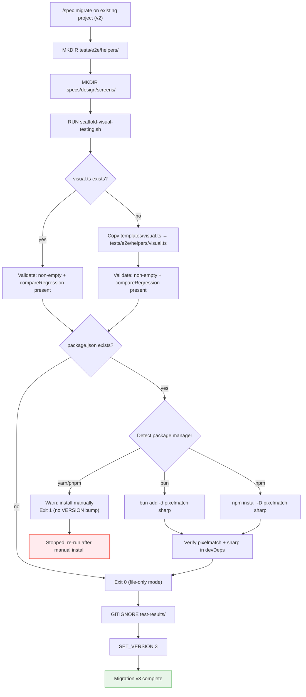

# spec.migrate v3 — Visual Testing Infrastructure Migration

## Overview

Add migration v3 to LiveSpec's versioned migration system. When an existing project runs `/spec.migrate`, this migration retrofits the visual testing infrastructure (helper scaffold, dirs, deps) without requiring the project to re-initialize from scratch.

## Problem Statement

After implementing the Visual Testing Infrastructure, existing projects that already have `.specs/` set up get no automated path forward. They would need to manually:
- Create `tests/e2e/helpers/visual.ts`
- Install pixelmatch + sharp
- Create `.specs/design/screens/`
- Update `.gitignore`

The migration system exists precisely for this.

## Architecture

### New Files

**`templates/visual.ts`** — Clean deployable TypeScript helper. Source of truth for the scaffold content. The migration script copies this file directly (no markdown parsing). Exports `compareRegression()` and `compareDesign()`, plus an internal `_pixelmatchDiff()` helper.

**`scripts/scaffold-visual-testing.sh`** — Migration script. Handles all conditional logic (package manager detection, dep installation, idempotent validation). The DSL `COPY` verb is not used here because it cannot express conditional logic — `RUN` is the correct choice.

The script is responsible for its own exit criteria validation before exiting 0. `migrate.sh` does not add post-RUN validation hooks; the script self-validates.

**`migrations/3/migrate.md`** — DSL actions:
```
MKDIR tests/e2e/helpers
MKDIR .specs/design/screens
RUN scaffold-visual-testing.sh
GITIGNORE test-results/
SET_VERSION 3
```

`SET_VERSION 3` is reached only if `RUN scaffold-visual-testing.sh` exits 0. If the script exits non-zero, `migrate.sh` stops immediately (due to `set -euo pipefail` behavior — script failure propagates).

### VERSION Bump

`VERSION` file: `2` → `3`

### Exit Criteria (validated by the script itself before `exit 0`)

The script checks these conditions before exiting successfully:
1. `tests/e2e/helpers/visual.ts` exists and is non-empty
2. If package.json exists: `pixelmatch` in `devDependencies`
3. If package.json exists: `sharp` in `devDependencies`

If any condition fails → script exits non-zero → `migrate.sh` stops → `SET_VERSION 3` not reached → version stays at 2.

**Special case — no package.json:** Script scaffolds the file, skips dep install, exits 0. Only condition 1 is checked. VERSION is bumped. Deps can be installed manually later.

**Special case — Playwright not installed:** Visual.ts is scaffolded anyway (it's a plain TypeScript file with no runtime requirement at copy time). Package manager detection and dep install proceed normally. Migration completes if exit criteria pass.

**Special case — yarn/pnpm detected:** Script scaffolds files, prints manual install instructions, exits non-zero. VERSION stays at 2. User installs deps manually and re-runs `/spec.migrate`.

### Idempotency

- Script checks existence before writing (skips if visual.ts already exists)
- When skipping an existing file, still validates it (non-empty + `compareRegression` present)
- If required deps are already in `devDependencies`, install is skipped
- `MKDIR` in DSL is idempotent
- `GITIGNORE` verb in migrate.sh checks for duplicate entries
- `SET_VERSION` only reached if script exits 0

### Non-reversible

Explicitly documented as non-reversible. Revert via `git`. Consistent with v1→v2 behavior.

## Sequence



## Post-Migration Instructions

After running `/spec.migrate`, the user must run `/spec.test` to capture baselines for their existing features. The migration only scaffolds the infrastructure — it does not run Playwright or capture screenshots.

Output message from migration:
```
  Visual testing infrastructure ready.
  Next: run /spec.test to capture visual baselines for your existing features.
```

## Edge Cases

| Case | Behavior |
|---|---|
| No package.json in project | Scaffold visual.ts, skip dep install, exit 0, VERSION bumped |
| Playwright not installed locally | Scaffold + install deps normally; Playwright not required at migration time |
| visual.ts already exists | Validate (non-empty + compareRegression present), skip copy |
| yarn/pnpm detected | Scaffold + warn + exit 1 (VERSION stays 2) |
| Project has no `tests/e2e/` | MKDIR creates it; scaffold placed in helpers/ |
| Dep already declared in `devDependencies` | Skip install and continue |

---

*Design approved 2026-04-10 — v1.3 (aligned gitignore path with helper output, clarified internal helper naming, removed stale Playwright detection wording, and documented dependency-skip idempotency)*
