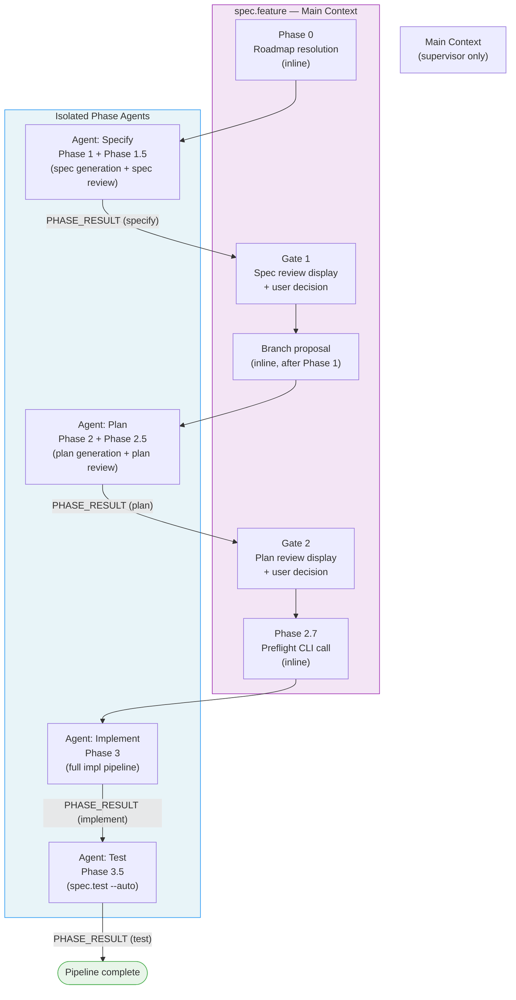

# Design: Supervisor Pattern for spec.feature

## Problem

`/spec.feature` executes all pipeline phases (specify, plan, implement, test) inline in the main conversation context. Every file read, generation trace, and step result accumulates in the same window. For a single feature, this inflates the context to ~167k tokens, approaching the limit and degrading response quality in later phases.

Root causes:
- Phase 1 (specify): reads project.md, constitution.md, stack.md, roadmap.md → ~15-20k
- Phase 2 (plan): re-reads same files + generates diagrams → ~20-30k
- Phase 3 (implement): reads all context files + conventions.md (per step) + accumulates step results → ~80-100k
- Phase 3.5 (test): adds ~10-15k

## Solution: Supervisor Pattern

Transform `spec.feature` from an inline executor into a **pure supervisor**. Each major phase runs in an isolated subagent with a fresh context. The main context only orchestrates: spawn phase agent → receive structured PHASE_RESULT → handle gate → spawn next phase agent.

This mirrors the architecture already used by `spec.ship` for feature-level isolation.



## Architecture

### Main Context Responsibilities

The main context does **only** the following:
1. Phase 0: read roadmap, resolve feature name, confirm with user
2. Spawn Specify agent → receive PHASE_RESULT → display gate → handle user decision
3. Branch proposal: analyze SCOPE field from PHASE_RESULT, propose branch if needed
4. Spawn Plan agent → receive PHASE_RESULT → display gate → handle user decision
5. Phase 2.7: run `livespec pipeline update` + `/spec.preflight --light` as direct CLI calls
6. Spawn Implement agent → receive PHASE_RESULT
7. Spawn Test agent → receive PHASE_RESULT
8. Auto-commit (if `--auto`)
9. Display completion summary

The main context **never**:
- Reads spec.md, plan.md, constitution.md, stack.md, or any generated files
- Runs `livespec` CLI subcommands (except pipeline updates and Phase 2.7 preflight)
- Reads conventions.md

### Phase Agent Responsibilities

Each phase agent receives a minimal context package and executes its full phase:
- Resolves before/after hooks at all 3 levels
- Reads all necessary context files
- Includes `.conventions/conventions.md` content when generating code or specs
- Makes `livespec pipeline update` calls for its own phase states
- Returns a structured PHASE_RESULT block as its last output

## PHASE_RESULT Schema

### Phase 1 — Specify

```
PHASE_RESULT: OK | BLOCKED
PHASE: specify
FEATURE: NNN-feature-name
SPEC_PATH: .specs/features/NNN-feature-name/spec.md
SCOPE: S | M | L
FR_COUNT: N
REVIEW: PASS | FINDINGS
FINDINGS_COUNT: N BLOCKING, N WARNING, N INFO
FINDINGS_DETAIL:
  [verbatim verifier findings table — included when REVIEW != PASS]
SUMMARY: <2-3 sentence description of what the spec covers>
```

`FINDINGS_DETAIL` carries the full verifier report so the main context can display it faithfully in the gate prompt without reading the spec file.

### Phase 2 — Plan

```
PHASE_RESULT: OK | BLOCKED
PHASE: plan
FEATURE: NNN-feature-name
PLAN_PATH: .specs/features/NNN-feature-name/plan.md
STEPS_COUNT: N
REVIEW: PASS | FINDINGS
FINDINGS_COUNT: N BLOCKING, N WARNING, N INFO
FINDINGS_DETAIL:
  [verbatim verifier findings table — included when REVIEW != PASS]
SUMMARY: <2-3 sentence description of implementation approach>
```

### Phase 3 — Implement

```
PHASE_RESULT: OK | BLOCKED
PHASE: implement
FEATURE: NNN-feature-name
FILES_CHANGED: N
STEPS_DONE: N/total
TESTS: N passed, N failed
BLOCKED_REASON: <one line, only if BLOCKED>
SUMMARY: <2-3 sentence summary of what was implemented>
```

### Phase 3.5 — Test

```
PHASE_RESULT: OK | BLOCKED
PHASE: test
FEATURE: NNN-feature-name
AC_COVERAGE: N/total ACs covered
TESTS: N passed, N failed
BLOCKED_REASON: <one line, only if BLOCKED>
SUMMARY: <2-3 sentence test summary>
```

## Context Package per Phase Agent

Each phase agent prompt includes:
- Feature name and feature directory path
- Relevant paths (spec.md path for plan agent, spec.md + plan.md for implement agent)
- Active flags (--auto, --resume, --mono, --branch, --no-branch, --priority, --step)
- **Full content of `.conventions/conventions.md`** (if it exists) — required by conventions-preload rule
- For `--resume`: explicit instruction to read pipeline.md and progress.md to identify resume point

The agent does **not** receive file contents (it reads them itself in its fresh context).

## Gate Handling

### Interactive mode

After each phase agent completes, the main context displays:

```
Phase N complete — [Feature Name]
→ Spec: .specs/features/NNN/spec.md

### Review Findings
[FINDINGS_DETAIL from PHASE_RESULT — if any]

N BLOCKING, N WARNING, N INFO finding(s).
Type continue to proceed, or describe changes needed.
```

User options:
- **continue** → spawn next phase agent
- **describe changes** → re-spawn same phase agent with change description appended to prompt
- **abort** → stop pipeline

### --auto mode

Skip all user gates. If PHASE_RESULT has BLOCKING findings → re-spawn phase agent with findings as context (max 2 retries). If BLOCKING remain after 2 retries → abort. If only WARNING/INFO → proceed.

## Branch Proposal

After Phase 1 completes, the main context uses `SCOPE` and `FEATURE: NNN-feature-name` from PHASE_RESULT to decide whether to propose a branch:

- `--branch` flag: create branch immediately, no question
- `--no-branch` flag: skip entirely
- Default: if SCOPE is M or L → propose. If S → skip.

Branch is created by the main context (a single `git checkout -b` call) before spawning the Plan agent.

## Flag Behavior

| Flag | Effect on supervisor pattern |
|---|---|
| `--auto` | Skip all user gates, auto-handle BLOCKING findings (max 2 retries per phase) |
| `--mono` | **Unchanged** — only affects implement agent's internal orchestration (no Superpowers sub-dispatch). Does NOT disable supervisor pattern at feature level. |
| `--economy` | **Disables supervisor pattern** — all phases run inline in main context (current behavior). Consistent with --economy's definition: "no sub-agents, direct tools only." |
| `--resume` | Main context reads pipeline.md, finds first non-Done phase, spawns its agent with `--resume` in prompt. Implement agent reads progress.md for step-level resume. |
| `--branch` / `--no-branch` | Handled by main context after Phase 1, as before |
| `--priority` | Passed through to Specify agent prompt |
| `--step N` | Passed through to Implement agent prompt |

## Phase 2.7 — Preflight (Stays Inline)

Phase 2.7 is a lightweight CLI call, not a generation task. It stays in the main context:

```
1. livespec pipeline update --feature NNN --phase preflight --status in_progress
2. Run spec.preflight --light (direct tool call)
3. Gate: critical fail → STOP; warnings → log + continue; pass → spawn Implement agent
4. livespec pipeline update --feature NNN --phase preflight --status done|blocked
```

## pipeline.md Update Responsibility

- **Before spawning each phase agent:** main context calls `livespec pipeline update --phase X --status in_progress`
- **Within the phase agent:** agent calls `livespec pipeline update --phase X --status done` on success
- **On BLOCKED PHASE_RESULT:** main context does not update (phase remains in_progress for resume)

This ensures pipeline.md reflects the correct state even if an agent fails mid-execution.

## --resume with Supervisor Pattern

1. Main context reads `pipeline.md`
2. Finds first phase with status != Done and != Skipped
3. Spawns that phase's agent with `--resume` in prompt
4. For the Implement phase: the spawned implement agent reads `progress.md` and resumes at the first non-Done step

## Context Budget (Target)

| Component | Current | After supervisor |
|---|---|---|
| Main context per phase | All reads inline | Only PHASE_RESULT (~200 tokens) |
| Total main context | ~167k | ~5-15k |
| Phase agent context | — | Fresh, ~30-60k max |

## Scope of File Changes

Only `commands/feature.md` is modified. No changes to:
- `commands/specify.md`
- `commands/plan.md`
- `commands/implement.md`
- `commands/test.md`
- Any agent or system files

The sub-commands are already written correctly for isolated execution.

## What Does NOT Change

- All phase logic (generation, validation, testing) is unchanged
- All gates and approval flows are preserved
- All flags remain compatible (--auto, --step, --branch, --resume, --priority)
- --economy preserves current inline behavior for token-constrained environments
- SHIP_RESULT protocol (used by spec.ship) is unchanged
