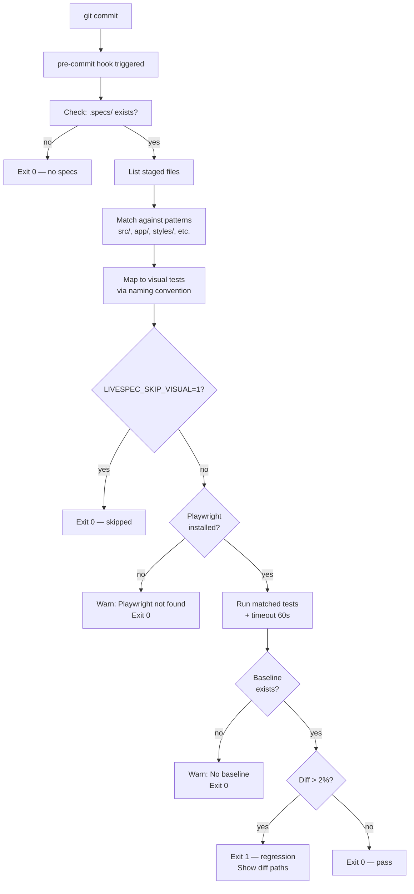

# Visual Testing Infrastructure — LiveSpec

## Overview

This design brings comprehensive visual regression and design fidelity testing to LiveSpec projects. It establishes a unified protocol for capturing, comparing, and managing visual baselines across projects targeting Playwright + Next.js/bun stacks, while remaining tool-agnostic at the protocol level.

## Problem Statement

Current state:
- `/spec.test` Phase 4.5 captures visual baselines but has no systematic design fidelity check
- `/spec.check` Step 8 detects visual drift but thresholds are hardcoded and undocumented
- Pre-commit hooks don't enforce visual test passage, allowing regressions to slip through
- No unified helper (`visual.ts`) is scaffolded for projects
- Mockup Pencil PNGs are manually exported with no clear integration point

## Core Decisions

### 1. Responsibility Split: check ↔ test

| Command | Purpose | Tool | Threshold | Stores |
|---|---|---|---|---|
| `/spec.check` | Detect regression vs previous baseline | Playwright native | 2% (configurable) | `baselines/` |
| `/spec.test` | Verify conformance to design mockup | pixelmatch | 5-8% (configurable) | `design-references/` |

**Rationale:** Each command has a single, clear responsibility. Regression detection and design fidelity are orthogonal concerns. The 2% threshold for regression is Playwright convention (strict, catches unintentional changes). The 5-8% threshold for design allows minor rendering differences (font anti-aliasing, browser vendor variations) while catching significant deviations from approved mockups.

### 2. Visual Diff Format: 3 Images

When a visual test fails, the output includes:

```
test-results/visual-diffs/[test-name]/
  baseline.png         # Previous known-good screenshot
  diff.png             # Pixelmatch diff with zones in red
  actual.png           # Current screenshot
```

This format (proven by jest-image-snapshot) gives developers immediate diagnosis: baseline shows what it was, diff shows where it changed, actual shows what it is now.

**Implementation:** The helper `visual.ts` exposes `compareDesign()` which invokes pixelmatch and generates these 3 images. The protocol documents this format as mandatory for failed comparisons.

### 3. ignoreRegions API

Visual comparisons without exclusion zones fail constantly on dynamic content (timestamps, avatars, generated data, network-dependent values). The helper exposes:

```typescript
compareDesign(screenshot, mockupPng, {
  threshold: 0.05,
  ignoreRegions: [
    { x: 100, y: 200, width: 50, height: 20 }, // avatar area
    { x: 0, y: 0, width: 1280, height: 50 }    // timestamp header
  ]
})
```

This makes the visual tests less flaky and more maintainable.

### 4. Scaffold Entry Points

`tests/e2e/helpers/visual.ts` is scaffolded at two moments:

- **`/spec.init`**: When Playwright is detected during project initialization
- **`/spec.test` Phase 4.5.1**: If visual tests are needed but the helper is missing

This double-entry design ensures that the helper exists regardless of when Playwright is added to the project.

### 5. Pre-Commit Hook Integration

The existing `validator/hooks/pre-commit-hook` (currently validates `.specs/*.md` files) is extended to also run visual tests when files in these paths are staged:

```
src/     app/     components/     styles/     tests/e2e/     public/
```

**Convention-based test mapping:** The hook maps staged files to their corresponding visual tests via naming convention:
- `src/components/Button.tsx` → search `tests/e2e/components/**/*button*` (lowercase)
- `styles/**` → run all visual tests (CSS = global impact)
- No match → run all visual tests (fallback safe, not a skip)

**Escape hatch:** `LIVESPEC_SKIP_VISUAL=1 git commit ...` bypasses visual testing for emergency hotfixes.

**Performance gates:**
- Timeout: 60s per test suite (configurable via `LIVESPEC_VISUAL_TIMEOUT`)
- If Playwright not installed locally → skip with warning (not an error)
- Non-blocking on missing baselines (skip with warning during onboarding)

### 6. Baseline Capture Strategy

**First run (no baseline exists):**
- Pre-commit hook skips with message: `"No baseline for [test] — run spec.test to capture"`
- Developer runs `spec.test`, which captures baseline automatically in Phase 4.5
- Baseline only committed if all non-visual tests (Phase 4) passed
- This prevents bootstrapping a baseline from a broken state

**Subsequent runs:**
- Pre-commit hook runs comparison against existing baseline
- If diff > 2% (regression) → blocks commit
- If diff exists but <= 2% → passes

### 7. Design Fidelity (conformance to Pencil mockups)

When `/spec.test` executes Phase 4.5, it optionally compares the new baseline against a Pencil mockup PNG stored in:

```
.specs/design/screens/[screen-name].png
```

These PNGs are:
- Exported manually from Pencil (`pencil export`) at design milestone points
- Committed to the repository and versioned
- Used as a source of truth for UI conformance
- Optional (if mockup absent, fidelity check skips with warning)

**Threshold:** 5-8% (configurable) — allows browser rendering variance, catches layout/positioning issues.

### 8. Stack Agnosticism vs. Playwright-First

**Protocol (`system/testing/visual-baselines.md`):** Tool-agnostic. Describes concepts (capture, compare, threshold, ignoreRegions) without prescribing implementation.

**Implementation (`visual-helper-scaffold.md`):** Explicitly targets Playwright + bun + pixelmatch. This is LiveSpec's reference implementation, not an assertion that other stacks are unsupported.

**Documentation clarity:** The protocol intro states clearly:
> "This protocol is tool-agnostic. The reference implementation provided by LiveSpec targets Playwright + bun + pixelmatch. Adapters for other frameworks are community contributions."

This prevents false expectations of universal support while providing a clear, working path forward for the most common stack.

---

## Architecture

### Helper `visual.ts` API

```typescript
// Regression comparison (existing baseline vs actual)
await compareRegression(page, testName, {
  threshold: 0.02,       // 2% diff allowed
  updateBaseline: false
})

// Design fidelity (actual vs mockup PNG)
await compareDesign(page, mockupPng, {
  threshold: 0.08,       // 8% diff allowed
  ignoreRegions: [       // Exclude dynamic zones
    { x: 0, y: 0, width: 1280, height: 50 }
  ]
})

// Internal: pixelmatch wrapper that produces 3-image output
async function pixelmatchDiff(
  actualBuffer: Buffer,
  expectedBuffer: Buffer,
  options: { threshold, ignoreRegions }
): Promise<{ mismatch, baseline, diff, actual }>
```

Both functions throw on failure with a structured error indicating:
- Percentage mismatch
- Path to diff images (`test-results/visual-diffs/[name]/`)
- Recommendation (update baseline, adjust design, investigate CSS)

### File Organization

```
.specs/
  design/
    screens/
      login.png          # Pencil export (design reference)
      dashboard.png
  features/
    001-auth/
      baselines/
        login-default.png
        login-loading.png
      checks/
        YYYY-MM-DD.md    # Check report with visual section
  testing/
    strategy.md          # Resolved test commands + Visual Test Mapping

tests/e2e/
  helpers/
    visual.ts            # Helper (generated by /spec.init or /spec.test)
  components/
    button.spec.ts       # Playwright tests for component states
  flows/
    auth.spec.ts         # End-to-end flows with screenshots
  pages/
    dashboard.spec.ts
  test-results/
    visual-diffs/
      button--error/
        baseline.png
        diff.png
        actual.png
```

### Hook Execution Flow



---

## Commands Integration

### `/spec.init` — Phase C (initialize project)

After scaffolding `.specs/`, check if Playwright is detected (via `package.json` `@playwright/test`). If yes:
- Create `tests/e2e/helpers/visual.ts` from template
- Create `tests/e2e/` directory structure
- Document in output: "Visual testing helpers scaffolded"

### `/spec.test` — Phase 4.5 (visual baselines)

Phase 4.5 now has three sub-phases:

**Phase 4.5.1 — Generate visual test files**
- For each screen in `spec.md` `## Screens` section without a corresponding test file
- Generate boilerplate Playwright test that navigates to screen and captures `locator.screenshot()`
- Use existing test patterns as reference

**Phase 4.5.2 — Capture baselines**
- Run visual tests via resolved test command (e.g., `npx playwright test --grep visual`)
- New screenshots saved to `.specs/features/NNN/baselines/`
- Baseline committed along with feature implementation

**Phase 4.5.3 — Design fidelity check (conformance)**
- For each freshly captured baseline in Phase 4.5.2
- If `.specs/design/screens/[name].png` exists, run `compareDesign()`
- Report: ✅ Faithful (<5%) or 🎨 Diverged (>5%) with diff percentage
- If mockup absent: log "Design fidelity skipped — no mockup provided"

### `/spec.check` — Step 8 (visual drift detection)

Unchanged in responsibility, but now with documented thresholds:
- Runs visual regression tests via `compareRegression()`
- Compares current screenshots against committed baselines
- Threshold: 2% (configurable)
- Reports: `[test-name] visual drift (4.2%) — update baseline or fix code`

---

## Testing Strategy

### Unit Tests
- Helper functions (`pixelmatchDiff`, `ignoreRegions` logic)
- Error handling (missing screenshots, malformed regions)

### Integration Tests
- `/spec.init` scaffolds `visual.ts` when Playwright detected
- `/spec.test` captures baseline when tests pass
- `/spec.check` detects regression correctly
- Hook runs tests and blocks on diff > 2%

### Visual Regression Tests
- End-to-end: commit change → hook blocks → baseline updated → hook passes
- Flakyness: screenshots taken in controlled environment (fixed browser size, mocked timestamps, isolated fixtures)

---

## Edge Cases & Handling

| Case | Behavior |
|---|---|
| Baseline missing on first run | Hook skips with warning; `spec.test` captures |
| Mockup Pencil PNG missing | Fidelity check skips with warning; no error |
| Playwright not installed locally | Hook skips with warning (opt-in for CI enforcement) |
| CSS change affects 200 elements | Hook maps `styles/**` → run all visual tests |
| LIVESPEC_SKIP_VISUAL set | Hook exits 0 (emergency override) |
| Archive baseline (moved to `baselines/archived/`) | Ignored by hook and comparisons |
| Test timeout > 60s | Hook logs warning and skips test |

---

## Success Criteria

1. ✅ Pre-commit hook blocks commits with visual regressions (diff > 2%)
2. ✅ Developers get actionable feedback (baseline, diff, actual PNGs)
3. ✅ `/spec.test` captures new baselines and verifies design fidelity
4. ✅ `/spec.check` detects visual drift on existing features
5. ✅ Helper is automatically scaffolded during project init
6. ✅ Protocol remains tool-agnostic while Playwright implementation is production-ready
7. ✅ Projects can use Pencil mockups as design contracts
8. ✅ Developers can bypass for emergency hotfixes (`LIVESPEC_SKIP_VISUAL=1`)

---

## Non-Goals

- Visual testing for non-UI features (infrastructure, APIs)
- Multi-browser visual testing (screenshots only on Chrome headless)
- Visual test generation from Gherkin (separate feature)
- Real-time visual diff feedback in IDE (would require plugin)

---

*Design approved 2026-04-10 — Ready for implementation planning*
