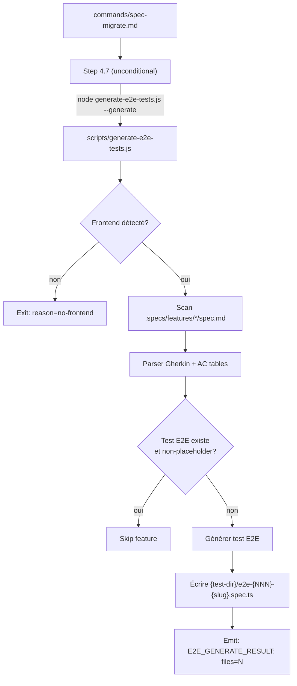

# Design: Migration 7 — E2E Test Generation Post-Migration

**Date:** 2026-04-20
**Task:** Ajouter une migration 7 qui génère des tests E2E interactifs à partir des specs existantes après chaque migration.

---

## Problème

Après une migration LiveSpec, les projets consommateurs (ex: claude-pilot) ont :
- Des tests visuels scaffoldés (screenshots via `migrate-visual-tests.js`)
- Mais **aucun test de comportement interactif** (clicks, formulaires, navigation, assertions fonctionnelles)

Les specs contiennent pourtant tout le matériel nécessaire :
- Des scénarios Gherkin détaillés dans `## User Scenarios & Testing`
- Des tables AC avec critères testables dans `## Acceptance Criteria`
- Des flowcharts Mermaid montrant les flux utilisateur

Ce matériel n'est jamais transformé en code de test E2E par la migration.

---

## Architecture



### Mécanisme d'exécution

- **`migrations/7/migrate.md`** : fait uniquement `SET_VERSION 7` (pas de `RUN`)
- **Step 4.7 dans `commands/spec-migrate.md`** : invoque le script **unconditionnellement** (comme Step 4.5)
- Le script tourne à chaque `spec.migrate`, même sur "already up to date" → nouvelles features = nouveaux tests

### Pourquoi deux mécanismes séparés

- Migration DSL (`SET_VERSION`) : one-shot, fait le bump de version
- Step 4.7 (command flow) : permanent, regénère à chaque run si nécessaire
- Pas de double exécution : le `RUN` verb n'est PAS utilisé dans la migration

---

## Script: `scripts/generate-e2e-tests.js` (scanner uniquement)

Le script garde son rôle de **scanner/détecteur** (`--scan` mode) :
- Détecte les features avec Gherkin mais sans tests E2E
- Émet la liste des features à traiter
- N'est PAS responsable de la génération (c'est l'IA)

### Détection frontend

Réutilise la même logique que `migrate-visual-tests.js` :
- 9 indicateurs (routes dirs, package.json deps, frontend/ dir, etc.)
- Si aucun → exit avec `reason=no-frontend`

### Détection des tests existants

Un test E2E **existe déjà** si :
- Un fichier `e2e-{NNN}-{slug}.spec.ts` ou `{NNN}-{slug}.spec.ts` est présent dans le test dir
- ET il contient plus de 10 lignes (non-placeholder)
- ET il contient au moins un `test(` avec du contenu (pas juste `test("placeholder", async () => {})`)

---

## Génération de tests : AI-driven (Step 4.7)

**La génération est faite par l'IA**, pas par un script regex. L'IA :

1. **Lit les specs** (Gherkin scenarios, AC, user stories)
2. **Lit le code source** (routes, composants, sélecteurs réels)
3. **Lit les fixtures** (fonctions de mock disponibles)
4. **Génère des tests complets** sans aucun placeholder

### Exigences absolues

- **Zéro `// TODO:`** — chaque step est traduit en code fonctionnel
- **Zéro `test.todo()`** — chaque scénario a un corps complet
- **Routes réelles** — lues depuis le code, pas inférées par regex
- **Sélecteurs réels** — `data-testid`, `getByRole`, `getByText` lus depuis le code source
- **Fixtures réelles** — utilisation des fonctions de mock existantes
- **Style cohérent** — même patterns que les tests existants du projet

### Quand l'information n'est pas trouvable dans le code

- Route manquante → utiliser la route la plus probable depuis la spec
- Sélecteur non trouvé → utiliser des sélecteurs sémantiques Playwright (`getByRole`, `getByText`, `getByLabel`)
- Mock API manquant → créer un `page.route()` inline avec des données réalistes
- **Jamais** de placeholder — toujours une implémentation complète

### Convention de nommage

| Pattern | Usage |
|---------|-------|
| `route-{slug}.spec.ts` | Tests visuels (screenshots) — Step 4.5 |
| `e2e-{NNN}-{slug}.spec.ts` | Tests E2E interactifs (comportement) — Step 4.7 |
| `{NNN}-{slug}.spec.ts` | Legacy visual (ancien format, reconnu par la détection) |

---

## Migration file: `migrations/7/migrate.md`

```markdown
---
version: 7
description: "E2E interactive test generation from feature specs"
date: 2026-04-20
---

# Migration v7: E2E Test Generation

Bumps version to enable Step 4.7 (E2E test generation from Gherkin specs).
The actual generation runs unconditionally in commands/spec-migrate.md Step 4.7,
not via RUN verb.

## Actions

SET_VERSION 7
```

---

## Intégration dans `commands/spec-migrate.md`

### Step 4.7 — E2E Test Generation (nouveau)

```markdown
### Step 4.7 — E2E Test Generation

**This step runs unconditionally** — same trigger as Step 4.5.

1. Resolve `E2E_SCRIPT` = `{livespec_dir}/scripts/generate-e2e-tests.js`

2. **Guard: script exists?**
   If not on disk → `WARNING: generate-e2e-tests.js not found — E2E generation skipped`

3. **Guard: Node.js available?**
   If `command -v node` fails → `WARNING: Node.js required — skipped`

4. **Run:**
   ```bash
   set +e
   E2E_OUTPUT=$(node "$E2E_SCRIPT" --generate 2>&1)
   E2E_EXIT=$?
   set -e
   ```

5. **Guard: non-zero exit?**
   If exit != 0 → `WARNING: E2E generation failed (exit {code})` + continue

6. **Parse sentinel:** `E2E_GENERATE_RESULT: files=N [reason=...]`
   Store `E2E_FILES` count and optional `REASON`.
```

### Extension Step 4.6 — Reconciliation élargie

Étendre le glob de Step 4.6 pour aussi couvrir `e2e-*.spec.ts` :
- Check 1 (duplicates) : inclure `e2e-*.spec.ts` dans le scan
- Check 2 (syntax) : inclure `e2e-*.spec.ts`
- Check 3 (dead stubs) : inclure `e2e-*.spec.ts`

### Extension Step 5 — Rapport

```
E2E test generation:
  {E2E_FILES} file(s) created:
    frontend/tests/e2e/e2e-001-authentication.spec.ts
    frontend/tests/e2e/e2e-002-workflow-engine.spec.ts
  {N} feature(s) skipped (tests already exist)
```

---

## Guards et safety

- **Never overwrite** : fichier existant avec contenu réel → skip
- **TODO markers** : sélecteurs non-inférables marqués `TODO-`
- **test.todo()** : scénarios complexes non-traduisibles → pending (pas broken)
- **Idempotent** : relancer ne change rien si les tests existent déjà
- **Non-blocking** : échec du script ne bloque pas la migration
- **Frontend guard** : même 9 indicateurs que `migrate-visual-tests.js`

---

## Fichiers à créer/modifier

| Fichier | Action |
|---------|--------|
| `migrations/7/migrate.md` | Créer — `SET_VERSION 7` uniquement |
| `scripts/generate-e2e-tests.js` | Créer — scaffold generator Gherkin → Playwright |
| `commands/spec-migrate.md` | Modifier — ajouter Step 4.7 + étendre Step 4.6 + rapport |
| `VERSION` | Modifier — 6 → 7 |

---

## Hors scope

- Exécution des tests générés (rôle de `/spec.test`)
- Génération de fixtures (`fixtures.ts`) — doivent déjà exister
- Modification des tests visuels existants
- `## Behavioral AC` (géré par `/spec.implement` Step 0a, pas par la migration)
- Parsing des flowcharts Mermaid (route extraction suffisante depuis le texte)
