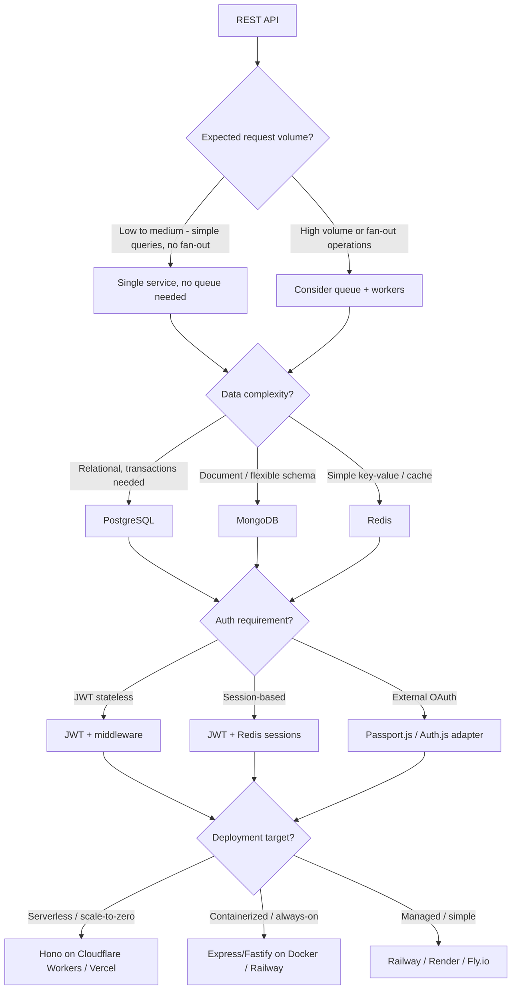
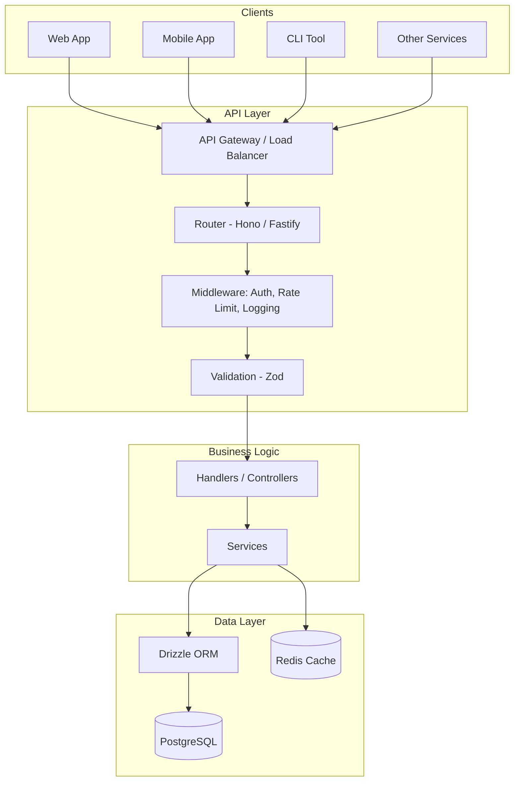

# Stack Preset: API REST

> Use this preset for backend services, microservices, and data APIs that serve other clients.

---

## Use When

- Building a standalone backend service or microservice
- Creating a data API consumed by web, mobile, or other services
- Building a CLI tool with a backend
- Need a focused API without a web frontend
- Migrating a monolith into services

## Do NOT Use When

- Need to serve a web frontend alongside the API → use [web-realtime](web-realtime.md) with Next.js API routes
- Need real-time push events → add WebSocket layer or use [web-realtime](web-realtime.md)
- Building a static content site → use [web-static](web-static.md)

---

## Infrastructure Decision Tree



---

## Recommended Stack

| Layer | Choice | Why |
|---|---|---|
| Framework | **Hono** (serverless) or **Fastify** (containerized) | Hono = ultra-fast, edge-compatible; Fastify = high performance, schema validation |
| Runtime | **Node.js 20+** or **Bun** | Node.js = maximum compatibility; Bun = faster startup |
| Database | **PostgreSQL** via **Drizzle ORM** | Type-safe queries, migrations, excellent DX |
| Caching | **Upstash Redis** (serverless) or **Redis** (containerized) | Response caching, rate limiting, job queues |
| Auth | **JWT** + custom middleware | Stateless, scalable, easy to implement |
| Validation | **Zod** | Runtime schema validation + TypeScript types |
| Documentation | **Scalar** or **Swagger UI** with OpenAPI | Auto-generated from route schemas |
| Testing | **Vitest + supertest** | Fast unit + integration tests |
| Containerization | **Docker** + **docker-compose** | Reproducible environments |
| CI/CD | **GitHub Actions** | Automated test + deploy pipeline |

---

## Architecture Pattern



---

## Project Structure

```
src/
├── index.ts              ← Entry point, server setup
├── config.ts             ← Environment config with Zod validation
├── routes/
│   ├── index.ts          ← Route registration
│   ├── users.ts          ← User routes
│   └── notifications.ts  ← Notification routes
├── handlers/
│   ├── users.ts          ← Request handlers (thin layer)
│   └── notifications.ts
├── services/
│   ├── users.ts          ← Business logic
│   └── notifications.ts
├── data/
│   ├── schema.ts         ← Drizzle schema definitions
│   ├── users.ts          ← User queries
│   └── notifications.ts  ← Notification queries
├── middleware/
│   ├── auth.ts           ← JWT verification
│   ├── rate-limit.ts     ← Rate limiting
│   └── logger.ts         ← Request logging
└── types/
    └── index.ts          ← Shared TypeScript types

db/
├── migrations/           ← Drizzle migration files
└── seed.ts               ← Dev data seeding

tests/
├── unit/                 ← Service unit tests
├── integration/          ← API endpoint tests
└── helpers/              ← Test utilities, DB seeding
```

---

## Getting Started

```bash
# Initialize project
mkdir my-api && cd my-api
npm init -y
npm install typescript @types/node tsx

# Install framework
npm install hono  # or: npm install fastify

# Install database + ORM
npm install drizzle-orm postgres
npm install -D drizzle-kit

# Install validation
npm install zod

# Install auth
npm install jose  # JWT

# Install testing
npm install -D vitest supertest @types/supertest

# Install dev tools
npm install -D prettier eslint
```

---

## Docker Setup

```dockerfile
# Dockerfile
FROM node:20-alpine AS builder
WORKDIR /app
COPY package*.json ./
RUN npm ci
COPY . .
RUN npm run build

FROM node:20-alpine AS runner
WORKDIR /app
COPY --from=builder /app/dist ./dist
COPY --from=builder /app/node_modules ./node_modules
EXPOSE 3000
CMD ["node", "dist/index.js"]
```

```yaml
# docker-compose.yml (development)
services:
  api:
    build: .
    ports:
      - "3000:3000"
    environment:
      - DATABASE_URL=postgres://postgres:postgres@db:5432/myapp
    depends_on:
      - db

  db:
    image: postgres:16-alpine
    environment:
      POSTGRES_PASSWORD: postgres
      POSTGRES_DB: myapp
    ports:
      - "5432:5432"
    volumes:
      - postgres_data:/var/lib/postgresql/data

volumes:
  postgres_data:
```

---

## API Documentation

Document all endpoints in an OpenAPI spec and generate a `contracts/openapi.yaml` for each feature.

Use Scalar or Swagger UI to serve interactive docs:

```typescript
// src/index.ts
import { Scalar } from '@scalar/hono-api-reference'
app.get('/docs', Scalar({ spec: { url: '/openapi.json' } }))
```

---

## Deterministic Preset Selection

When choosing this preset, decide each axis explicitly (no implicit defaults):

| Axis | Option A | Option B | Selection Rule |
|---|---|---|---|
| Framework | Hono | Fastify | Hono for edge/serverless, Fastify for long-lived container APIs |
| Runtime | Node.js | Bun | Node.js unless startup latency is a strict requirement and ecosystem fit is validated |
| Database | PostgreSQL | MongoDB | PostgreSQL by default; MongoDB only for document-first domain with low relational joins |
| Auth | JWT middleware | OAuth adapter | JWT for service-to-service/internal APIs, OAuth for user-facing auth federation |
| Deploy | Serverless | Containerized | Serverless for bursty workloads, containerized for stable high-throughput |

Record all chosen axes in `.specs/stacks/_default.md` with one-line rationale each.

### Operational Readiness Checks

Before considering stack decision complete:

- OpenAPI strategy chosen (generation + serving path)
- Migration strategy selected (Drizzle or equivalent)
- Rate limiting strategy selected (Redis or edge-native)
- Testing scope mapped (unit/integration/smoke)

If any is missing, mark `Decision Pending` and do not finalize.

---

*LiveSpec Stack Preset v1.0*
