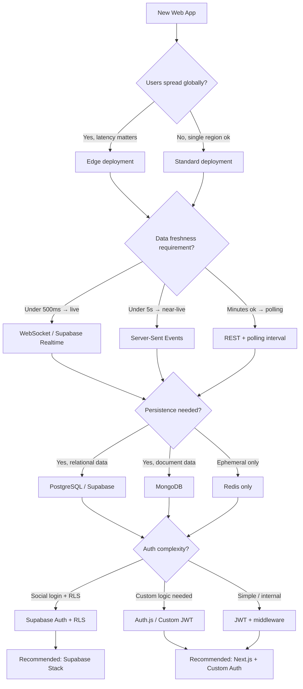
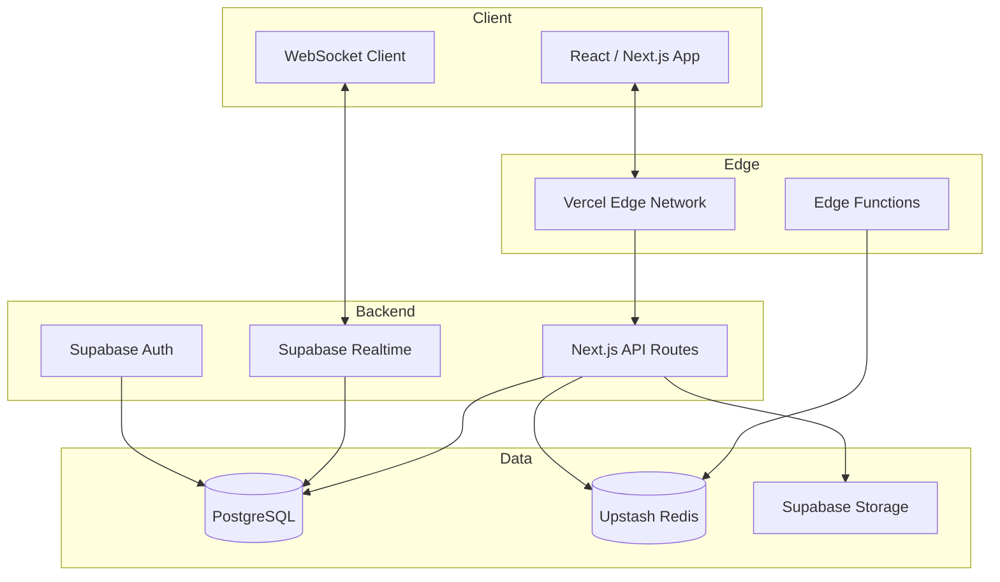

# Stack Preset: Web Real-Time

> Use this preset for applications with live updates, collaborative features, or frequently changing data.

---

## Use When

- Users need to see data update without refreshing the page
- Multiple users interact with shared data (collaboration, comments, presence)
- Events need to be pushed from server to clients (notifications, live feeds, dashboards)
- Data freshness requirement is under 2 seconds

## Do NOT Use When

- Data changes less than once per minute → use [web-static](web-static.md) or [api-rest](api-rest.md) with polling
- No user-facing frontend → use [api-rest](api-rest.md)
- Read-only content site → use [web-static](web-static.md)

---

## Infrastructure Decision Tree



---

## Recommended Stack

| Layer | Choice | Why |
|---|---|---|
| Framework | **Next.js 14** (App Router) | Server components + API routes + streaming |
| Runtime / Deploy | **Vercel** (Edge Functions where needed) | Zero-config, edge network, preview URLs |
| Database | **Supabase PostgreSQL** | Managed Postgres + realtime built in |
| Real-time | **Supabase Realtime** | WebSocket subscriptions on Postgres changes |
| Cache | **Upstash Redis** | Serverless Redis for rate limiting, sessions, queues |
| Auth | **Supabase Auth** | Row-Level Security + social providers built in |
| File Storage | **Supabase Storage** | S3-compatible, integrated with auth |
| Testing | **Vitest + Playwright** | Fast unit tests + full E2E + visual regression |
| CI/CD | **GitHub Actions** | Native GitHub integration |

---

## Architecture Pattern



---

## Latency Considerations

| Scenario | Expected Latency | Optimization |
|---|---|---|
| Initial page load | < 100ms | Edge caching, RSC streaming |
| API data fetch | < 200ms | Connection pooling (Supabase), Redis cache |
| Real-time event delivery | < 500ms | Supabase Realtime WebSocket |
| Database write | < 50ms | Supabase managed Postgres, regional instance |
| File upload | Variable | Multipart to Supabase Storage |

---

## Environment Variables

```env
# Supabase
NEXT_PUBLIC_SUPABASE_URL=https://xxx.supabase.co
NEXT_PUBLIC_SUPABASE_ANON_KEY=xxx
SUPABASE_SERVICE_ROLE_KEY=xxx  # Server-side only

# Upstash Redis
UPSTASH_REDIS_REST_URL=https://xxx.upstash.io
UPSTASH_REDIS_REST_TOKEN=xxx
```

---

## Getting Started

```bash
# Create Next.js app
npx create-next-app@latest my-app --typescript --tailwind --app

# Install Supabase client
npm install @supabase/supabase-js @supabase/ssr

# Install Upstash Redis (optional)
npm install @upstash/redis

# Install testing tools
npm install -D vitest @vitejs/plugin-react @playwright/test
```

---

## Testing Strategy with This Stack

- **Unit tests:** Vitest — business logic, data transformations, utility functions
- **Integration tests:** Vitest + Supabase local emulator — API routes, database queries
- **E2E tests:** Playwright — full user flows against local or staging environment
- **Visual tests:** Playwright screenshots — UI components with defined visual specs
- **Real-time tests:** Playwright with WebSocket mocking — subscription behavior

See `testing-strategy-template.md` for detailed test examples.
See `system/testing/test-protocol.md` for the stack-agnostic discovery and execution protocol.

---

## Deterministic Selection Profile

When this preset is selected, generate `_default.md` with these required fields:

- `Project Type`: web-realtime
- `Primary Latency Target`: `<500ms live events` or explicit alternative
- `Data Model`: relational/document/ephemeral
- `Auth Mode`: Supabase Auth / custom JWT / Auth.js
- `Deployment Mode`: edge-first / single-region
- `Cost Posture`: low-start / balanced / performance-first

If any field is unknown, set `[ASSUMED]` and list follow-up questions.

### Fallback Variants

If Supabase or Vercel is constrained by policy/cost/region, choose one variant explicitly:

1. `Next.js + PostgreSQL + Pusher + Auth.js`
2. `Remix + Postgres + SSE + custom JWT`
3. `SPA + API REST backend + polling/SSE` (near-real-time only)

Always document chosen variant and rejection reason for non-selected options.

---

*LiveSpec Stack Preset v1.0*
