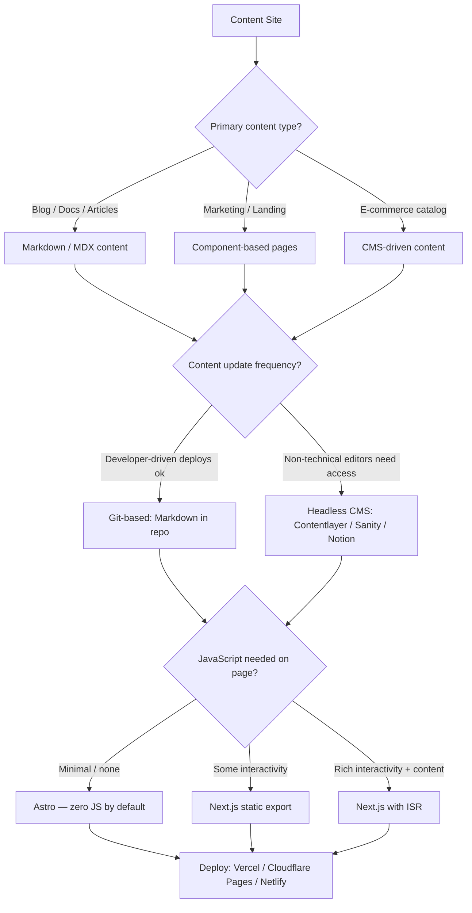
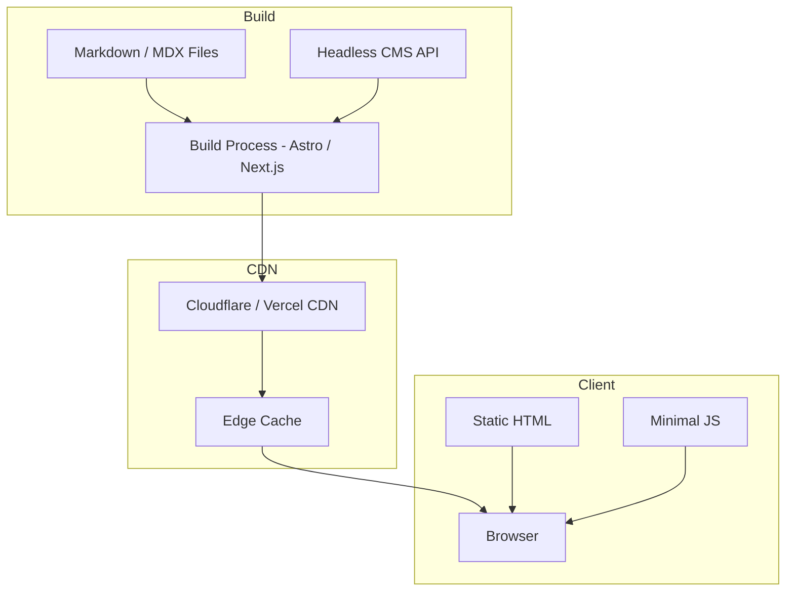

# Stack Preset: Web Static

> Use this preset for content-driven sites, documentation, blogs, and marketing pages where content changes infrequently.

---

## Use When

- Content is primarily text, images, and static assets
- Content changes on a schedule (daily, weekly) not in real-time
- SEO and Core Web Vitals are critical
- Site is a blog, documentation, marketing page, landing page, or portfolio
- No authenticated user-specific dynamic content (or minimal)

## Do NOT Use When

- Users need to see live data updates → use [web-realtime](web-realtime.md)
- Significant user authentication and personalization → use [web-realtime](web-realtime.md)
- Complex data interactions → use [api-rest](api-rest.md) as backend

---

## Infrastructure Decision Tree



---

## Recommended Stack

| Layer | Choice | Why |
|---|---|---|
| Framework | **Astro** (for pure content) or **Next.js** (static export) | Astro = zero JS by default, best performance; Next.js = needed for more interactivity |
| Content | **Markdown / MDX** in repo, or **Contentlayer** | Type-safe content from Markdown files |
| Styling | **Tailwind CSS** | Utility-first, no unused CSS with PurgeCSS |
| Deploy | **Vercel** or **Cloudflare Pages** | CDN-first delivery, instant cache invalidation |
| Images | **Cloudinary** or built-in `<Image>` | Automatic format optimization, CDN delivery |
| Search | **Pagefind** (static) or **Algolia** (managed) | Pagefind is zero-server; Algolia scales to millions |
| Analytics | **Plausible** (privacy-first) or **Vercel Analytics** | No cookies, GDPR-friendly |
| Testing | **Vitest + Playwright** | Component tests + E2E for critical paths |

---

## Architecture Pattern



---

## Performance Targets

| Metric | Target | How |
|---|---|---|
| Lighthouse Performance | > 95 | Static HTML, minimal JS, optimized images |
| LCP (Largest Contentful Paint) | < 2.5s | Image optimization, CDN delivery |
| CLS (Cumulative Layout Shift) | < 0.1 | Defined image dimensions, no layout shifts |
| FID / INP | < 100ms | Minimal JS, deferred non-critical scripts |
| Build time | < 60s | Incremental builds, content caching |

---

## Getting Started

```bash
# Astro (recommended for pure content sites)
npm create astro@latest my-site

# Next.js static export
npx create-next-app@latest my-site --typescript --tailwind --app
# Then in next.config.js: output: 'export'

# Install Contentlayer (for type-safe Markdown)
npm install contentlayer next-contentlayer

# Install testing tools
npm install -D vitest @playwright/test
```

---

## Deterministic Selection Profile

When this preset is selected, `_default.md` must include:

- `Rendering Mode`: SSG / ISR
- `Content Source`: git-mdx / headless-cms
- `Interactivity Budget`: minimal / moderate
- `Search Strategy`: Pagefind / Algolia
- `Analytics Strategy`: Plausible / provider-native
- `Deploy Target`: Vercel / Cloudflare Pages / Netlify

If any field is unknown, set `[ASSUMED]` and list one follow-up question per unknown.

See `system/testing/test-protocol.md` for the stack-agnostic discovery and execution protocol.

### Dynamic Escalation Rule

If personalization, auth complexity, or update frequency increases beyond static assumptions:

- mark `Escalation Suggested: web-realtime`
- list impacted pages/features
- recommend running `/spec.stack impact "web-static -> web-realtime"`

---

## Deployment Configuration (Copy-Paste Safe)

```json
{
  "buildCommand": "npm run build",
  "outputDirectory": "dist",
  "framework": "astro"
}
```

For Next.js static export, set `"framework": "nextjs"` and ensure static export is configured in `next.config.js`.

---

## When Content Changes

For **Git-based content:** Push to main → CI builds → Vercel deploys automatically

For **CMS-based content:** Editor saves → CMS sends webhook → Vercel triggers rebuild → Site updated in ~30s

---

*LiveSpec Stack Preset v1.0*
