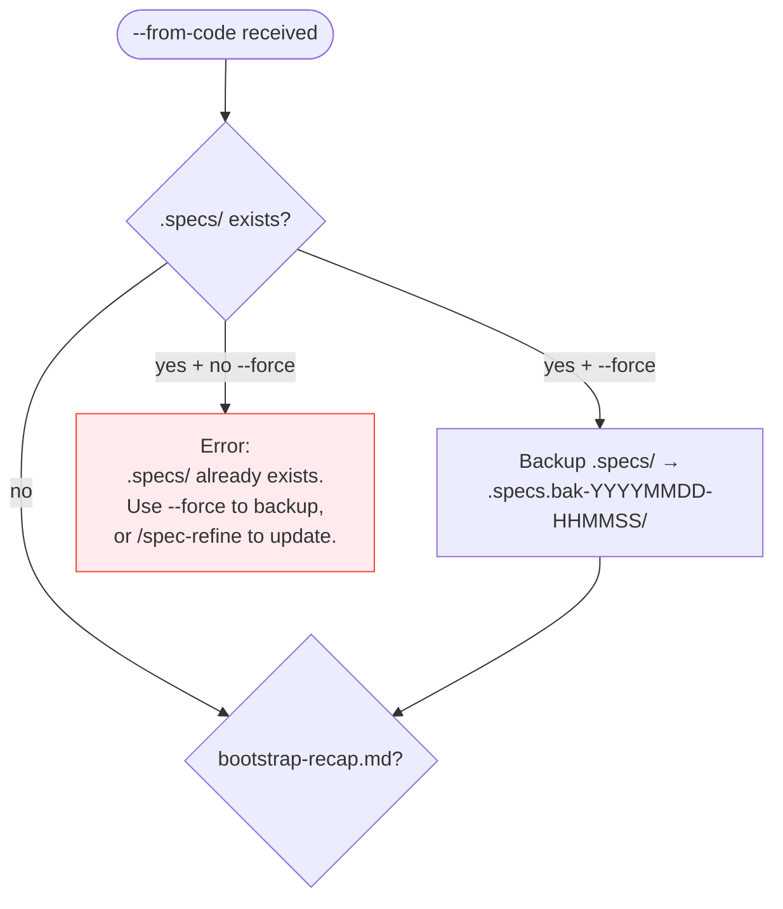

# From-Code Flow

> Referenced by `.agent-sync/skills/spec-init/SKILL.md` when `--from-code` flag is set.
> This file specifies the complete reverse-engineering flow: code analysis → bootstrap recap → human validation → Phase C entry.

---

## Interface

**Inputs from caller (init.md):**
- `--from-code` flag (always true when this file is reached)
- `--deep` flag (boolean — enables Tier 4 scan)
- `--force` flag (boolean — backup .specs/ and/or overwrite recap)
- `--auto` flag (boolean — skip human validation, proceed directly)
- Project root path
- `.specs/` existence state (exists / does not exist)
- `bootstrap-recap.md` existence and status (none / draft / validated / malformed)

**Outputs:**
- `bootstrap-recap.md` in project root with `status: draft` (first run)
- Phase C entry signal when `status: validated` and validation passes
- After Phase C/D/E: `bootstrap-recap.md` moved to `.specs/bootstrap-recap.md` with `status: completed`

---

## Pre-Checks

### 1. Guard: .specs/ existence



### 2. Guard: bootstrap-recap.md state

```mermaid
stateDiagram-v2
    [*] --> NoRecap: no file found
    [*] --> Draft: status is draft
    [*] --> Validated: status is validated
    [*] --> Malformed: unparseable YAML or missing sections

    NoRecap --> Scanning: start Phase A'
    Malformed --> Scanning: warn "Recap malformed — regenerating"
    Draft --> WaitHuman: print edit instructions
    Validated --> ValidationGate: run validation rules

    Scanning --> Draft: generate recap
    ValidationGate --> PhaseC: all checks pass
    ValidationGate --> WaitHuman: show specific errors

    WaitHuman --> [*]: user re-runs after editing

    note right of Draft: --force overwrites,\nrestarts scan
    note right of Validated: --auto skips\nhuman editing
```



| State | Action |
|---|---|
| No `bootstrap-recap.md` | Start Phase A' scan |
| `bootstrap-recap.md` with `status: draft` | Print: "Edit bootstrap-recap.md, set status to 'validated', then re-run `/spec-init --from-code`" |
| `bootstrap-recap.md` with `status: validated` | Run validation gate → Phase C if pass |
| `bootstrap-recap.md` malformed (unparseable YAML, missing H2 sections) | Warn: "Existing recap is malformed — regenerating." Start Phase A' scan. |
| Invalid status value (not draft/validated) | Error: "Invalid status '[value]'. Set status to 'validated' to proceed." |
| `bootstrap-recap.md` exists + `--force` | Overwrite recap, restart Phase A' scan |
| `--auto` flag | Generate recap → skip human validation → proceed directly to Phase C. Tags remain in files as documentation. |

---

## Phase A' — Tiered Code Scan

Replaces the conversational brainstorm (Phase A, 6 questions). The LLM scans the repository and auto-generates answers.

### Tier 1 — Manifests (read in full, cap: 12K tokens)

Detect and read all matching manifest files:

| Pattern | Ecosystem |
|---|---|
| `package.json` | Node.js / JavaScript / TypeScript |
| `go.mod` | Go |
| `pyproject.toml`, `setup.py`, `requirements.txt` | Python |
| `Cargo.toml` | Rust |
| `composer.json` | PHP |
| `Gemfile` | Ruby |
| `pom.xml` | Java / Maven |
| `build.gradle`, `build.gradle.kts` | Java / Kotlin / Gradle |
| `pubspec.yaml` | Dart / Flutter |
| `*.csproj` | .NET |

**Monorepo handling:** If more than 5 manifest files of the same type are found, read the root manifest + the 5 most recently modified. Log skipped manifests in `## Analysis Coverage`.

### Tier 2 — Structure (cap: 12K tokens)

| Source | How to read | Purpose |
|---|---|---|
| README.md (or README) | First 100 lines | Project description, vision |
| Directory tree | `ls` depth 3, ignore: node_modules, dist, .git, __pycache__, .next, build, coverage, vendor | Architecture overview |
| Main entrypoints | First match per category (see table below) | Core module structure |
| Config files | next.config.*, vite.config.*, astro.config.*, wrangler.toml, vercel.json, fly.toml, Dockerfile | Deploy and framework detection |

**Entrypoint detection (first match per category):**

| Category | Patterns (in priority order) |
|---|---|
| Server | `src/index.ts`, `src/main.ts`, `src/server.ts`, `src/app.ts`, `main.go`, `cmd/*/main.go`, `app.py`, `main.py`, `src/main.rs` |
| Frontend | `src/App.tsx`, `src/App.vue`, `src/App.svelte`, `app/layout.tsx`, `pages/_app.tsx` |
| CLI | `bin/*`, files with `#!/usr/bin/env` shebang |

### Tier 3 — Deep (targeted grep, gets remaining budget)

| Signal | Grep pattern | Maps to | Default tag |
|---|---|---|---|
| API routes | `router\.(get\|post\|put\|delete)`, `app\.(get\|post)`, `@Get\|@Post\|@Delete`, `func.*Handler` | Inferred Features | OBSERVED |
| DB schemas | `CREATE TABLE`, `model.*{`, `schema\.`, `@Entity`, `type.*struct.*gorm`, `prisma model` | Detected Stack + Features | OBSERVED |
| Auth patterns | `auth`, `login`, `session`, `jwt`, `passport`, `supabase.auth`, `clerk`, `@auth` | Users & Roles + Features | INFERRED |
| Payment patterns | `stripe`, `payment`, `billing`, `invoice`, `subscription` | Inferred Features | INFERRED |
| Real-time | `websocket`, `socket\.io`, `realtime`, `Server-Sent Events`, `EventSource`, `useChannel` | Real-Time Needs | OBSERVED |
| Testing | `describe\(`, `test\(`, `it\(`, `func Test`, `@Test`, `pytest`, `spec\.` | Detected Stack (testing layer) | OBSERVED |
| i18n | `i18n`, `locale`, `intl`, `t\(`, `useTranslation` | Geography | INFERRED |
| Analytics | `analytics`, `tracking`, `posthog`, `mixpanel`, `segment` | Inferred Features | INFERRED |

### Tier 4 — History (--deep only, extra 30K budget)

| Source | How to read | Purpose | Default tag |
|---|---|---|---|
| `git log --oneline -50` | Full output | Active development areas | SPECULATIVE |
| `.github/workflows/*.yml` | Read each file | CI/CD, deploy targets | INFERRED |
| `.gitlab-ci.yml` | Read full | CI/CD | INFERRED |
| `.env.example`, `.env.sample` | Read full (no secrets — these are templates) | Environment variables, service dependencies | INFERRED |

**All Tier 4 signals are tagged `[SPECULATIVE]` by default** unless they directly confirm a Tier 1-3 finding (in which case the Tier 1-3 tag is preserved).

### Token Budget — Waterfall Model

```
Total budget: 30K tokens (default) | 60K tokens (--deep)

Tier 1 reads what it needs (usually 500-3K) → remaining flows to Tier 2
Tier 2 reads up to 12K cap → remaining flows to Tier 3
Tier 3 gets everything left (typically 15-28K)
Tier 4 (--deep): additional 30K on top
```

**Overflow handling:**
- If a tier exceeds its cap: truncate files by modification date (most recent first), keep partial results
- Skipped files listed in `## Analysis Coverage` section of recap
- User warned in output: `"Tier N truncated: X/Y files skipped (token budget)."`

---

## Auto-Answering the 6 Questions

Using scan results, generate answers to the same 6 questions from `spec-init` Phase A.

| Question | Primary signal source | Typical confidence |
|---|---|---|
| **Q1: What are you building?** | README + package description + entrypoints | INFERRED |
| **Q2: Who uses it?** | Auth patterns, role references, admin routes, RLS | INFERRED / SPECULATIVE |
| **Q3: Where do they use it?** | Frontend framework, mobile config, responsive CSS | OBSERVED / INFERRED |
| **Q4: What needs to be real-time?** | WebSocket/SSE grep results | OBSERVED |
| **Q5: Where are users geographically?** | Deploy config, CDN, i18n, region config | INFERRED / SPECULATIVE |
| **Q6: Scale and budget?** | CI config, infra files, Dockerfile, .env patterns | SPECULATIVE |

### Format Rule

- **`[OBSERVED]` or `[INFERRED]`** → present as affirmation:
  > `[INFERRED] Your project is a task management API built with Express and PostgreSQL.`

- **`[SPECULATIVE]`** → present as question:
  > `[SPECULATIVE] Is this project primarily targeting individual developers or enterprise teams?`

- **No signal at all** → use `[FILL]` marker:
  > `[FILL] — No signal detected. Please describe your target users.`

---

## Phase B' — Auto Stack Detection

Replaces the interactive decision tree (Phase B). The stack is extracted from the code.

### Detection Logic

1. Read all Tier 1 manifests
2. Extract dependencies with versions
3. Map to stack layers:

| Layer | Detection source |
|---|---|
| Language | Manifest type + file extensions |
| Framework | Dependencies (express, next, django, gin, fastify, hono, etc.) |
| Database | Dependencies (pg, mysql2, prisma, drizzle, mongoose, sqlc) + schema files |
| ORM | Dependencies (prisma, drizzle, typeorm, sequelize, sqlc) |
| Auth | Dependencies (passport, clerk, supabase, auth0, lucia) + auth patterns |
| Deploy | Config files (vercel.json, wrangler.toml, Dockerfile, fly.toml, railway.json) |
| Testing | Dependencies (vitest, jest, pytest, go test) + test file patterns |
| Package Manager | Lock file: bun.lockb → bun, pnpm-lock.yaml → pnpm, package-lock.json → npm, yarn.lock → yarn |
| Linter/Formatter | Config files (.eslintrc*, biome.json, .prettierrc*) + dependencies |
| Design | Config files (.pen, figma tokens, .excalidraw) — maps to design tool check |

### Conflict Handling

When conflicting signals are detected:

```markdown
| Testing | Jest + Vitest | — | Both in devDependencies | [OBSERVED-CONFLICT] |
```

Note: `[OBSERVED-CONFLICT]` tags **must be resolved** by the human before validation passes. Present both choices with evidence count (e.g., "Jest: 45 test files. Vitest: 12 test files.").

### ADR Generation

Generate one ADR per major stack choice:

```markdown
# ADR-NNN: [Technology] as [Layer]

- **Date:** YYYY-MM-DD
- **Status:** Observed (from existing codebase)
- **Context:** Project uses [Technology] [Version] as [purpose].
- **Evidence:** [manifest] dependency, [N] files in [path]
- **Alternatives in ecosystem:** [Alt1], [Alt2], [Alt3]
- **Note:** This ADR documents an observed choice, not a deliberate decision.
  Rationale was not available from the codebase.
```

### Polyglot Projects

When multiple manifest types are detected, present stacks neutrally:

```markdown
### Stack 1: Node.js 20 (package.json)
[OBSERVED] Express 4.18, Prisma 5.x, React 18, TypeScript 5.4

### Stack 2: Go 1.22 (go.mod)
[OBSERVED] Chi router, sqlc, PostgreSQL driver

### Domain roles
[INFERRED] Stack 1 appears to be the web application layer (React frontend + Express API).
[INFERRED] Stack 2 appears to be a background processing service.

> Review and correct the domain role assignments above.
```

Do **not** hardcode domain labels (frontend/backend) as section headers — present them as `[INFERRED]` suggestions.

---

## Scan Quality Gate

**Run after Phase A'/B' complete, before generating the recap.**

Count sections that have at least INFERRED-level content:

| Populated sections | Action |
|---|---|
| < 3, **OR** missing Project Vision, **OR** missing Detected Stack | **Abort:** "Insufficient signal to generate specs. Use `spec-init` without --from-code, or add a README to improve detection." |
| 3-5 sections (with Vision + Stack present) | **Warn:** "Low coverage — N sections need manual input." Proceed with `[FILL]` gaps. |
| 6+ sections | **Proceed** normally |

**Hard requirement:** `## Project Vision` and `## Detected Stack` must both have at least `[INFERRED]` content. If either is missing or only `[SPECULATIVE]`, abort regardless of total count.

---

## Recap Generation

After scan quality gate passes:

1. **Read** template from **Read** [`bootstrap-recap-template.md`](templates/bootstrap-recap-template.md)
2. Fill all sections from scan results with appropriate tags
3. Write `bootstrap-recap.md` to project root with `status: draft`
4. Display output summary:

```
Scanning repository...
  Tier 1: [N] manifest(s) .......................... [N] tokens
  Tier 2: [N] structure files ...................... [N] tokens
  Tier 3: [N] grep patterns ........................ [N] tokens
  [Tier 4: [N] history files ....................... [N] tokens]
  Total: [N] / [budget] tokens

Auto-generating project profile...
  Q1 Vision ........... [TAG]
  Q2 Users ............ [TAG] [N] roles detected
  Q3 Platforms ........ [TAG]
  Q4 Real-time ........ [TAG] [N] features
  Q5 Geography ........ [TAG]
  Q6 Scale ............ [TAG]

Detecting stack...
  [N] layers detected, [N] conflicts

Inferring features...
  [N] implemented, [N] gaps detected

bootstrap-recap.md generated.

  Tags: [N] OBSERVED · [N] INFERRED · [N] SPECULATIVE · [N] CONFLICT
  Action required: [N] sections need manual input

→ Edit bootstrap-recap.md, set status to "validated", then re-run:
  /spec-init --from-code
```

If `--auto`: skip the "Edit..." prompt, proceed directly to validation gate.

---

## Validation Gate

Before entering Phase C, verify the recap:

- [ ] YAML frontmatter parseable with `status: validated`
- [ ] All 9 H2 sections present (## Project Vision through ## Proposed Roadmap)
- [ ] `## Project Vision` is not empty
- [ ] `## Users & Roles` has at least 1 role row
- [ ] `## Detected Stack` has at least 1 row
- [ ] No `[FILL]` markers remain
- [ ] No `[OBSERVED-CONFLICT]` tags remain

**On failure:** Display specific errors:
```
Validation failed:
  ✗ [FILL] marker found in ## Geography (line 42)
  ✗ [OBSERVED-CONFLICT] in ## Detected Stack — Testing layer (line 67)

→ Fix the issues in bootstrap-recap.md, then re-run.
```

**On success:** Proceed to Phase C (standard init.md pipeline).

---

## Phase C Entry — Recap to Artifacts Mapping

When validation passes, the recap feeds into the standard Phase C/D/E pipeline:

| Recap section | Target artifact | Notes |
|---|---|---|
| Project Vision | `.specs/project.md` → Vision | |
| Users & Roles | `.specs/project.md` → Users table | |
| Platforms | `.specs/project.md` → Constraints (target platforms) | |
| Real-Time Needs | `.specs/project.md` → Real-Time Requirements table | |
| Geography | `.specs/project.md` → Geographic Requirements | |
| Scale & Budget | `.specs/project.md` → Constraints (scale, budget) | |
| Detected Stack | `.specs/stacks/_default.md` | With `updated` frontmatter |
| Stack ADRs | `.specs/stacks/decisions/ADR-NNN-*.md` | Status: "Observed" |
| Proposed Roadmap | `.specs/roadmap.md` | Pre-checked items in "Implemented" section |

### Constitution Generation

`.specs/constitution.md` is synthesized from:
- **Project Vision** → architecture style (API-first, SPA, SSR, CLI, etc.)
- **Detected Stack** → technology constraints and capabilities
- **Codebase structure** → patterns (monolith, microservices, monorepo, serverless, event-driven)

The LLM uses **Read** [`constitution-template.md`](constitution-template.md) and fills it from these three sources.

### Design Tool Check

Runs identically to standard init (Step 3.5 in init.md). `--from-code` does **not** skip this step.

---

## Post Phase E — Recap Cleanup

After Phase E completes:

1. Move `bootstrap-recap.md` from project root to `.specs/bootstrap-recap.md`
2. Update YAML frontmatter:
   ```yaml
   status: completed
   completed: YYYY-MM-DD
   ```
3. The recap now serves as provenance documentation inside `.specs/`

---

## Edge Cases

| Case | Handling |
|---|---|
| Empty repo (no code files) | Abort: "No source code detected. Use `spec-init` without --from-code." |
| Monorepo (15+ manifests of same type) | Scan root + 5 most recent. Warn in Analysis Coverage. |
| No README | Q1 Vision tagged `[SPECULATIVE]` — may trigger abort if no other Vision signal |
| No tests found | Testing strategy generated with recommendations based on stack |
| Binary-only project | Abort: "No parseable source code found." |
| `.brainstorm/` exists | `--from-code` ignores brainstorm data. Use regular `spec-init` for that path. |
| Corrupted/partial `bootstrap-recap.md` | Treat as "no recap", re-scan. Warn: "Existing recap is malformed — regenerating." |
| `.specs/` exists + `bootstrap-recap.md` at root | `--force` required. Backs up `.specs/`, then checks recap status. |
| User typos in YAML status | Error: "Invalid status '[value]'. Set status to 'validated' to proceed." |
| `--from-code --stack` | Warning: "--stack ignored in --from-code mode (stack detected from code)." |
| `--force` + recap exists | Re-scan codebase, overwrite existing recap. |
| All Q5/Q6 answers SPECULATIVE | Valid — recap has more [FILL] markers for human. |
| `## Analysis Coverage` | Informational only — not parsed by Phase C, not required for validation. |
| `.conventions/` already exists (with `index.md` or legacy `conventions.md`) | Phase E skips the conventions bootstrap (convention guard). Projects on the legacy format should run `/spec-refresh-conventions --full` once to migrate. |
| Polyglot project | Multiple stacks presented neutrally. Domain roles as [INFERRED]. One ADR per domain. |

---

*From-code flow spec — LiveSpec v1.1*
*Referenced by .agent-sync/skills/spec-init/SKILL.md when --from-code flag is set.*
