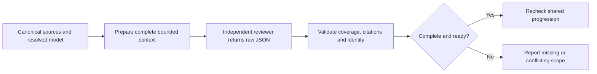

# Complete review and progression

## Goal review identity

- Before locking a new goal that contains a model-bound review task, resolve the actual reviewer model from active runtime metadata or explicit review configuration; never guess it or derive it from a receipt.
- Add `--model=<actual-model>` to internal active flags even when the user supplied no flags. Forward it unchanged to every child command and child `goal render`, review preparation/ingestion, Analyze and progression gate. An explicit review budget follows the same path through `--review-max-chars`.
- If unresolved, stop immediately with `BLOCKED at step 0 - prerequisite_unmet - reviewer_model_unresolved`; obtain available runtime metadata internally. No extra user command or configuration is required. The CLI refuses to save an unusable review-bearing goal.
- Deterministic commands and pre-configuration bootstrap without review tasks or documentary acceptance receipts need no model identity; existing immutable goals keep their original policy.


<!-- @spec FR-002: Shared native review protocol — .specs/features/078-requirement-evidence-integrity/spec.md#fr-002 -->
<!-- @spec FR-015: Shared progression authority — .specs/features/078-requirement-evidence-integrity/spec.md#fr-015 -->

Existing specify, plan, check, implement and refine workflows use this protocol internally; it adds no mandatory user command or document.

## Prepare and consume the actual review



- Resolve the actual reviewer model from the active runtime/configuration; never label an unknown provider default as a known model.
- Run the existing validation entry point, with `spec` for specification review or `plan` for plan review:

  ```bash
  livespec validate .specs/features/NNN-feature-name --prepare-review spec --model <resolved-model>
  ```

- Read the returned `prepared` (`PreparedReview`) and `response_schema` in full. Its exact section/requirement identities and batch prompts are authoritative. Dispatch each complete `batches[].prompt` to the independent native reviewer. Include the `ReviewResponse` JSON schema from **Read** [review_contract.py](../validator/semantic/review_contract.py). Do not trim text, omit sections or replace source obligations with a summary. Preparation errors or an indivisible over-budget section mean incomplete review.
- Reviewer returns one strict JSON response per batch: `batch_id`, exhaustive `reviewed_section_ids`, qualified requirement `conclusions`, `ambiguities`, `extra_scope`, grounded `findings`, `confidence`, and `synthesized_batch_ids`. Each requirement receives `covered`, `contradictory`, `missing` or `ambiguous`, rationale and exact citations. A missing behavior cites its source and searched plan sections, without inventing a plan quotation. Technical necessities need a justification; unapproved business scope blocks.
- For multiple batches, generate the final synthesis using `synthesis_prompt(prepared, raw_results)` from **Read** [review_receipts.py](../validator/semantic/review_receipts.py); preserve all batch IDs, obligations and unresolved contradictions. A fitting review needs one call; unchanged valid cache reuse needs none.
- Persist actual returned strings in a generated bundle `{"raw_results":["<actual batch JSON>"],"synthesis":null}`; for multiple batches, `synthesis` contains the actual synthesis JSON string. Never manufacture a PASS or conclusions from a prose summary. Ingest through the same validator as provider reviews:

  ```bash
  livespec validate .specs/features/NNN-feature-name --ingest-review <actual-bundle.json> --review-kind spec --model <resolved-model>
  ```

- Read the returned receipt and diagnostics. `complete` means exhaustive valid grounding; `ready` additionally requires covered conclusions and no unresolved critical ambiguity, blocking finding or unapproved scope. Missing, partial, malformed or stale review cannot establish readiness. Return the actual receipt path with the phase result.
- Generated `.reviews/spec.json` and `.reviews/plan.json` are disposable caches, not a second source of truth. Source/dependency, reviewer model, prompt/schema/policy changes invalidate reuse. Only the explicitly normalized selected spec/plan lifecycle metadata is excluded from normative identity; changed requirement meaning always invalidates it. Preserve archived raw source identity and historical verdicts.
- UI and accepted Penflow history still require the existing bound snapshot/result and cumulative certification. This semantic receipt supplements that authority; it does not replace it.

## Clarification without lost questions

- Step 5.9 of specify collects deterministic candidates; reconcile them with the completed current spec review before planning. Use `collect_clarification_inventory` from **Read** [clarify_inventory.py](../validator/clarify_inventory.py), passing `prepare_feature_review(project_root, feature, "spec", model)` and its current receipt path. Preserve `inventory`; `presented` is only a slice of at most five unresolved items.
- Reuse approved-context resolutions and accepted decisions; ask only for unresolved observable business choices. French and English vague qualities need relevant metrics; an unrelated number is insufficient. Presentation limits never discard the sixth critical question. Automatic execution blocks while any critical decision or required review remains unresolved.
- Record an accepted answer using `persist_clarification_decision` from **Read** [clarify_decisions.py](../validator/clarify_decisions.py), then update affected normative wording in place. Preserve FR/AC/SC IDs. Recollect after each write; stale question objects are rejected. Revalidate the spec and refresh only the affected review before progression. Use the existing Clarifications section, not an additional user ledger.

## Shared gate at direct and nested boundaries

```bash
livespec validate .specs/features/NNN-feature-name --progression plan --model <resolved-model>
livespec validate .specs/features/NNN-feature-name --progression implement --model <resolved-model>
```

- Before writing a plan, require current clarification readiness. Before application code, require current Clarify and Analyze readiness. Pipeline update/next and direct commands use the same source-backed authority; absence of pipeline metadata does not waive it. Failed gates leave the phase incomplete; no automatic jump or interactive override can certify a contradiction.
- Analyze stays read-only and reports structural reference coverage separately from semantic readiness. `livespec validate <feature-dir> --pre-impl --structural-only` is diagnostic only and cannot authorize implementation. Ordinary `--pre-impl` consumes the current complete plan review and blocks missing/stale/contradictory coverage.
- `--no-review` permits producing an explicitly unreviewed draft only. It cannot satisfy a current mandatory review or progression gate. A human-readable review report remains useful but cannot substitute for its validated raw result.

## Documentary acceptance

- A resolved execution task with `ac-scope:feature`, excluding RED, freezes the full acceptance inventory by default. A coordinator explicitly declaring `ac-binding:reviewed-spec` instead binds the complete current independently reviewed spec, allowing its creation after goal compilation. Submit `spec_review_receipt_path` for a complete ready spec-kind review with the contract's model/budget, together with execution and any documentary acceptance receipts. Missing/stale review, empty inventory and uncovered criteria block proof, archive and archive-read. Existing contracts without this declaration keep their frozen inventory.
- AC declarations default to execution; `**Evidence:** review` requires explicit `**Review inputs:**` links. Unknown/conflicting types block.
- Within the existing review work, prepare with `livespec validate <feature-dir> --prepare-review acceptance --model <actual-model>` and ingest actual raw output with `--ingest-review <bundle.json> --review-kind acceptance` and the same model/budget. Attach `acceptance_review_receipt_path` alongside the runtime receipt for final acceptance. No documentary AC enters runtime `certified_acs`.
- Policy2 proof, terminal acceptance archive and archive read enforce the same conjunction using the immutable contract. Preparation retains its individual scope; policy1 and historical contracts retain their versioned interpretation.
