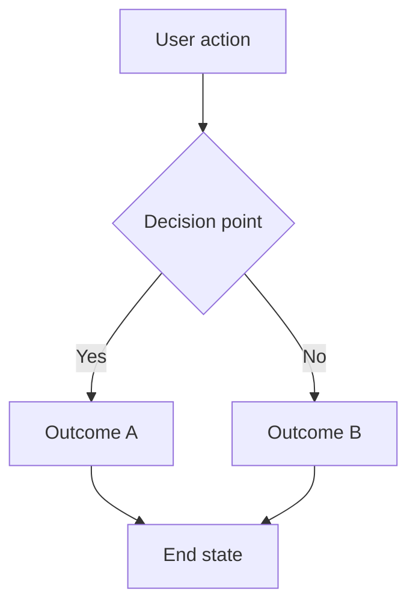
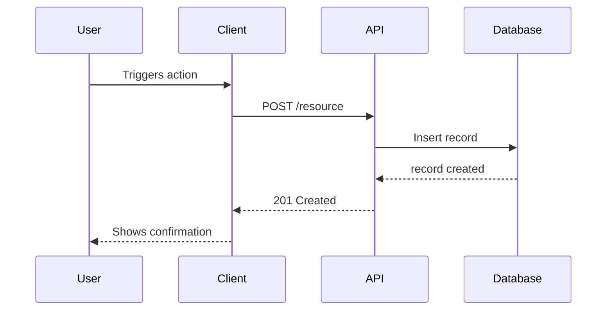
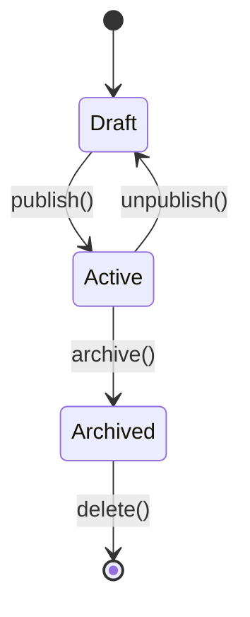
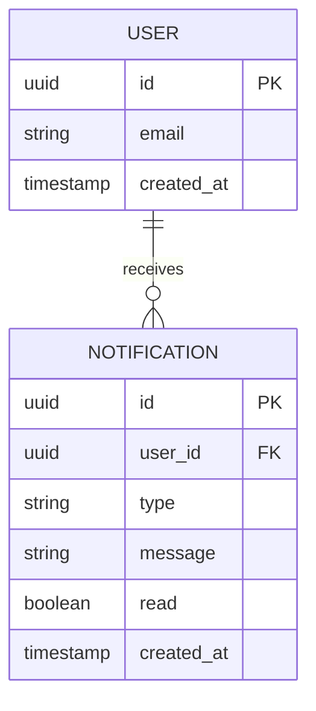

# LiveSpec System — Universal Spec Rules

> **EVERY AI TOOL READS THIS FILE FIRST.**
> This file defines how the spec system works in this project. Follow these rules for every task.

---

## Core Principles

1. **The spec is the functional source of truth, not the code.**
   If the spec says one thing and the code does another, the code is wrong (unless the spec was intentionally updated).

2. **Every feature has a spec — no implementation without a spec.**
   Before writing a single line of code, the corresponding `.specs/features/NNN-feature-name/spec.md` must exist.

3. **Specs are living — updated when behavior changes.**
   When a feature's behavior is modified, the spec.md is updated first (or simultaneously). Specs never become stale.

4. **Specs are visual — Mermaid user flows are mandatory.**
   Every user story in a spec.md must include a Mermaid flowchart. Text-only specs are incomplete.

5. **Code is linked to specs — every implementation is traceable.**
   After implementation, `implementation.md` maps every FR and AC to the `@spec` anchor comment placed directly in the source code. Anchor comments include a **brief description** and the **relative path to the spec file with a fragment anchor** for deep-linking:
   ```
   // @spec FR-001: Brief description — .specs/features/NNN-feature-name/spec.md#fr-001
   ```
   - The description (after `:`) is a short summary (<50 chars) of the FR/AC
   - The fragment `#fr-001` enables deep-linking within the Markdown ecosystem (GitHub, preview, `implementation.md` → `spec.md`)
   - `grep -rn "@spec FR-001"` continues to work regardless of line number changes
   - Multi-requirements: list each `ID: description` separated by commas (e.g. `// @spec FR-001: Fetch count, FR-003: Mark as read — spec.md#fr-001`)

---

## Project Layout

When LiveSpec is installed in a project, the `.specs/` directory is the source of truth:

```
.specs/
├── README.md                ← Spec registry and artifact index
├── spec-system.md           ← This file (rules)
├── constitution.md          ← Architecture principles for this project
├── project.md               ← Vision, users, constraints
│
├── commands/                ← LiveSpec command docs
│   ├── init.md
│   ├── specify.md
│   ├── plan.md
│   ├── implement.md
│   ├── check.md
│   ├── explain.md
│   ├── stack.md
│   └── link.md
│
├── stacks/
│   ├── _default.md          ← Chosen stack + rationale
│   └── decisions/           ← Architecture Decision Records
│       └── ADR-001-*.md
│
├── testing/
│   └── strategy.md          ← Testing strategy for this project
│
├── features/
│   └── NNN-feature-name/
│       ├── spec.md
│       ├── plan.md
│       ├── progress.md          ← Step-by-step checkpoint (MANDATORY during implement)
│       ├── implementation.md
│       ├── changelog.md
│       ├── contracts/
│       └── baselines/
│
└── changelog.md             ← Global changelog
```

---

## Feature Directory Structure

Each feature lives in `.specs/features/NNN-feature-name/` where `NNN` is a zero-padded sequential number (001, 002, ...).

### spec.md — WHAT and WHY (functional)

**Required sections:**

- **Feature Name** — short, descriptive
- **Branch** — associated git branch
- **Date** — creation date
- **Status** — Draft | Review | Approved | Implemented | Deprecated
- **Input** — original request or user problem

**User Scenarios & Testing:**
- Prioritized user stories: P1 (critical), P2 (important), P3 (nice-to-have)
- Each story includes:
  - Description
  - Priority reason
  - Independent test
  - Given/When/Then acceptance scenarios
  - **Mermaid flowchart (MANDATORY)**

**Acceptance Criteria:**
- Numbered AC-001, AC-002, ...
- Each is testable, specific, and verifiable

**Functional Requirements:**
- Numbered FR-001, FR-002, ...
- Each maps to at least one AC

**Additional sections:**
- Key Entities (data model concepts)
- Edge Cases
- Success Criteria (measurable SC-001, ...)

### plan.md — HOW (technical)

**Required sections:**

- **Summary** — one-line technical approach
- **Technical Context** — language, deps, storage, testing framework, platform, project type
- **Constitution Check** — verify decisions against constitution.md principles
- **Mermaid Sequence Diagrams** — for API/service interactions (MANDATORY when API calls exist)
- **Mermaid State Diagrams** — for entities with states (MANDATORY when entity has lifecycle)
- **Mermaid ER Diagrams** — for data model (MANDATORY when new entities are created)
- **Implementation Plan** — file-by-file, step-by-step
- **Testing Strategy** — which test types for which parts
- **Risks & Considerations**

### implementation.md — WHERE in code (spec↔code links)

Created AFTER implementation, not before. Maps every requirement to actual code.

**Required sections:**

- **Requirement Mapping table:** `| Requirement | File(s) | @spec Anchor | Status | Last Verified |`
- **Status values:**
  - ✅ Implemented — fully implemented and tested
  - ⚠️ Partial — partially implemented
  - ❌ Missing — not yet implemented
  - 🔄 Modified — implementation changed after spec
- **Acceptance Criteria Mapping table:** `| AC | Test File | Status |`
- **Files Created/Modified** — list with descriptions

**Rule: This file MUST be updated after every implementation or modification.**

### changelog.md — WHEN (history)

Per-feature changelog. An entry is added for EVERY change:

**Entry format:**
```
## YYYY-MM-DD — [Type]: Description

- **Type:** Feature | Bugfix | Refactor | Spec Update
- **Spec modified:** Yes (sections: ...) | No
- **Code modified:** file1.ts, file2.ts
- **AC impacted:** AC-001, AC-003
- **Author:** human | tool-name
```

### contracts/ — API contracts

OpenAPI YAML or GraphQL schemas for any API endpoints introduced by the feature.

### baselines/ — Visual test baselines

Playwright screenshot baselines for visual features. Filenames match the test scenario names.

---

## README.md — Spec Registry

`.specs/README.md` is the centralized index of all spec artifacts. It is maintained automatically by spec commands.

**Update rules:**
- `/spec.init` creates it with initial content
- `/spec.specify` adds a feature row (Status: Draft)
- `/spec.plan` updates feature status to Planned
- `/spec.implement` updates feature status to Implemented/In Progress + regenerates Recent Activity from changelog.md
- `/spec.stack` adds ADR rows + regenerates Recent Activity
- `/spec.check` and `/spec.explain` do not modify it
- Every update also refreshes the `Last updated` date in the header

**Section markers:** Updatable sections use `<!-- readme:features:start/end -->`, `<!-- readme:decisions:start/end -->`, `<!-- readme:activity:start/end -->` HTML comments. Do not remove these markers.

**Recovery:** If README.md is missing, any updating command rebuilds it by scanning existing `.specs/features/*/spec.md`, `.specs/stacks/decisions/ADR-*.md`, and `.specs/changelog.md`.

---

## Rules for AI Tools

### Command discovery

Detailed step-by-step instructions for each `/spec.*` command are available in `.specs/commands/`.
If that directory is missing, run `bash scripts/install.sh` to install it.

### When CREATING a new feature

1. Create the directory `.specs/features/NNN-feature-name/`
2. Generate `spec.md` with all required sections including **Mermaid flowcharts for each user story**
3. Generate `plan.md` with sequence/state/ER diagrams as appropriate
4. After implementation: create `implementation.md` mapping FR/AC to `@spec` anchor comments in source files
5. Add first entry to `changelog.md`

### When MODIFYING existing code

1. **Read the spec FIRST** — locate the feature's spec.md
2. **Verify conformity** — does the requested change conform to the AC?
3. **If behavior changes** — update spec.md first, then code
4. After modification: update `implementation.md` with new `@spec` anchor references
5. Add changelog entry describing what changed and why

### When DEBUGGING

1. Read `spec.md` to understand the expected behavior
2. Read `implementation.md` to find which files contain the relevant code
3. Compare spec vs actual code to identify the gap
4. Fix the issue
5. Update `changelog.md` with a Bugfix entry

### When REVIEWING a feature

1. Run `/spec.check [feature]` to compare spec vs code
2. Check all AC are implemented and tested
3. Check all FR map to files in `implementation.md`
4. For visual features, compare screenshots with baselines
5. Report any gaps

---

## Mermaid Diagram Requirements

### In spec.md — User Flow (flowchart)

Every user story requires a flowchart:



### In plan.md — Sequence Diagram

For any feature involving API calls or service interactions:



### In plan.md — State Diagram

For any entity with a lifecycle:



### In plan.md — ER Diagram

For any feature introducing new database entities:



---

## Quality Gates

Before a spec is considered complete:
- [ ] All user stories have Mermaid flowcharts
- [ ] All AC are testable (Given/When/Then format)
- [ ] All FR map to at least one AC
- [ ] No more than 3 `[NEEDS CLARIFICATION]` markers

Before a plan is considered complete:
- [ ] Sequence diagrams exist for API interactions
- [ ] State diagrams exist for stateful entities
- [ ] ER diagrams exist for new data models
- [ ] Constitution Check section is filled
- [ ] All FR are covered in the implementation plan

Before implementation is considered complete:
- [ ] `progress.md` exists with a checkpoint row for **every** step (BLOCKING — enables `--resume`)
- [ ] `implementation.md` is created and all FR/AC have status ✅
- [ ] All tests pass
- [ ] `changelog.md` has an entry
- [ ] For visual features: Playwright baselines captured in `baselines/`

Before `/spec.init` is considered complete:
- [ ] At least 1 ADR exists in `.specs/stacks/decisions/` (BLOCKING — every stack choice must be justified)
- [ ] `project.md` contains real values, not template placeholders
- [ ] `_default.md` contains the chosen stack with rationale, not `[TBD]`

---

## Intent Classification

Before acting on a user request, classify the intent to determine the correct command:

| User intent | Command |
|---|---|
| New feature request | `/spec.specify` |
| Technical design for an existing feature | `/spec.plan` |
| Code/build task for an approved feature | `/spec.implement` |
| Audit / spec-code alignment | `/spec.check` |
| Understanding / history / "why" question | `/spec.explain` |
| Stack or ADR change | `/spec.stack` |
| No `.specs/` directory exists | `/spec.init` |
| Feature exists but no `spec.md` | `/spec.specify` |
| Feature has `spec.md` but no `plan.md` | `/spec.plan` |

---

## Universal Command Reliability Standard

Every `/spec.*` command must follow these execution rules:

1. **Intent check first**
   Confirm the command matches user intent; if not, propose the correct `/spec.*` command (see Intent Classification above).

2. **Ambiguity cap**
   Ask at most 2 clarifying questions. If ambiguity remains, proceed with explicit `[ASSUMED]` markers.

3. **Prerequisite gate**
   Validate required files before writing. If missing, stop and provide the minimal recovery command.

4. **Evidence-based reporting**
   Do not mark items as complete without file/test evidence.

5. **Definition of done**
   End each command with:
   - artifacts created/updated
   - unresolved blockers (if any)
   - next recommended command

### Minimum Failure Report Format

If command cannot complete safely, return:

- `Blocked By:` exact reason
- `Missing/Failing Artifact:` file or command
- `Recovery:` minimal actionable steps
- `Resume With:` exact `/spec.*` command or flag

---

*LiveSpec v1.0 — The spec is the source of truth.*
