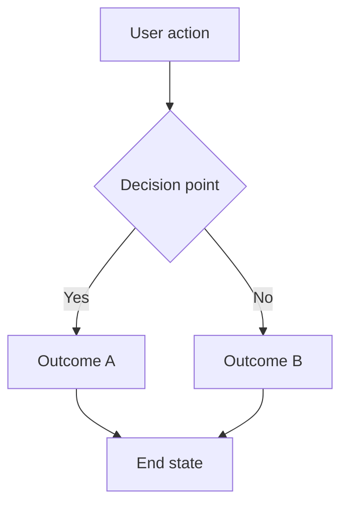
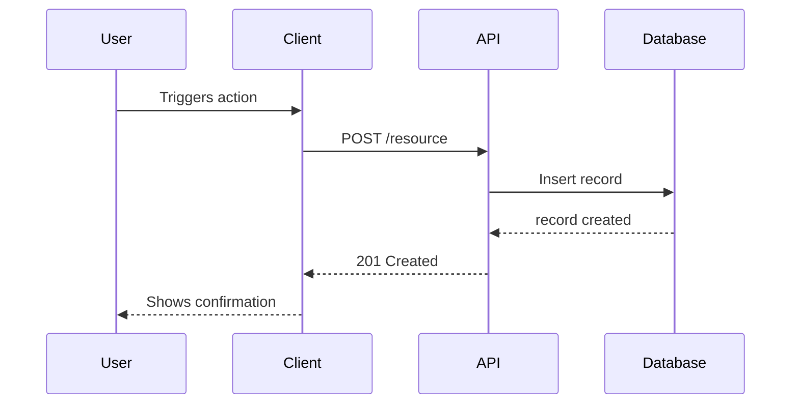
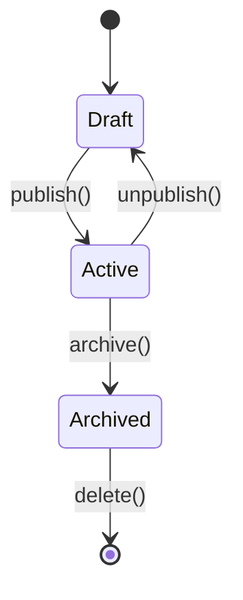
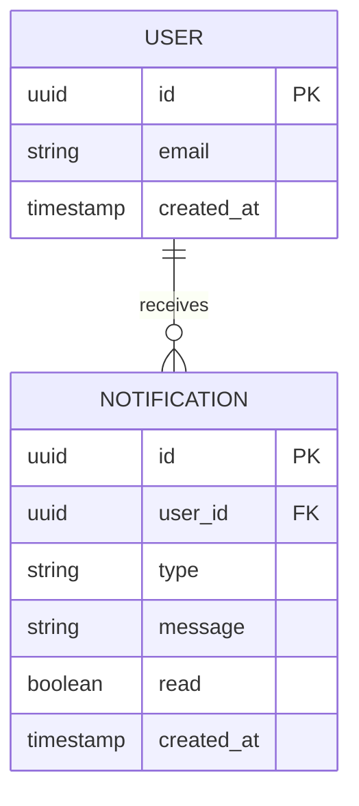

# LiveSpec System — Universal Spec Rules

> **EVERY AI TOOL READS THIS FILE FIRST.**
> This file defines how the spec system works in this project. Follow these rules for every task.

---

## Core Principles

1. **The spec is the functional source of truth, not the code.**
   If the spec says one thing and the code does another, the code is wrong (unless the spec was intentionally updated).

2. **Every feature has a spec — no implementation without a spec.**
   Before writing a single line of code, the corresponding `.specs/features/NNN-feature-name/spec.md` must exist.

3. **Specs are living — updated when behavior changes.**
   When a feature's behavior is modified, the spec.md is updated first (or simultaneously). Specs never become stale.

4. **Specs are visual and testable — Gherkin scenarios and Mermaid flows are mandatory.**
   Every user story in a spec.md must include Gherkin scenarios (source of truth for AI and test scaffolding) and a Mermaid flowchart (visual representation of the same flow). Text-only specs are incomplete.

5. **Code is linked to specs — every implementation is traceable.**
   After implementation, `implementation.md` maps every FR and AC to the `@spec` anchor comment placed directly in the source code. Anchor comments include a **brief description** and the **relative path to the spec file with a fragment anchor** for deep-linking:
   ```
   // @spec FR-001: Brief description — .specs/features/NNN-feature-name/spec.md#fr-001
   ```
   - The description (after `:`) is a short summary (<50 chars) of the FR/AC
   - The fragment `#fr-001` enables deep-linking within the Markdown ecosystem (GitHub, preview, `implementation.md` → `spec.md`)
   - `grep -rn "@spec FR-001"` continues to work regardless of line number changes
   - Multi-requirements: list each `ID: description` separated by commas (e.g. `// @spec FR-001: Fetch count, FR-003: Mark as read — spec.md#fr-001`)

---

## Project Layout

When LiveSpec is installed in a project, the `.specs/` directory is the source of truth:

```
.specs/
├── README.md                ← Spec registry and artifact index
├── spec-system.md           ← This file (rules)
├── constitution.md          ← Architecture principles for this project
├── project.md               ← Vision, users, constraints
├── roadmap.md              ← Feature backlog (MVP / Post-MVP / Future)
├── preflight.md             ← Preflight manifest (tooling, auth, tokens)
├── preflight-report.md      ← Latest preflight execution report
│
├── stacks/
│   ├── _default.md          ← Chosen stack + rationale
│   └── decisions/           ← Architecture Decision Records
│       └── ADR-001-*.md
│
├── testing/
│   └── strategy.md          ← Testing strategy for this project
│
├── features/
│   └── NNN-feature-name/
│       ├── spec.md
│       ├── plan.md
│       ├── progress.md          ← Step-by-step checkpoint (MANDATORY during implement)
│       ├── implementation.md
│       ├── changelog.md
│       ├── checks/              ← Gap report history
│       ├── logs/                ← Execution logs (auto-saved)
│       ├── contracts/
│       └── baselines/
│
├── hooks/                   ← Lifecycle hooks (before/after commands)
│   ├── before-plan.md       ← Team hooks (committed)
│   ├── before-plan.local.md ← Personal hooks (gitignored)
│   └── ...
│
├── design/
│   ├── ui.<ext>            ← Design source file (tool-specific)
│   ├── ui.pdf              ← Full PDF export
│   ├── screens/            ← Per-screen PNG exports
│   │   ├── *.png           ← Latest version of each screen
│   │   ├── index.md        ← Screen inventory (auto-maintained)
│   │   └── NNN-feature-name/  ← Versioned PNGs per feature
│   │       └── *.png
│   └── changelog.md        ← Screen-centric visual history
│
├── changelog.md             ← Global changelog (current year)
├── archive/                 ← Rotated changelogs by year
│   ├── changelog-2025.md
│   └── changelog-2024.md
```

---

## Feature Directory Structure

Each feature lives in `.specs/features/NNN-feature-name/` where `NNN` is a zero-padded sequential number (001, 002, ...).

### spec.md — WHAT and WHY (functional)

**Required sections:**

- **Feature Name** — short, descriptive
- **Branch** — associated git branch
- **Date** — creation date
- **Status** — Draft | Review | Approved | Implemented | Deprecated
- **Input** — original request or user problem

**User Scenarios & Testing:**
- Prioritized user stories: P1 (critical), P2 (important), P3 (nice-to-have)
- Each story includes:
  - Description
  - Priority reason
  - Independent test
  - Gherkin scenarios (```gherkin blocks) — source of truth for AI and test scaffolding
  - **Mermaid flowchart (MANDATORY)** — visual representation of the same flow

**Acceptance Criteria:**
- Numbered AC-001, AC-002, ...
- Each is testable, specific, and verifiable

**Functional Requirements:**
- Numbered FR-001, FR-002, ...
- Each maps to at least one AC

**Additional sections:**
- Key Entities (data model concepts)
- Edge Cases
- Success Criteria (measurable SC-001, ...)

### plan.md — HOW (technical)

**Required sections:**

- **Summary** — one-line technical approach
- **Technical Context** — language, deps, storage, testing framework, platform, project type
- **Constitution Check** — verify decisions against constitution.md principles
- **Gherkin Scenarios + Mermaid Sequence Diagrams** — for API/service interactions (MANDATORY when API calls exist)
- **Gherkin Scenarios + Mermaid State Diagrams** — for entities with states (MANDATORY when entity has lifecycle)
- **Mermaid ER Diagrams** — for data model (MANDATORY when new entities are created) — no Gherkin (no behavioral flow)
- **Implementation Plan** — file-by-file, step-by-step
- **Testing Strategy** — which test types for which parts
- **Risks & Considerations**

### implementation.md — WHERE in code (spec↔code links)

Created AFTER implementation, not before. Maps every requirement to actual code.

**Required sections:**

- **Requirement Mapping table:** `| Requirement | File(s) | @spec Anchor | Status | Last Verified |`
- **Status values:**
  - ✅ Implemented — fully implemented and tested
  - ⚠️ Partial — partially implemented
  - ❌ Missing — not yet implemented
  - 🔄 Modified — implementation changed after spec
- **Acceptance Criteria Mapping table:** `| AC | Test File | Status |`
- **Files Created/Modified** — list with descriptions

**Rule: This file MUST be updated after every implementation or modification.**

### changelog.md — WHEN (history)

Per-feature changelog. An entry is added for EVERY change:

**Entry format:**
```
## YYYY-MM-DD — [Type]: Description

- **Type:** Feature | Bugfix | Refactor | Spec Update
- **Spec modified:** Yes (sections: ...) | No
- **Code modified:** file1.ts, file2.ts
- **AC impacted:** AC-001, AC-003
- **Author:** human | tool-name
```

### contracts/ — API contracts

OpenAPI YAML or GraphQL schemas for any API endpoints introduced by the feature.

### baselines/ — Visual test baselines

Playwright screenshot baselines for visual features. Filenames match the test scenario names.

### checks/ — Audit trail

Gap reports from `/spec.check` runs. Each file is named `YYYY-MM-DD.md` and contains the full gap report from that date. Enables historical tracking of spec-code alignment over time.

### logs/ — Execution logs

Detailed execution logs from `/spec.implement` runs. Each file is named `YYYY-MM-DD.md`. Saved by default (use `--no-save` to disable).

### roadmap.md — Feature Backlog

Persistent backlog of specs to build, organized in tiers (MVP / Post-MVP / Future) with a Deferred section for items split from `/spec.specify` requests. Generated by `/spec.init`, maintained by `/spec.specify`.

**Section markers:** `<!-- roadmap:mvp:start/end -->`, `<!-- roadmap:postmvp:start/end -->`, `<!-- roadmap:future:start/end -->`, `<!-- roadmap:deferred:start/end -->`.

**Item format in tiers:**

```markdown
- [ ] **Feature name** — description · Roles: X · Scope: S/M/L · Deps: Y
```

**When checked (spec created):**

```markdown
- [x] **Feature name** — description · Roles: X · Scope: M · Deps: Y → [NNN-name](features/NNN-name/spec.md)
```

---

## README.md — Spec Registry

`.specs/README.md` is the centralized index of all spec artifacts. It is maintained automatically by spec commands.

**Update rules:**
- `/spec.init` creates it with initial content
- `/spec.specify` adds a feature row (Status: Draft)
- `/spec.plan` updates feature status to Planned
- `/spec.implement` updates feature status to Implemented/In Progress + regenerates Recent Activity from changelog.md
- `/spec.stack` adds ADR rows + regenerates Recent Activity
- `/spec.refine` updates the `Last updated` date (does not modify feature rows)
- `/spec.propose` does not modify it (read-only command)
- `/spec.check` and `/spec.explain` do not modify it
- `/spec.status` does not modify any files (read-only command)
- `/spec.init` creates `roadmap.md` with inferred feature backlog
- `/spec.specify` checks matching roadmap items + adds deferred splits to `roadmap.md`
- `/spec.propose` reads `roadmap.md` including Deferred section (read-only)
- `/spec.refine project` re-evaluates roadmap after project profile changes + supports direct roadmap refinement
- `/spec.specify` detects emerging dependencies and roadmap item absorption
- Every update also refreshes the `Last updated` date in the header

**Section markers:** Updatable sections use `<!-- readme:features:start/end -->`, `<!-- readme:decisions:start/end -->`, `<!-- readme:activity:start/end -->` HTML comments. Do not remove these markers.

**Recovery:** If README.md is missing, any updating command rebuilds it by scanning existing `.specs/features/*/spec.md`, `.specs/stacks/decisions/ADR-*.md`, and `.specs/changelog.md`.

---

## Lifecycle Hooks

LiveSpec supports **lifecycle hooks** — Markdown files with instructions injected before/after each command. Hooks enable customizing LiveSpec behavior without modifying core commands.

**Full protocol:** Read [`system/hooks.md`](../system/hooks.md) for the complete resolution protocol, naming conventions, and inheritance model.

**Quick reference:**
- 3 resolution levels: global (`~/.claude/livespec/hooks/`) → project (`.specs/hooks/`) → local (`.specs/hooks/*.local.md`)
- Naming: `{before|after}-{command}.md` and `{before|after}-{command}.local.md`
- Inheritance: `mode: extend` (default, accumulate) or `mode: override` (replace chain)
- Step-level hooks: `before-implement-step.md` / `after-implement-step.md`
- Discovery: `/spec.hooks [command]` to see active hooks; use `--create`/`--edit` to manage hooks

---

## Rules for AI Tools

### MANDATORY — Hooks Resolution Protocol

**You MUST resolve hooks before and after EVERY `/spec.*` command execution.** This is not optional. Failure to resolve hooks means conventions are not loaded and the command runs without context.

**Before starting any command:** resolve `before-{command}` hooks.
**After completing any command:** resolve `after-{command}` hooks.

#### Resolution algorithm (for each hook event)

For a given event (e.g., `before-plan`), Read files at 3 levels in order:

| Level | Path | Scope |
|-------|------|-------|
| 1. Global | `~/.claude/livespec/hooks/before-plan.md` | All LiveSpec projects |
| 2. Project | `.specs/hooks/before-plan.md` | This project (committed, team-shared) |
| 3. Local | `.specs/hooks/before-plan.local.md` | Personal (gitignored) |

- If a file does not exist at a level → skip that level silently.
- If the **local** hook has `mode: override` in its YAML frontmatter → execute **only** the local hook, skip global and project.
- Otherwise (`mode: extend`, the default) → execute **all** existing hooks in order: global → project → local.

#### Exhaustive hook table — all commands

| Command | Before hooks to resolve | After hooks to resolve |
|---------|------------------------|----------------------|
| `init` | `before-init` (global, project, local) | `after-init` (global, project, local) |
| `propose` | `before-propose` (global, project, local) | `after-propose` (global, project, local) |
| `specify` | `before-specify` (global, project, local) | `after-specify` (global, project, local) |
| `plan` | `before-plan` (global, project, local) | `after-plan` (global, project, local) |
| `implement` | `before-implement` (global, project, local) | `after-implement` (global, project, local) |
| `implement` (each step) | `before-implement-step` (global, project, local) | `after-implement-step` (global, project, local) |
| `check` | `before-check` (global, project, local) | `after-check` (global, project, local) |
| `test` | `before-test` (global, project, local) | `after-test` (global, project, local) |
| `explain` | `before-explain` (global, project, local) | `after-explain` (global, project, local) |
| `stack` | `before-stack` (global, project, local) | `after-stack` (global, project, local) |
| `feature` | `before-feature` (global, project, local) | `after-feature` (global, project, local) |
| `refine` | `before-refine` (global, project, local) | `after-refine` (global, project, local) |
| `preflight` | `before-preflight` (global, project, local) | `after-preflight` (global, project, local) |
| `fix` | `before-fix` (global, project, local) | `after-fix` (global, project, local) |

**No hooks:** `hooks`, `play-coverage`, `status`, `refresh-conventions` — these are diagnostic/utility commands.

**`feature` sub-commands:** `/spec.feature` wraps a pipeline (specify → plan → implement). Resolve `before-feature`/`after-feature` around the full pipeline AND resolve each sub-command's own hooks (before-specify, before-plan, before-implement, etc.) at each phase.

**`implement` step hooks:** In addition to `before-implement`/`after-implement` (once), resolve `before-implement-step`/`after-implement-step` before and after EACH implementation step.

### Command discovery

Detailed step-by-step instructions for each `/spec.*` command are installed globally via `bash scripts/install.sh` (symlinked to `~/.claude/commands/spec.*.md`). The 18 available commands are: `/spec.init`, `/spec.propose`, `/spec.specify`, `/spec.plan`, `/spec.implement`, `/spec.test`, `/spec.check`, `/spec.fix`, `/spec.explain`, `/spec.stack`, `/spec.feature`, `/spec.ship`, `/spec.preflight`, `/spec.hooks`, `/spec.play-coverage`, `/spec.refine`, `/spec.status`, `/spec.refresh-conventions`.

### When CREATING a new feature

1. Create the directory `.specs/features/NNN-feature-name/`
2. Generate `spec.md` with all required sections including **Gherkin scenarios for each user story** (source of truth for tests) and **Mermaid flowcharts** (visual representation)
3. Generate `plan.md` with sequence/state/ER diagrams as appropriate
4. After implementation: create `implementation.md` mapping FR/AC to `@spec` anchor comments in source files
5. Add first entry to `changelog.md`

### Changelog Convention

Every `/spec.*` command that creates or modifies an artifact MUST add an entry to:
1. The feature's `changelog.md` (detailed entry)
2. The global `.specs/changelog.md` (summary line)

Read-only commands (`/spec.explain`, `/spec.status`) are exempt.

### Changelog Rotation

To prevent changelogs from growing unbounded:

**Global `.specs/changelog.md`:**
- Keeps entries for the **current year** only
- When adding an entry, if entries from previous years exist, move them to `.specs/archive/changelog-YYYY.md` (one file per year)
- Add a "Previous years" link section at the bottom: `> Archive: [2025](archive/changelog-2025.md) | [2024](archive/changelog-2024.md)`
- The `archive/` directory is created on first rotation

**Per-feature `changelog.md`:**
- No automatic rotation (features are naturally scoped)
- If a feature changelog exceeds 50 entries, the feature is likely too large — consider splitting into sub-features

**README.md Recent Activity:**
- Already capped at 10 entries (self-managing, no rotation needed)

### When MODIFYING existing code

1. **Read the spec FIRST** — locate the feature's spec.md
2. **Verify conformity** — does the requested change conform to the AC?
3. **If behavior changes** — update spec.md first, then code
4. After modification: update `implementation.md` with new `@spec` anchor references
5. Add changelog entry describing what changed and why

### When DEBUGGING

1. Read `spec.md` to understand the expected behavior
2. Read `implementation.md` to find which files contain the relevant code
3. Compare spec vs actual code to identify the gap
4. Fix the issue
5. Update `changelog.md` with a Bugfix entry

### When working with DESIGN mockups

1. Design mockups are centralized in `.specs/design/` — one source file per project
2. PNGs in `screens/` are the reference for implementation — always the latest version
3. The design source file (`ui.pen`, `ui.fig`, etc.) is saved manually by the user
4. When a feature modifies existing screens, save the versioned PNG in `screens/<NNN-feature-name>/` and update the latest copy at `screens/<name>.png`
5. The `## Screens` section in `spec.md` links features to their visual references
6. Design fidelity threshold is 5% (more permissive than visual regression at 2%)

### When REVIEWING a feature

1. Run `/spec.check [feature]` to compare spec vs code
2. Check all AC are implemented and tested
3. Check all FR map to files in `implementation.md`
4. For visual features, compare screenshots with baselines
5. Report any gaps

---

## Diagram Requirements (Gherkin + Mermaid)

Every behavioral flow requires **two representations**:
1. **Gherkin** (```gherkin blocks) — the canonical, machine-parseable format. Source of truth for AI test scaffolding and all test derivation (unit, integration, E2E, visual).
2. **Mermaid** — the visual representation of the same flow, for human comprehension.

**All tests are derived from Gherkin scenarios, never from Mermaid diagrams.** Mermaid is purely a visualization aid.

**Exception:** ER diagrams (data model) have no behavioral flow — they use Mermaid only, no Gherkin.

### Gherkin Syntax Rules

- Use proper `Feature:` / `Scenario:` / `Given` / `When` / `Then` / `And` keywords
- Each story must have at least 2 scenarios (happy path + edge case)
- Scenarios must be specific enough to derive Playwright test steps directly
- Use present tense, third person
- Fenced with ````gherkin` (not plain ``` blocks)

### In spec.md — User Flow (Gherkin + flowchart)

Every user story requires Gherkin scenarios (source of truth for tests) followed by a Mermaid flowchart (visual aid):

```gherkin
Feature: User action
  Scenario: Happy path
    Given a precondition is true
    When  the user performs the action
    Then  the system produces outcome A
    And   the state is updated

  Scenario: Alternative path
    Given a different precondition
    When  the user performs the action
    Then  the system produces outcome B
```


```mermaid
flowchart TD
    A[User action] --> B{Decision point}
    B -- Yes --> C[Outcome A]
    B -- No --> D[Outcome B]
    C --> E[End state]
    D --> E
```

### In plan.md — Sequence Diagram (Gherkin + sequenceDiagram)

For any feature involving API calls or service interactions:

```gherkin
Feature: Resource creation
  Scenario: Successful creation
    Given an authenticated user
    When  the user submits a new resource
    Then  the system persists the resource
    And   returns a 201 Created response

  Scenario: Validation failure
    Given an authenticated user
    When  the user submits invalid data
    Then  the system returns a 400 error
    And   the resource is not created
```


```mermaid
sequenceDiagram
    participant U as User
    participant C as Client
    participant A as API
    participant D as Database

    U->>C: Triggers action
    C->>A: POST /resource
    A->>D: Insert record
    D-->>A: record created
    A-->>C: 201 Created
    C-->>U: Shows confirmation
```

### In plan.md — State Diagram (Gherkin + stateDiagram)

For any entity with a lifecycle:

```gherkin
Feature: Entity lifecycle
  Scenario: Publish draft
    Given a draft entity exists
    When  the user publishes the entity
    Then  the entity state changes to Active

  Scenario: Archive active entity
    Given an active entity exists
    When  the user archives the entity
    Then  the entity state changes to Archived
    And   it is no longer visible in the active list
```


```mermaid
stateDiagram-v2
    [*] --> Draft
    Draft --> Active: publish()
    Active --> Archived: archive()
    Active --> Draft: unpublish()
    Archived --> [*]: delete()
```

### In plan.md — ER Diagram (Mermaid only)

For any feature introducing new database entities. **No Gherkin** — ER diagrams represent data structure, not behavioral flow.


```mermaid
erDiagram
    USER {
        uuid id PK
        string email
        timestamp created_at
    }
    NOTIFICATION {
        uuid id PK
        uuid user_id FK
        string type
        string message
        boolean read
        timestamp created_at
    }
    USER ||--o{ NOTIFICATION : receives
```

---

## Quality Gates

Before a spec is considered complete:
- [ ] All user stories have Gherkin scenarios (```gherkin blocks) — source of truth for tests
- [ ] All user stories have Mermaid flowcharts — visual representation of the same flow
- [ ] Gherkin scenarios and Mermaid flowcharts describe the same flow
- [ ] All AC are testable (Given/When/Then format)
- [ ] All FR map to at least one AC
- [ ] No more than 3 `[NEEDS CLARIFICATION]` markers
- [ ] If feature has UI screens: `## Screens` section exists with PNG references
- [ ] If design tool configured: referenced PNGs exist in `.specs/design/screens/`

Before a plan is considered complete:
- [ ] Sequence diagrams exist for API interactions
- [ ] State diagrams exist for stateful entities
- [ ] ER diagrams exist for new data models
- [ ] Constitution Check section is filled
- [ ] All FR are covered in the implementation plan

Before implementation is considered complete:
- [ ] `progress.md` exists with a checkpoint row for **every** step (BLOCKING — enables `--resume`)
- [ ] `implementation.md` is created and all FR/AC have status ✅
- [ ] All tests pass
- [ ] `changelog.md` has an entry
- [ ] For visual features: Playwright baselines captured in `baselines/`
- [ ] For visual features with design mockups: design fidelity check performed

Before `/spec.init` is considered complete:
- [ ] At least 1 ADR exists in `.specs/stacks/decisions/` (BLOCKING — every stack choice must be justified)
- [ ] `project.md` contains real values, not template placeholders
- [ ] `_default.md` contains the chosen stack with rationale, not `[TBD]`
- [ ] `preflight.md` exists with checks generated from stack
- [ ] `preflight-report.md` exists with execution results

---

## Intent Classification

Before acting on a user request, classify the intent to determine the correct command:

| User intent | Command |
|---|---|
| New feature request | `/spec.specify` |
| Technical design for an existing feature | `/spec.plan` |
| Code/build task for an approved feature | `/spec.implement` |
| Audit / spec-code alignment | `/spec.check` |
| Understanding / history / "why" question | `/spec.explain` |
| Stack or ADR change | `/spec.stack` |
| No `.specs/` directory exists | `/spec.init` |
| Feature exists but no `spec.md` | `/spec.specify` |
| Feature has `spec.md` but no `plan.md` | `/spec.plan` |
| What should I build next? / Propose next feature | `/spec.propose` |
| Full feature pipeline (specify → plan → implement) | `/spec.feature` |
| Refine or update project-level artifacts | `/spec.refine project` |
| Refine or update an existing feature spec | `/spec.refine [feature]` |
| Refine an existing plan | `/spec.refine [feature] plan` |

---

## Universal Command Reliability Standard

Every `/spec.*` command must follow these execution rules:

1. **Intent check first**
   Confirm the command matches user intent; if not, propose the correct `/spec.*` command (see Intent Classification above).

2. **Ambiguity cap**
   Ask at most 2 clarifying questions. If ambiguity remains, proceed with explicit `[ASSUMED]` markers.

3. **Prerequisite gate**
   Validate required files before writing. If missing, stop and provide the minimal recovery command.

4. **Evidence-based reporting**
   Do not mark items as complete without file/test evidence.

5. **Definition of done**
   End each command with:
   - artifacts created/updated
   - unresolved blockers (if any)
   - next recommended command

### Minimum Failure Report Format

If command cannot complete safely, return:

- `Blocked By:` exact reason
- `Missing/Failing Artifact:` file or command
- `Recovery:` minimal actionable steps
- `Resume With:` exact `/spec.*` command or flag

---

*LiveSpec v1.0 — The spec is the source of truth.*
