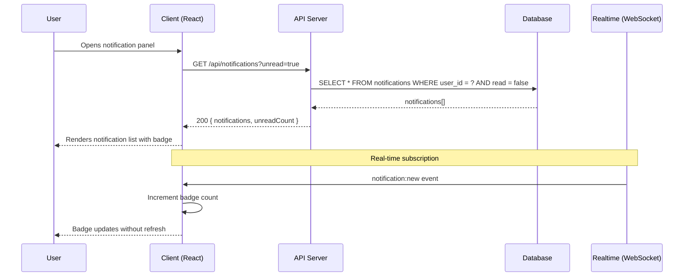
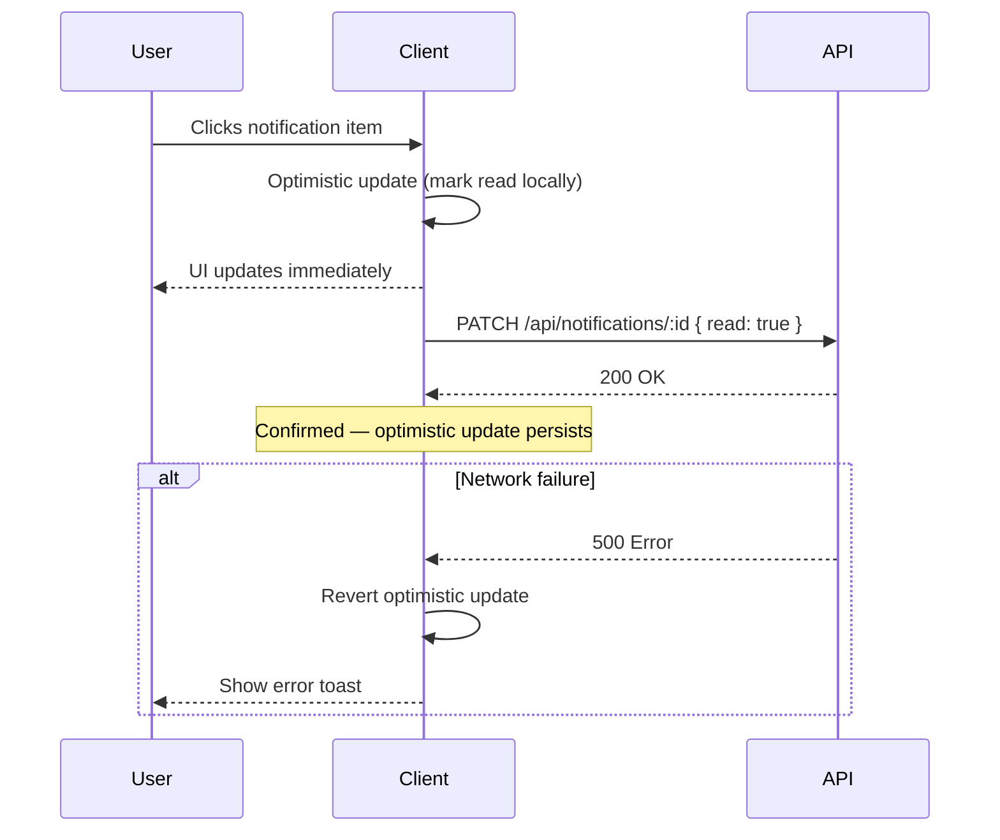
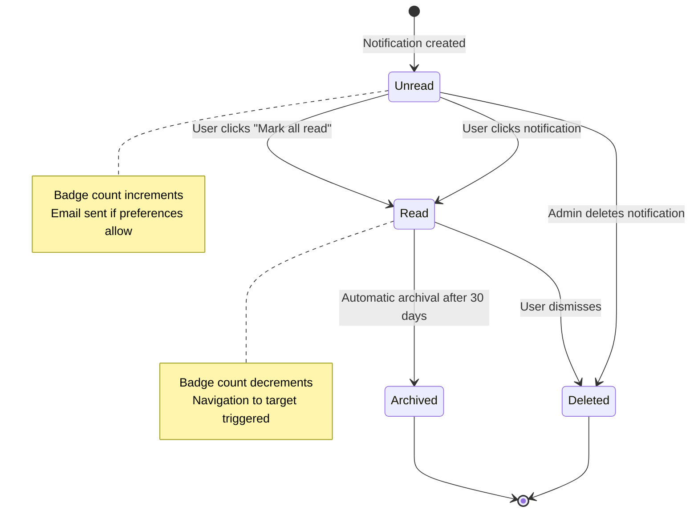
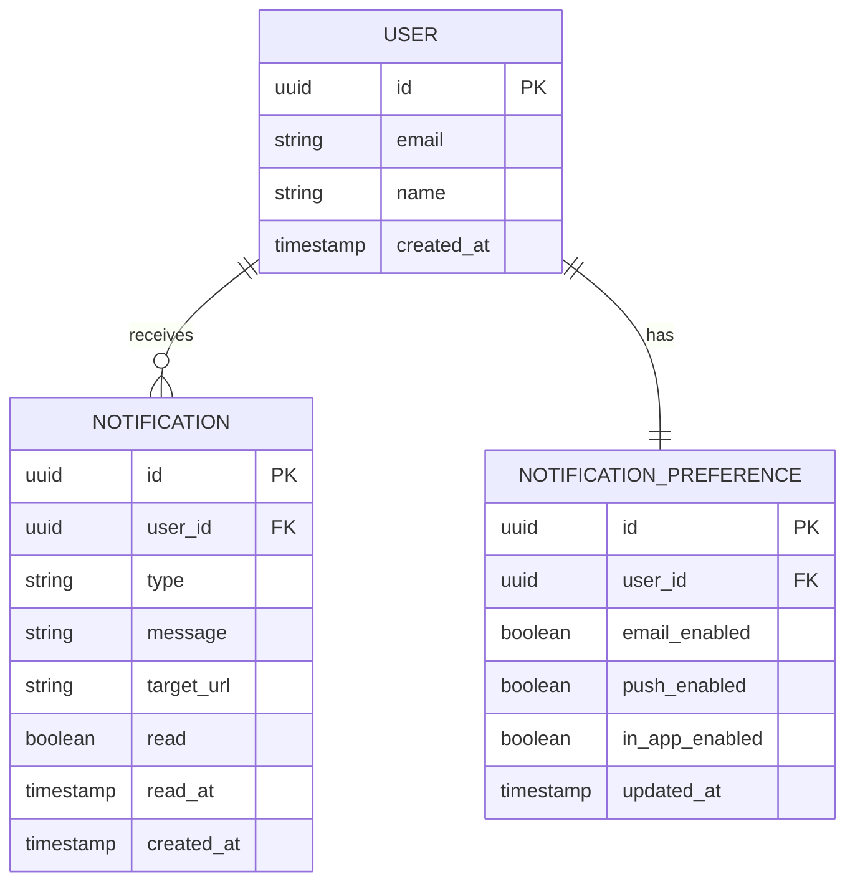

# Technical Plan: [Feature Name]

> **Instructions for AI:** This plan is generated by `/spec.plan`. Read the spec.md, constitution.md, stacks/_default.md, and testing/strategy.md before filling this out. Diagrams are MANDATORY where applicable.

---

## Summary

[One sentence describing the technical approach]

**Feature:** [Feature Name]
**Spec:** `.specs/features/NNN-feature-name/spec.md`
**Date:** YYYY-MM-DD
**Status:** Draft | Approved

---

## Technical Context

| Aspect | Choice | Reason |
|---|---|---|
| Language | [TypeScript / Python / etc.] | [From constitution/stack] |
| Framework | [Next.js / Express / etc.] | [From stack preset] |
| Database | [PostgreSQL / SQLite / etc.] | [From stack preset] |
| Real-time | [WebSocket / SSE / Polling / None] | [Based on spec requirements] |
| Testing | [Vitest / Jest / etc.] | [From testing strategy] |
| Platform | [Vercel / Docker / etc.] | [From stack preset] |
| Project Type | [Web App / API / CLI / etc.] | [From project.md] |

---

## Constitution Check

> Verify this plan against `.specs/constitution.md` principles before proceeding.

- [ ] **Simplicity:** This is the simplest solution that satisfies the AC
- [ ] **Separation of Concerns:** UI, business logic, and data layers are properly separated
- [ ] **Explicit:** No magic configuration, dependencies are visible
- [ ] **Fail Fast:** Inputs validated at boundaries, errors returned early
- [ ] **Testing:** All business logic has unit tests, all flows have E2E tests
- [ ] **Naming:** Follows project naming conventions

**Notes on any deviations:**
[Document any deviation from constitution principles and why it's justified]

---

## Mermaid Sequence Diagrams

> **MANDATORY** for any feature involving API calls, service interactions, or async operations.

### [Primary Interaction Name]



> 💡 **Example above is for Notifications.** Replace with your feature's sequence diagram.

### [Secondary Interaction — e.g., Mark as Read]



---

## Mermaid State Diagrams

> **MANDATORY** for any entity that has a lifecycle or multiple states.

### [Entity Name] State Machine



> 💡 **Example above is for a Notification entity.** Replace with your entity's state diagram.

---

## Mermaid ER Diagrams

> **MANDATORY** for any feature that introduces new database tables or significant schema changes.



> 💡 **Example above is for Notifications.** Replace with your feature's data model.

---

## API Error Contract

> **Include this section when the plan defines API routes.** Omit for non-API features.

Define the error response shape used by all API endpoints in this feature:

| Status Code | When | Response Body |
|---|---|---|
| 400 | Validation error (bad input) | `{ error: string, field?: string }` |
| 404 | Resource not found | `{ error: string }` |
| 500 | Unexpected server error | `{ error: string }` |

> 💡 **Example above is generic.** Adapt to the feature's needs. The goal is a **single consistent shape** across all routes — not per-route ad hoc formats.

---

## Infrastructure Setup

> **Include this section only when the spec defines Infrastructure Requirements.** This phase runs before Step 1. Omit for features with no infrastructure dependencies.

### Resources to Provision

| Resource | Type | Provisioning Command | Verification Command | Config Update | Status |
|---|---|---|---|---|---|
| [Name] | [Type] | `[create command]` | `[verify command]` | `[file + binding]` | Pending |

### Infrastructure Gate

Before proceeding to Step 1, verify:
- [ ] All resources provisioned (verification commands return success)
- [ ] All bindings configured with real values (no placeholders)
- [ ] Dev server starts without binding errors
- [ ] Health check endpoint responds (if applicable): `[command]`

> If any resource cannot be provisioned (account setup, billing, permissions), mark feature as `Blocked by Infrastructure` with the specific blocker.

---

## Implementation Plan

> File-by-file, step-by-step. Each step should be independently executable.
>
> **@spec anchors:** Every file implementing a FR/AC must include `// @spec FR-NNN: description — spec.md#fr-nnn` next to the implementing function. Place anchors as code is written, not retroactively.

### Step 1 — Database Schema

**File:** `db/migrations/YYYYMMDD_create_notifications.sql`

```sql
-- Create notifications table
CREATE TABLE notifications (
    id UUID PRIMARY KEY DEFAULT gen_random_uuid(),
    user_id UUID NOT NULL REFERENCES users(id) ON DELETE CASCADE,
    type VARCHAR(50) NOT NULL,
    message TEXT NOT NULL,
    target_url TEXT,
    read BOOLEAN DEFAULT false,
    read_at TIMESTAMPTZ,
    created_at TIMESTAMPTZ DEFAULT NOW()
);

-- Index for common query pattern
CREATE INDEX idx_notifications_user_unread ON notifications(user_id, read) WHERE read = false;
```

**FR covered:** FR-001, FR-002

---

### Step 2 — Data Access Layer

**File:** `src/data/notifications.ts`

- Function `getUnreadNotifications(userId: string)` — queries DB for unread notifications
- Function `markNotificationRead(notificationId: string, userId: string)` — updates read status
- Function `markAllNotificationsRead(userId: string)` — bulk update
- Function `getUserNotificationPreferences(userId: string)` — fetches preferences
- Function `updateNotificationPreferences(userId: string, prefs: Partial<NotificationPreference>)`

**FR covered:** FR-001, FR-003, FR-005, FR-006

---

### Step 3 — API Endpoints

**File:** `src/api/notifications/route.ts`

- `GET /api/notifications` — list notifications with unread count
- `PATCH /api/notifications/:id` — mark single notification as read
- `POST /api/notifications/mark-all-read` — bulk mark as read
- `GET /api/notifications/preferences` — get preferences
- `PUT /api/notifications/preferences` — update preferences

**FR covered:** FR-001, FR-003, FR-005, FR-006

---

### Step 4 — UI Components

**File:** `src/components/notifications/NotificationBell.tsx`

- Displays unread count badge
- Opens notification panel on click
- Subscribes to real-time updates

**File:** `src/components/notifications/NotificationPanel.tsx`

- Lists notifications (unread first)
- Empty state when no notifications
- "Mark all read" button
- Individual notification items (click to navigate)

**File:** `src/components/notifications/NotificationItem.tsx`

- Single notification display
- Read/unread visual distinction
- Click handler

**FR covered:** FR-001, FR-002, FR-003, FR-004, FR-006

---

### Step 5 — Real-time Subscription (if applicable)

**File:** `src/hooks/useNotificationSubscription.ts`

- Subscribe to `notification:new` WebSocket events
- Update local count and list on new notification
- Unsubscribe on component unmount

**FR covered:** FR-002

---

## Testing Strategy

| Test Type | What | File | FR/AC |
|---|---|---|---|
| Unit | `getUnreadNotifications()` | `src/data/notifications.test.ts` | FR-001 |
| Unit | `markNotificationRead()` | `src/data/notifications.test.ts` | FR-003 |
| Integration | `GET /api/notifications` | `tests/api/notifications.test.ts` | AC-001 |
| Integration | `PATCH /api/notifications/:id` | `tests/api/notifications.test.ts` | AC-002 |
| E2E | Full notification flow | `tests/e2e/notifications.spec.ts` | AC-001, AC-002 |
| Visual | Notification panel | `tests/e2e/notifications.spec.ts` | SC-004 |

**Visual Testing:**
- Playwright captures baseline screenshots of notification panel (empty, with items, badge states)
- Baselines stored in `.specs/features/NNN-notifications/baselines/`
- Threshold: 2% diff triggers test failure

---

## Risks & Considerations

| Risk | Likelihood | Impact | Mitigation |
|---|---|---|---|
| [Risk 1] | High/Medium/Low | High/Medium/Low | [How to mitigate] |
| Real-time updates missing if WebSocket drops | Medium | Medium | Fallback to polling every 30s |
| N+1 queries if notifications loaded per-item | Low | High | Single query with JOIN, add DB index |
| Badge flicker on optimistic update revert | Low | Low | Use loading state, smooth transition |

---

## Project Structure (affected files)

```
src/
├── api/
│   └── notifications/
│       └── route.ts          ← New
├── components/
│   └── notifications/
│       ├── NotificationBell.tsx   ← New
│       ├── NotificationPanel.tsx  ← New
│       └── NotificationItem.tsx   ← New
├── data/
│   └── notifications.ts      ← New
└── hooks/
    └── useNotificationSubscription.ts  ← New

db/
└── migrations/
    └── YYYYMMDD_create_notifications.sql  ← New

tests/
├── api/
│   └── notifications.test.ts  ← New
└── e2e/
    └── notifications.spec.ts  ← New
```

---

*Generated by `/spec.plan` — LiveSpec v1.0*
