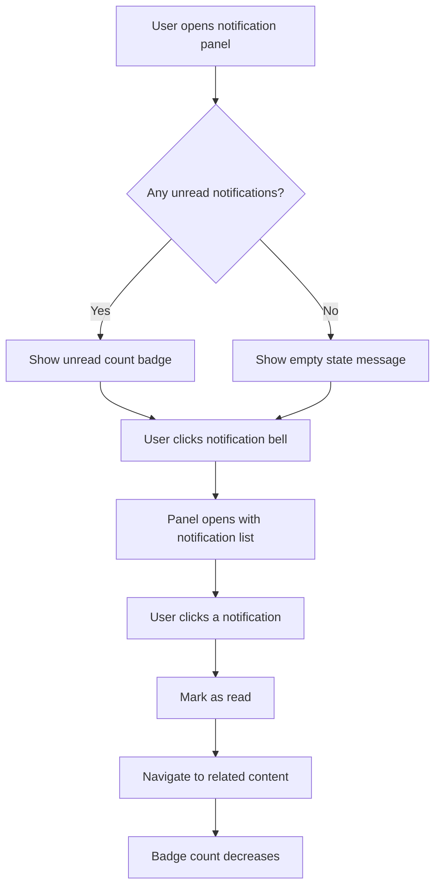
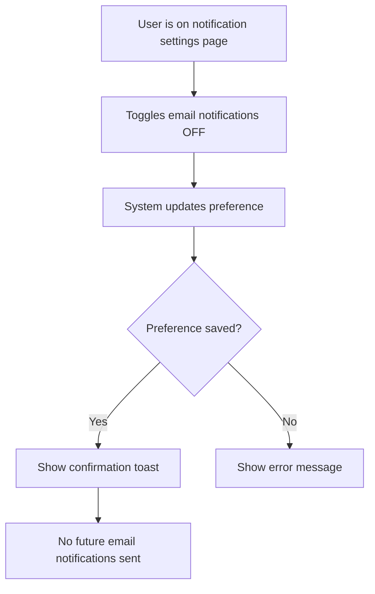
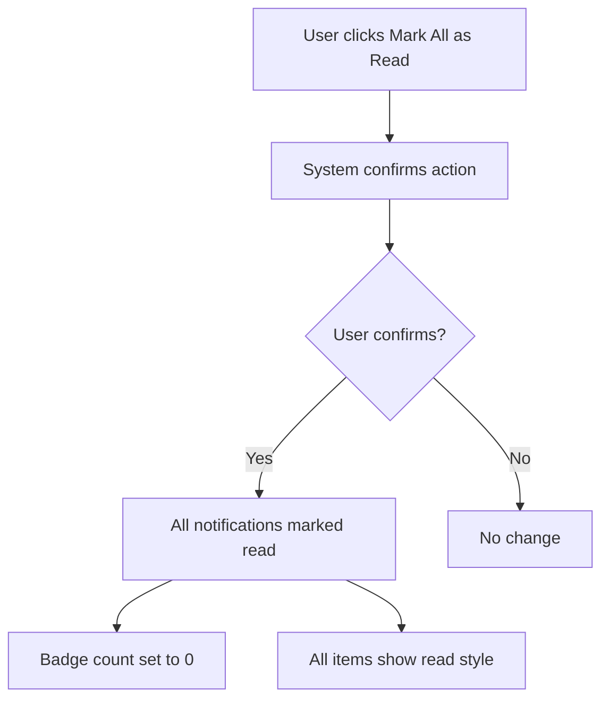

# Feature Spec: [Feature Name]

> **Instructions for AI:** Replace all `[placeholders]` with real content. Mermaid flowcharts are MANDATORY for every user story — do not omit them. Use the Notifications feature below as a model.

---

## Header

- **Feature:** [Feature Name]
- **Branch:** `feature/NNN-feature-name`
- **Date:** YYYY-MM-DD
- **Status:** Draft | Review | Approved | Implemented | Deprecated
- **Input:** [Original user request or problem statement]
- **Feature Number:** NNN

---

## User Scenarios & Testing

> Prioritize stories as P1 (critical — must ship), P2 (important — should ship), P3 (nice-to-have — can defer).

### Story 1 — [Primary User Action] `P1`

**As a** [user role], **I want to** [action], **so that** [benefit].

**Priority reason:** [Why is this P1? What breaks without it?]

**Independent test:** [How do you manually verify this story works, independent of other stories?]

#### Acceptance Scenarios

**Scenario 1.1 — [Happy path name]**
```
Given [precondition — what is true before]
When  [action — what the user does]
Then  [outcome — what the system does]
And   [additional outcome if needed]
```

**Scenario 1.2 — [Edge case or error path]**
```
Given [precondition]
When  [action]
Then  [outcome — typically an error or validation message]
```

#### User Flow



> 💡 **Example above is for a Notifications feature.** Replace with a flowchart relevant to your feature.

---

### Story 2 — [Secondary User Action] `P2`

**As a** [user role], **I want to** [action], **so that** [benefit].

**Priority reason:** [Why P2?]

**Independent test:** [Manual verification]

#### Acceptance Scenarios

**Scenario 2.1 — [Happy path]**
```
Given [precondition]
When  [action]
Then  [outcome]
```

#### User Flow



> 💡 Replace with your Story 2 flowchart.

---

### Story 3 — [Additional Feature] `P3`

**As a** [user role], **I want to** [action], **so that** [benefit].

**Priority reason:** [Why P3?]

**Independent test:** [Manual verification]

#### Acceptance Scenarios

**Scenario 3.1 — [Happy path]**
```
Given [precondition]
When  [action]
Then  [outcome]
```

#### User Flow



> 💡 Replace with your Story 3 flowchart.

---

## Acceptance Criteria

> Each AC must be specific, testable, and verifiable. Reference them from FR below.

| ID | Criterion | Priority | Story |
|---|---|---|---|
| AC-001 | [Specific, testable outcome] | P1 | Story 1 |
| AC-002 | [Specific, testable outcome] | P1 | Story 1 |
| AC-003 | [Specific, testable outcome] | P2 | Story 2 |
| AC-004 | [Specific, testable outcome] | P2 | Story 2 |
| AC-005 | [Specific, testable outcome] | P3 | Story 3 |

**Example (Notifications):**

| ID | Criterion | Priority | Story |
|---|---|---|---|
| AC-001 | Unread notification count is displayed as a badge on the bell icon | P1 | Story 1 |
| AC-002 | Clicking a notification marks it as read and navigates to related content | P1 | Story 1 |
| AC-003 | User can disable email notifications from settings | P2 | Story 2 |
| AC-004 | Preference change takes effect immediately (no page reload required) | P2 | Story 2 |
| AC-005 | User can mark all notifications as read in a single action | P3 | Story 3 |

> **Deep-link anchors:** Each AC below has a heading anchor (`#ac-001`, `#ac-002`, ...) enabling direct navigation from `implementation.md` and `@spec` comments.

### AC-001

**Criterion:** Unread notification count is displayed as a badge on the bell icon
**Priority:** P1 | **Story:** Story 1

### AC-002

**Criterion:** Clicking a notification marks it as read and navigates to related content
**Priority:** P1 | **Story:** Story 1

### AC-003

**Criterion:** User can disable email notifications from settings
**Priority:** P2 | **Story:** Story 2

### AC-004

**Criterion:** Preference change takes effect immediately (no page reload required)
**Priority:** P2 | **Story:** Story 2

### AC-005

**Criterion:** User can mark all notifications as read in a single action
**Priority:** P3 | **Story:** Story 3

---

## Functional Requirements

> Each FR must map to at least one AC. These become the rows in implementation.md.

| ID | Requirement | AC References |
|---|---|---|
| FR-001 | [System must do X] | AC-001 |
| FR-002 | [System must do Y] | AC-001, AC-002 |
| FR-003 | [System must do Z] | AC-003, AC-004 |
| FR-004 | [System must do W] | AC-005 |

**Example (Notifications):**

| ID | Requirement | AC References |
|---|---|---|
| FR-001 | System must fetch unread notification count for the authenticated user | AC-001 |
| FR-002 | System must update the unread count in real-time via WebSocket or polling | AC-001 |
| FR-003 | System must mark a notification as read when clicked | AC-002 |
| FR-004 | System must navigate to the notification's target URL after marking as read | AC-002 |
| FR-005 | System must expose an endpoint to update notification preferences | AC-003, AC-004 |
| FR-006 | System must expose an endpoint to mark all notifications as read | AC-005 |

> **Deep-link anchors:** Each FR below has a heading anchor (`#fr-001`, `#fr-002`, ...) enabling direct navigation from `implementation.md` and `@spec` comments.

### FR-001

**Requirement:** System must fetch unread notification count for the authenticated user
**AC References:** [AC-001](#ac-001)

### FR-002

**Requirement:** System must update the unread count in real-time via WebSocket or polling
**AC References:** [AC-001](#ac-001)

### FR-003

**Requirement:** System must mark a notification as read when clicked
**AC References:** [AC-002](#ac-002)

### FR-004

**Requirement:** System must navigate to the notification's target URL after marking as read
**AC References:** [AC-002](#ac-002)

### FR-005

**Requirement:** System must expose an endpoint to update notification preferences
**AC References:** [AC-003](#ac-003), [AC-004](#ac-004)

### FR-006

**Requirement:** System must expose an endpoint to mark all notifications as read
**AC References:** [AC-005](#ac-005)

---

## Key Entities

> List the main data objects involved in this feature.

| Entity | Description | Key Fields |
|---|---|---|
| [EntityName] | [What it represents] | [field1, field2, field3] |

**Example (Notifications):**

| Entity | Description | Key Fields |
|---|---|---|
| Notification | A message sent to a user about an event | id, user_id, type, message, read, created_at |
| NotificationPreference | User's delivery preferences | user_id, email_enabled, push_enabled, in_app_enabled |

---

## Infrastructure Requirements

> **Include this section only when the feature depends on external cloud resources** (databases, object storage, KV stores, queues, CDN, edge workers, etc.). Omit entirely for features with no infrastructure dependencies.

| Resource | Type | Provider | Environment | Required Before | Provisioning |
|---|---|---|---|---|---|
| [Name] | [KV / R2 / D1 / S3 / Queue / etc.] | [Cloudflare / AWS / Supabase / etc.] | [dev (auto) / prod / both] | [Step N in plan] | [CLI command or action] |

> **Rule:** Every resource listed here must have a provisioning step in the plan and a binding in config. No placeholders in implementation output.

---

## Edge Cases

> Scenarios that aren't in the happy path but must be handled correctly.

- **[Edge case 1]:** [How the system should behave]
- **[Edge case 2]:** [How the system should behave]
- **[Edge case 3]:** [How the system should behave]

**Example (Notifications):**

- **Empty state:** When the user has no notifications, display a friendly empty state (not a blank panel)
- **Very high count:** If unread count exceeds 99, display "99+" instead of the exact number
- **Notification deleted before click:** If a notification is deleted by the time user clicks it, show a graceful error instead of broken navigation
- **Simultaneous mark-all-read:** If multiple tabs mark all as read simultaneously, the final state should still be consistent (all read)
- **Network failure:** If the read status update fails, notify the user and revert optimistic UI update

---

## Success Criteria

> Measurable outcomes that define when this feature is complete and successful.

| ID | Criterion | How to Measure |
|---|---|---|
| SC-001 | [Measurable outcome] | [Measurement method] |
| SC-002 | [Measurable outcome] | [Measurement method] |

**Example (Notifications):**

| ID | Criterion | How to Measure |
|---|---|---|
| SC-001 | All P1 acceptance criteria pass automated tests | CI test suite green |
| SC-002 | Notification panel loads in under 200ms | Lighthouse / performance test |
| SC-003 | Read status updates within 500ms of user click | E2E test with timing assertion |
| SC-004 | Visual regression tests pass with baseline screenshots | Playwright visual diff < 2% |

---

*Generated by `/spec.specify` — LiveSpec v1.0*
