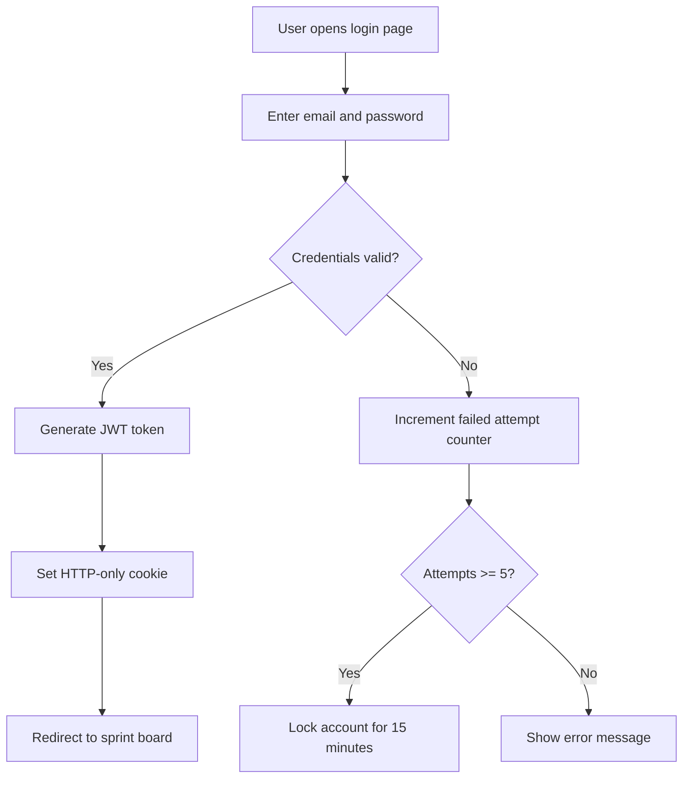
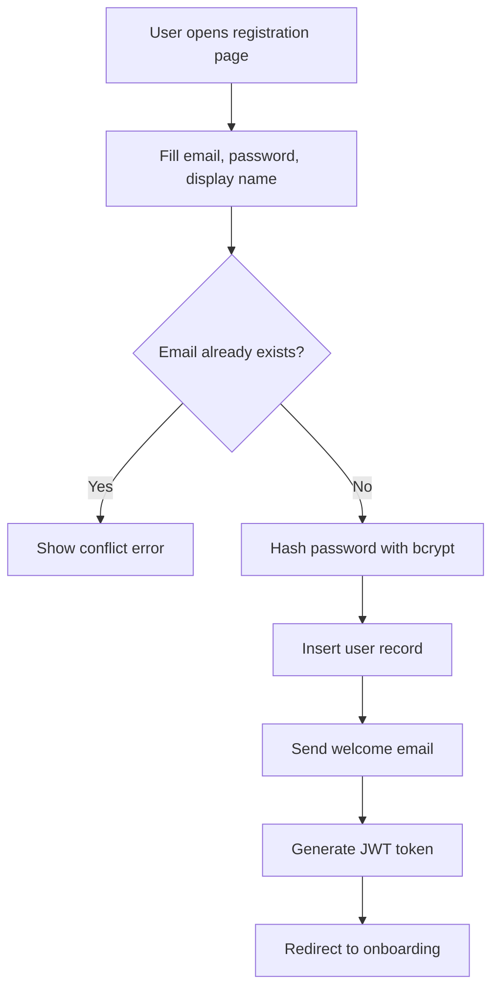
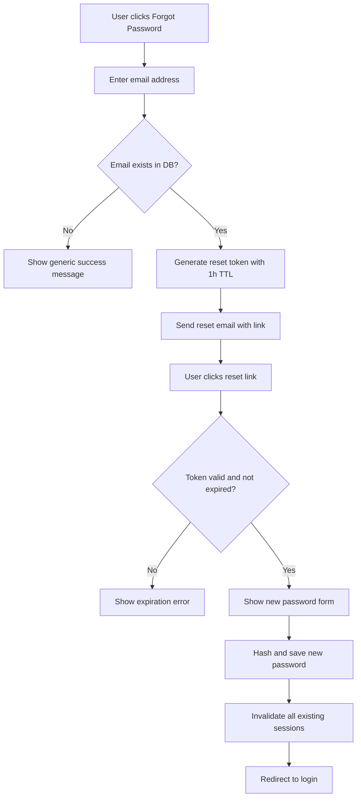

# User Authentication

## Feature Name

User Authentication

## Branch

`feature/001-user-auth`

## Date

2026-01-15

## Status

Draft

---

## User Scenarios

### Story 1: Email/Password Login

As a registered user, I want to log in with my email and password so that I can access my tasks and sprints.

```gherkin
Feature: Email/Password Login
  Scenario: Successful login with valid credentials
    Given a registered user with email "dev@taskflow.io" and a valid password
    When the user submits the login form with correct credentials
    Then the system returns a JWT access token
    And the user is redirected to the sprint board

  Scenario: Failed login with wrong password
    Given a registered user with email "dev@taskflow.io"
    When the user submits the login form with an incorrect password
    Then the system returns a 401 Unauthorized error
    And the login attempt is logged for rate-limiting
```



### Story 2: User Registration

As a new team member, I want to create an account so that I can join my team workspace and start tracking tasks.

```gherkin
Feature: User Registration
  Scenario: Successful registration with valid data
    Given the user is on the registration page
    When the user submits a valid email, password, and display name
    Then a new account is created
    And a welcome email is sent
    And the user is logged in automatically

  Scenario: Registration with duplicate email
    Given a user with email "existing@taskflow.io" already exists
    When a new user tries to register with the same email
    Then the system returns a 409 Conflict error
    And no duplicate account is created
```



### Story 3: Password Reset

As a user who forgot their password, I want to reset it via email so that I can regain access to my account.

```gherkin
Feature: Password Reset
  Scenario: Successful password reset flow
    Given a registered user with email "dev@taskflow.io"
    When the user requests a password reset
    Then a reset link is sent to their email
    And the link expires after 1 hour

  Scenario: Password reset with expired token
    Given a user has a password reset token older than 1 hour
    When the user clicks the expired reset link
    Then the system shows an expiration error
    And prompts the user to request a new reset link
```



---

## Acceptance Criteria

| ID | Criterion | Story |
|----|-----------|-------|
| AC-001 | Users can log in with a valid email/password combination and receive a JWT token | Story 1 |
| AC-002 | Invalid credentials return 401 without leaking whether the email exists | Story 1 |
| AC-003 | Account locks after 5 consecutive failed login attempts for 15 minutes | Story 1 |
| AC-004 | New users can register with email, password, and display name | Story 2 |
| AC-005 | Duplicate email registration returns 409 Conflict | Story 2 |

---

## Functional Requirements

| ID | Requirement | AC Ref | Priority |
|----|-------------|--------|----------|
| FR-001 | POST /api/auth/login accepts email and password, returns JWT on success | AC-001 | P1 |
| FR-002 | JWT tokens expire after 24 hours; refresh tokens expire after 7 days | AC-001 | P1 |
| FR-003 | Failed login attempts are tracked per-email with a 15-minute sliding window | AC-003 | P1 |
| FR-004 | POST /api/auth/register creates a user with bcrypt-hashed password | AC-004 | P1 |
| FR-005 | Registration checks email uniqueness at the database constraint level | AC-005 | P1 |
| FR-006 | POST /api/auth/reset-password generates a time-limited token and sends email | AC-002 | P2 |

---

## Key Entities

- **User**: id, email, password_hash, display_name, created_at, updated_at
- **Session**: id, user_id, refresh_token, expires_at, created_at
- **LoginAttempt**: id, email, success, ip_address, attempted_at
- **PasswordResetToken**: id, user_id, token_hash, expires_at, used_at

---

## Edge Cases

1. **Concurrent registration**: Two users register with the same email simultaneously. The database unique constraint must reject the second insert, not the application layer.
2. **Token replay**: A stolen JWT is used after the user changes their password. All sessions must be invalidated on password change.
3. **Rate limiting bypass**: Attacker rotates IP addresses to bypass per-IP rate limiting. Rate limiting must also apply per-email.
4. **Unicode in email**: User registers with a unicode-normalized email. The system must normalize emails before uniqueness checks.
5. **Password hash timing**: bcrypt comparison must use constant-time comparison to prevent timing attacks, even for non-existent users.

---

## Success Criteria

- Login flow completes in under 500ms at p95 with 100 concurrent users
- Zero plaintext passwords stored or transmitted (verified by integration test)
- Account lockout correctly triggers after exactly 5 failed attempts
- Password reset tokens are single-use and expire after 1 hour
- All auth endpoints return consistent error response format
